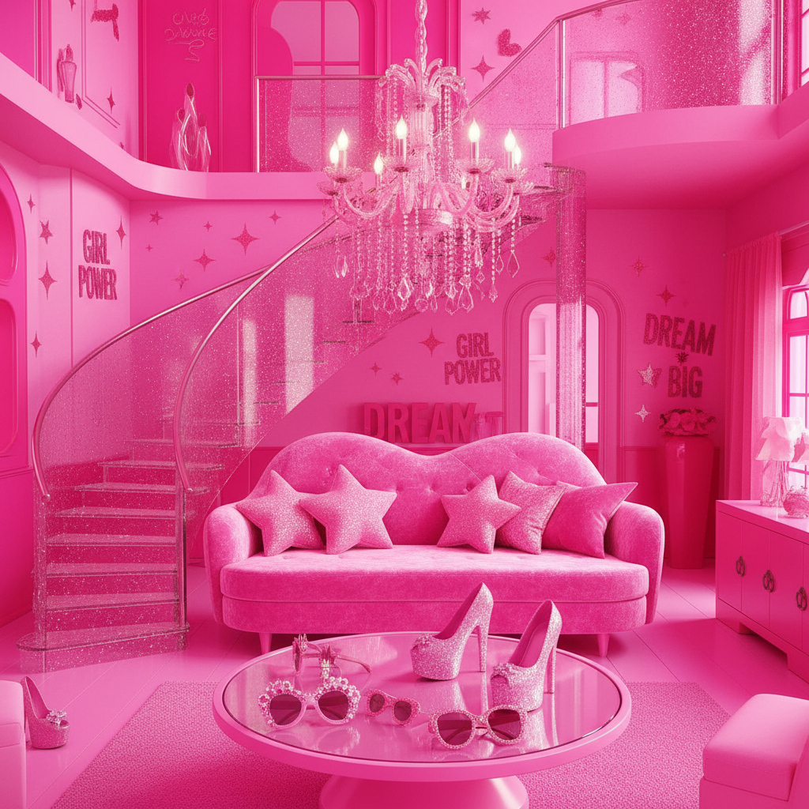
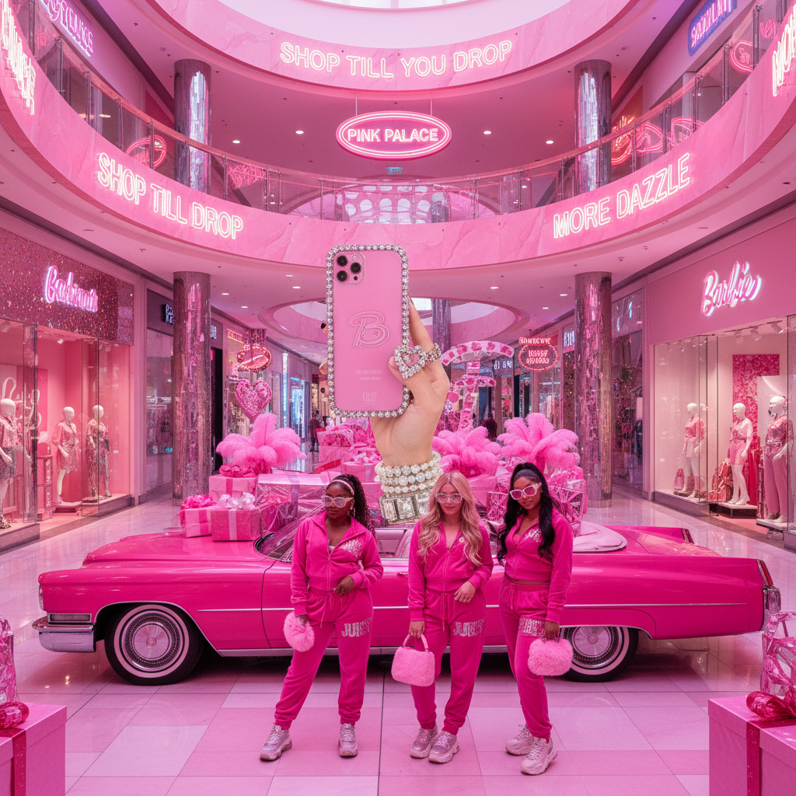

# Barbiecore / Bimbocore 芭比核





> **"Life in plastic, it's fantastic."**

## 概述

| 维度 | 描述 |
|------|------|
| 时期 | 2000s 原型 / 2022 全面回潮 |
| 别名 | Bimbocore, Pink Maximalism, Plastic Fantastic |
| 核心色彩 | 芭比粉 (Pantone 219C)、热粉、白色、金色 |
| 关键元素 | 粉色饱和、高跟鞋、亮片、人造皮草、心形墨镜 |
| 代表人物 | Paris Hilton, Legally Blonde, Nicki Minaj, Margot Robbie |
| 关联风格 | McBling, Coquette Y2K, Y2K Futurism |

---

## 历史脉络

### 2000s：原型期

Barbiecore 的基因可以追溯到 2000 年代初的 McBling 时代。Paris Hilton 穿着 Juicy Couture 天鹅绒运动套装、手持镶钻翻盖手机的形象，就是这种美学的活体广告。当时的流行文化——从《Legally Blonde》到 Destiny's Child 的 MV——都在传递一个信息：**粉色不是软弱，粉色是权力**。

这个时期的"bimbo"形象带有讽刺意味：表面上是对消费主义和超女性气质的拥抱，实际上是一种对男性凝视的戏仿和颠覆。

### 2010s：地下酝酿

在极简主义和 normcore 统治时尚界的十年里，Barbiecore 退入地下。Tumblr 上的 "bimbo positivity" 社区开始重新定义这个词：bimbo 不再是贬义词，而是一种有意识的美学选择和身体政治宣言。

### 2022：粉色核爆

Greta Gerwig 执导的《Barbie》电影（2023年上映，2022年开始宣传）引爆了全球粉色狂潮。Valentino 2022 秋冬系列的全粉色大秀、Zendaya 的粉色 Valentino 套装、以及社交媒体上 #Barbiecore 标签的爆发，让这种美学从亚文化变成了主流时尚。

---

## 视觉语法

### 色彩系统

```
主色：Hot Pink (#FF69B4) → Barbie Pink (#E0218A) → Fuchsia (#FF00FF)
辅色：Baby Pink (#FFB6C1)、白色、金色、银色
禁忌：任何暗沉、做旧、自然色调
```

### 材质偏好

- **光泽面料**：PVC、漆皮、缎面、亮片
- **毛绒质感**：人造皮草、天鹅绒、毛毛拖鞋
- **透明材质**：果冻包、透明高跟鞋、亚克力配饰
- **金属光泽**：镀金链条、水钻、施华洛世奇

### 标志性单品

| 类别 | 代表单品 |
|------|----------|
| 鞋履 | 粉色尖头高跟鞋、毛毛拖鞋、透明凉鞋 |
| 包袋 | 迷你手提包、心形包、镶钻手机壳 |
| 配饰 | 心形墨镜、珍珠项链、蝴蝶发夹 |
| 服装 | 紧身连衣裙、天鹅绒运动套装、迷你裙 |

---

## 与千禧怀旧的关系

Barbiecore 是千禧怀旧浪潮中最具商业爆发力的分支。它怀念的不是某个具体的技术产品或界面风格，而是一种**态度**——2000年代初那种毫不掩饰的、甚至有些"过分"的女性自信。

在当代语境下，它与 feminism 的关系变得更加复杂：
- **拥护者**认为：选择粉色和超女性气质本身就是一种赋权
- **批评者**认为：它仍然在强化消费主义和外貌焦虑
- **折中观点**：重要的是选择的自由，而不是选择的内容

---

## 中国语境

在中国，Barbiecore 的回潮与"多巴胺穿搭"热潮高度重合。2023年夏天，小红书上的粉色穿搭笔记暴增，从 BLACKPINK 的舞台造型到泡泡玛特的粉色联名，粉色经济渗透到了生活的方方面面。

值得注意的是，中国语境下的 Barbiecore 往往更偏向"甜美"而非"性感"，这与本土审美中对"少女感"的偏好有关。

---

## 设计应用

| 场景 | 应用方式 |
|------|----------|
| 品牌设计 | 粉色渐变背景 + 无衬线字体 + 光泽质感 |
| 社交媒体 | 高饱和粉色滤镜 + 闪光特效 + 心形贴纸 |
| 空间设计 | 粉色霓虹灯 + 亚克力家具 + 毛绒地毯 |
| 包装设计 | 粉色 + 金色烫金 + 丝带蝴蝶结 |

---

## 延伸阅读

- Aesthetics Wiki: [Barbiecore](https://aesthetics.fandom.com/wiki/Barbiecore)
- 《Barbie》电影美术设定集
- Paris Hilton 自传《Confessions of an Heiress》

---

## 相关风格

← [McBling 千禧闪耀](mcbling.md) | [Coquette Y2K 千禧甜心](coquette-y2k.md) →

↑ [返回千禧怀旧目录](README.md) | [返回总目录](../README.md)
