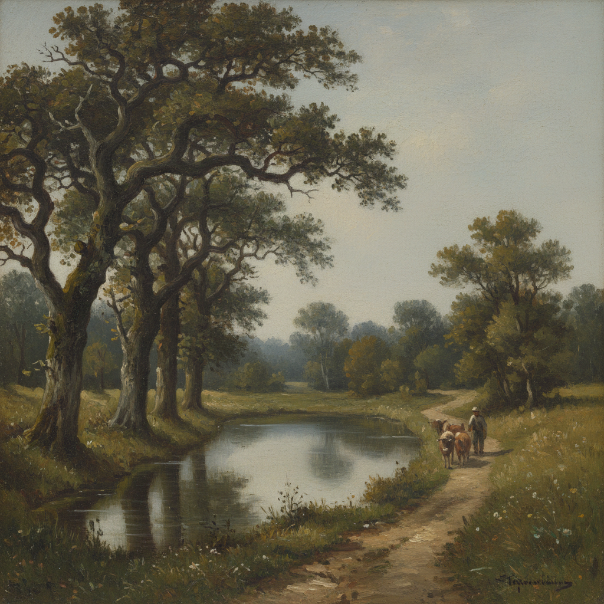

# Barbizon School 巴比松画派

> "Go to the country. The muse is in the woods." — Théodore Rousseau

## 概述

巴比松画派（Barbizon School）是19世纪中期（约1830–1870）法国的一个风景画运动，以巴黎南郊枫丹白露森林边的巴比松村为中心。画家们反对学院派的历史画传统，走出画室直接面对自然写生，成为印象派的直接先驱。

他们关注法国乡村的日常景观——农田、牧场、森林、池塘——而非古典神话或异国风光，开创了现代风景画的朴素美学。

## 核心特征

| 特征 | 描述 |
|------|------|
| 户外写生 | 最早系统性地在户外完成油画（plein air） |
| 朴素题材 | 普通乡村风景，拒绝理想化 |
| 自然光线 | 关注真实的光线变化和大气效果 |
| 笔触自由 | 比学院派更松散、更有表现力的笔触 |
| 农民形象 | 米勒等人将农民劳动提升为崇高主题 |
| 色调统一 | 偏爱灰绿、褐色等朴素色调 |

## 视觉特征

- **色调**：灰绿、土褐、暗金为主，低饱和度
- **天空**：多云的法国天空，柔和的漫射光
- **树木**：橡树是标志性元素，粗壮有力
- **水面**：静谧的池塘、小溪
- **人物**：劳作中的农民，或牧羊人与牛群
- **笔触**：可见的笔触痕迹，不追求光滑表面

## 代表人物

| 画家 | 代表作 | 特点 |
|------|--------|------|
| Théodore Rousseau | *The Forest in Winter at Sunset* | 枫丹白露森林的诗人 |
| Jean-François Millet | *The Gleaners* (1857) | 农民画家，社会关怀 |
| Charles-François Daubigny | *The Pond at Gylieu* (1853) | 水景大师，船上画室 |
| Camille Corot | *Ville-d'Avray* 系列 | 诗意的银灰色调 |
| Narcisse Virgilio Díaz | 森林内部光影 | 色彩最丰富的成员 |
| Constant Troyon | 牛群与牧场 | 动物画专家 |

## 历史背景

1. **1830年代**：Rousseau、Díaz 等人开始在巴比松定居写生
2. **1848年革命**：社会动荡促使更多画家关注底层生活
3. **1850-60年代**：画派鼎盛期，米勒《拾穗者》《晚祷》引发轰动
4. **1870年代**：印象派兴起，巴比松精神被继承和发展

## 与其他风格的关系

- **学院派** → 反叛对象，拒绝其历史画等级制度
- **印象派** → 直接继承者，莫奈等人受其启发
- **Hudson River School** → 美国对应物，同期的自然风景运动
- **Realism 现实主义** → 共享对真实生活的关注
- **Tonalism** → 继承其统一色调的美学

## 概念图

---

*浮光艺志 | Chronicle of Artistry*
