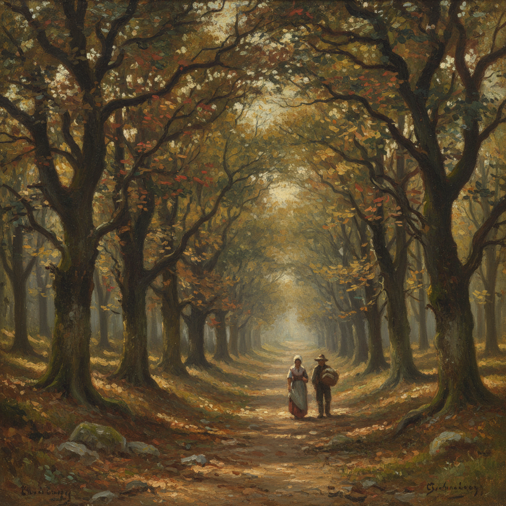

# Barbizon School 巴比松画派

> "Go to the country. The muse is in the woods." — Théodore Rousseau

## 概述

巴比松画派（Barbizon School，约1830–1870）是法国风景画的革命性运动，以枫丹白露森林边的巴比松村为中心。画家们走出画室，直接面对自然写生，为印象派铺平了道路。

## 核心特征

| 特征 | 描述 |
|------|------|
| 户外写生 | 直接面对自然的观察 |
| 乡村题材 | 森林、田野、农民生活 |
| 朴素色调 | 棕色、绿色、灰色的大地色系 |
| 真实光线 | 拒绝画室的人工光源 |
| 平凡之美 | 普通风景取代历史题材 |
| 情感投射 | 自然景观中的人类情感 |

## 代表人物

| 画家 | 贡献 |
|------|------|
| Théodore Rousseau | 领袖，森林风景的诗人 |
| Jean-François Millet | 农民生活的史诗画家 |
| Camille Corot | 银灰色调的抒情风景 |
| Charles-François Daubigny | 河景画家，船上画室 |
| Narcisse Díaz | 森林光影的捕捉者 |

## 代表作品

| 作品 | 画家 | 意义 |
|------|------|------|
| *The Gleaners* | Millet, 1857 | 农民劳动的尊严 |
| *Avenue of Chestnut Trees* | Rousseau, 1841 | 森林的纪念碑 |
| *Ville-d'Avray* | Corot, 1867 | 银色薄雾的诗意 |

## AI生成概念图

## 与其他风格的关系

- **Impressionism** → 直接启发了印象派的户外写生
- **Realism** → 与库尔贝的写实主义同时代
- **Romanticism** → 从浪漫主义的自然崇拜中发展而来
- **Hudson River School** → 美国的平行运动
