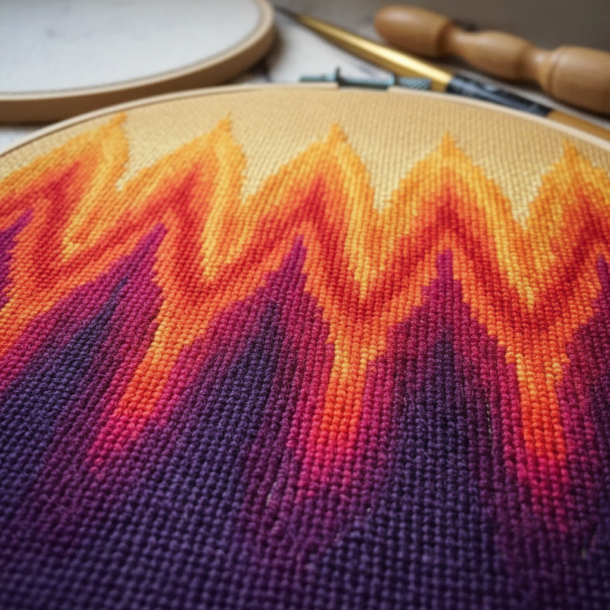

# Bargello Art 巴杰罗刺绣艺术

> "Bargello is flame made fabric — long straight stitches worked in graduated colors across canvas create undulating patterns that seem to flicker and flow like fire. Also called Florentine stitch or flame stitch, this needlepoint technique produces mesmerizing optical effects through nothing more than parallel vertical stitches stepped up and down in regular sequences. The simplicity of the stitch belies the complexity of the visual result." — Unknown

## 概述

巴杰罗刺绣艺术（Bargello Art）是一种在帆布网格上使用长直针法（通常跨越4-6个网格）按照阶梯式排列创造波浪和火焰图案的刺绣技法——以其渐变色彩和光学效果著称。Bargello得名于佛罗伦萨的巴杰罗宫（现为博物馆），那里收藏有17世纪的经典作品。

巴杰罗刺绣艺术的实践包括：1）火焰针——经典的锯齿波浪图案；2）匈牙利针——较短的对称图案；3）砖块针——交错排列的短针；4）四方向——从中心向四个方向展开的图案；5）渐变色——利用色彩渐变创造深度；6）几何变体——各种几何形状的变化；7）当代巴杰罗——将传统技法与现代设计结合的创作。

## 核心特征

| 特征 | 描述 |
|------|------|
| 直针 | 平行的长直针法 |
| 渐变 | 色彩的渐变效果 |
| 波浪 | 波浪和火焰图案 |
| 光学 | 强烈的光学效果 |
| 规律 | 数学般的规律性 |
| 快速 | 相对快速的制作 |

## 视觉特征

- **火焰**：火焰般的波浪图案
- **渐变**：色彩的平滑渐变
- **动感**：强烈的视觉动感
- **规律**：数学般的规律美
- **色彩**：丰富的色彩搭配
- **光学**：迷人的光学效果

## 代表作品

| 作品 | 艺术家/文化 | 年代 | 意义 |
|------|-------------|------|------|
| *Bargello Palace chairs* | 意大利 | 17世纪 | 巴杰罗宫椅面 |
| *Hungarian Point* | 匈牙利 | 16-17世纪 | 匈牙利尖针 |
| *Florentine stitch samplers* | 意大利 | 17-18世纪 | 佛罗伦萨针法样品 |
| *1970s revival pieces* | 欧美 | 1970年代 | 70年代复兴 |
| *Contemporary bargello* | 当代 | 当代 | 当代巴杰罗 |

## 历史时间线

| 时期 | 事件 |
|------|------|
| 15-16世纪 | 巴杰罗针法在意大利的起源 |
| 17世纪 | 巴杰罗的黄金时代 |
| 18世纪 | 在欧洲各地的传播 |
| 1970年代 | 巴杰罗的大规模复兴 |
| 当代 | 巴杰罗的现代化和创新 |

## 中国语境

巴杰罗刺绣艺术在中国有一定的爱好者群体。中国的十字绣热潮中，巴杰罗作为一种相关的帆布刺绣技法获得了关注——因为两者都在网格上工作。中国的一些手工艺社区开始教授巴杰罗技法——将其作为一种色彩和图案设计的练习。中国的室内设计中，巴杰罗风格的图案被应用于靠垫和装饰品——以其强烈的视觉效果和复古感受到欢迎。中国的一些设计师将巴杰罗的渐变色彩与中国传统色谱结合——创造具有东方韵味的火焰图案。中国的纺织品设计中，巴杰罗图案被数字化并应用于印花面料——将传统手工图案转化为现代纺织品设计。

## AI生成概念图

## 与其他风格的关系

- **Needlepoint** → 帆布绣
- **Op Art** → 光学艺术
- **Florentine Art** → 佛罗伦萨艺术
- **Textile Art** → 纺织艺术
- **Geometric Art** → 几何艺术
- **Color Theory** → 色彩理论

---

*浮光艺志 | Chronicle of Artistry*
