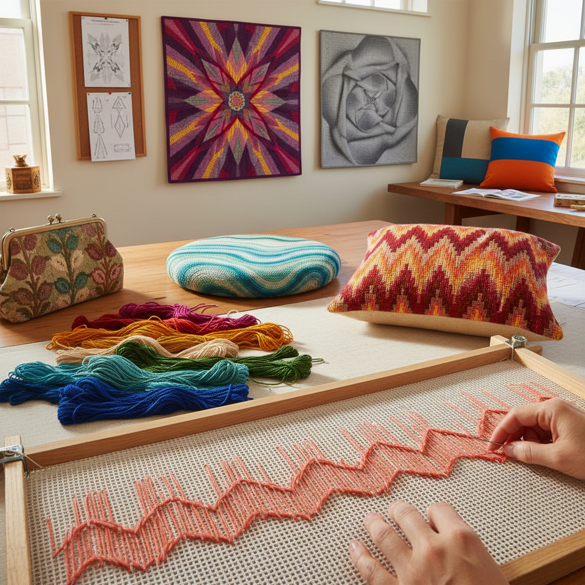

# Bargello Needlepoint 巴杰罗针绣

> "Bargello is rhythm made visible — straight stitches of varying lengths stepping up and down across canvas in waves, peaks, and flames, each row a single color shifting by one step to create optical effects of movement and depth that seem to pulse and flow like music translated into thread." — Unknown

## 概述

巴杰罗针绣（Bargello/Florentine Work/Flame Stitch）是一种在网格帆布上使用直针（straight stitches）按照阶梯式排列创造波浪、火焰或几何图案的针绣技法。Bargello的核心特征是：所有针脚都是垂直的直针（通常跨越4根帆布线），每一针相对于前一针上移或下移若干格，形成阶梯状的波浪线条。通过改变颜色的渐变和步进的模式，可以创造出火焰（flame）、波浪（wave）、菱形（diamond）、心形等多种图案。

Bargello得名于佛罗伦萨的巴杰罗宫（Palazzo del Bargello）——宫中保存有17世纪的此类椅垫。这种技法也被称为"佛罗伦萨绣"（Florentine work）或"匈牙利针法"（Hungarian point）。Bargello在17-18世纪的欧洲广泛用于椅垫、壁挂和配饰。1970年代Bargello经历了一次流行复兴。当代Bargello在针绣和纤维艺术中仍然活跃。

## 核心特征

| 特征 | 描述 |
|------|------|
| 直针 | 垂直的直针 |
| 阶梯 | 阶梯式排列 |
| 波浪 | 波浪和火焰图案 |
| 渐变 | 色彩的渐变效果 |
| 帆布 | 在网格帆布上 |
| 光学 | 光学运动效果 |

## 视觉特征

- **波浪**：流动的波浪图案
- **火焰**：火焰般的尖锐图案
- **渐变**：色彩的渐变过渡
- **节奏**：强烈的视觉节奏
- **运动**：光学运动感
- **鲜艳**：鲜艳的色彩组合

## 代表作品

| 作品 | 艺术家 | 年代 | 意义 |
|------|--------|------|------|
| *Bargello Palace chairs* | 意大利工匠 | 17世纪 | 巴杰罗宫椅垫 |
| *Florentine flame stitch* | 欧洲工匠 | 17-18世纪 | 佛罗伦萨火焰绣 |
| *1970s Bargello revival* | Various | 1970s | 70年代复兴 |
| *Contemporary Bargello* | Various | 当代 | 当代巴杰罗 |
| *Bargello quilts* | Various | 当代 | 巴杰罗拼布 |

## 历史时间线

| 时期 | 事件 |
|------|------|
| 15-16世纪 | 意大利和匈牙利的早期实践 |
| 17世纪 | Bargello在欧洲的流行 |
| 18世纪 | Bargello的持续使用 |
| 1970年代 | Bargello的流行复兴 |
| 当代 | Bargello的持续创新 |

## 中国语境

巴杰罗针绣在中国的手工社区中有一定的知名度——中国的十字绣和针绣爱好者中有人学习Bargello。Bargello的"火焰纹"图案与中国传统的"水波纹"和"火焰纹"有视觉上的相似性。当代中国的一些手工工作室开设Bargello课程。Bargello的渐变色彩效果在中国的手工社区中受到欢迎。中国的拼布（patchwork）社区中也有"Bargello quilt"（巴杰罗拼布）的实践——用布条模拟Bargello的波浪效果。

## AI生成概念图

## 与其他风格的关系

- **Needlepoint** → 针绣
- **Cross Stitch** → 十字绣
- **Op Art** → 光学艺术
- **Quilting** → 绗缝
- **Geometric Art** → 几何艺术
- **Textile Art** → 纺织艺术

---

*浮光艺志 | Chronicle of Artistry*
