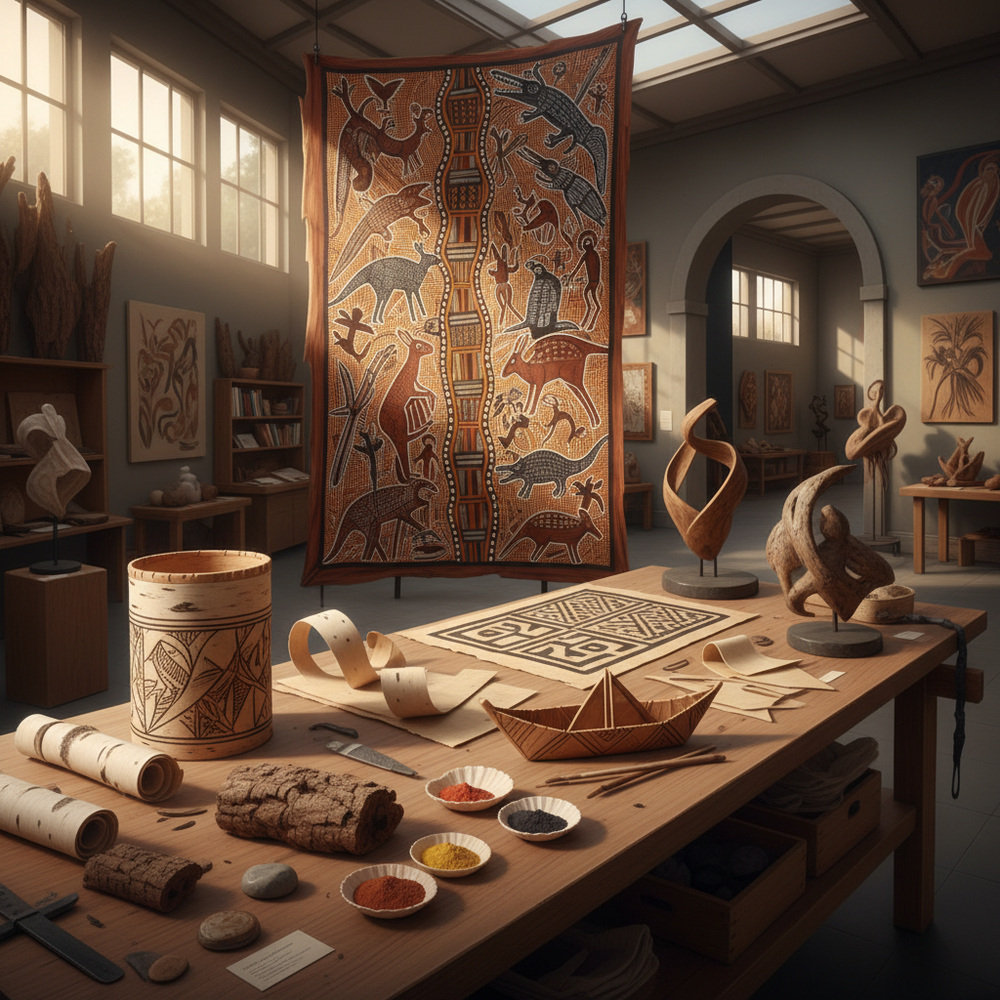

# Bark Art 树皮艺术

> "Bark is the skin of a tree — it protects, it breathes, it records the passage of years in its texture. Every scar, every crack, every pattern of lichen tells a story. When an artist works with bark, they work with a material that has already lived a life, that carries the memory of wind and rain and sun in its very fiber." — Unknown

## 概述

树皮艺术（Bark Art）是以树皮为主要材料或创作载体的艺术形式——利用树皮的天然纹理、色彩、柔韧性和层次感进行艺术创作。树皮艺术是世界各地原住民文化中的重要传统，也是当代自然材料艺术的重要分支。

树皮艺术的实践包括：1）树皮画——在树皮表面绘画（澳大利亚原住民传统）；2）桦树皮工艺——用桦树皮制作容器、独木舟和装饰品；3）树皮布——将树皮捶打成布料（太平洋岛屿tapa布）；4）树皮雕刻——在树皮上进行浮雕雕刻；5）树皮拼贴——用不同树皮拼贴成图案；6）树皮建筑——用树皮作为建筑覆盖材料；7）树皮纸——用树皮纤维制作的纸张。

## 核心特征

| 特征 | 描述 |
|------|------|
| 天然 | 纯天然材料 |
| 纹理 | 丰富的天然纹理 |
| 层次 | 多层的结构 |
| 柔韧 | 某些树皮可弯曲 |
| 文化 | 深厚的文化意义 |
| 可持续 | 可持续采收 |

## 视觉特征

- **棕色**：树皮的天然棕色调
- **纹理**：粗糙或光滑的纹理
- **层次**：剥离的层次感
- **有机**：有机的自然形态
- **斑驳**：地衣和苔藓的斑驳
- **温暖**：温暖的自然色调

## 代表作品

| 作品 | 艺术家 | 年代 | 意义 |
|------|--------|------|------|
| *Aboriginal bark paintings* | 澳大利亚原住民 | 古代至今 | 树皮画传统 |
| *Birch bark canoes* | 北美原住民 | 古代至今 | 桦树皮独木舟 |
| *Tapa cloth* | 太平洋岛屿 | 古代至今 | 树皮布 |
| *Birch bark crafts* | 北欧/俄罗斯传统 | 古代至今 | 桦树皮工艺 |
| *Contemporary bark art* | Various | 当代 | 当代树皮艺术 |

## 历史时间线

| 时期 | 事件 |
|------|------|
| 史前 | 树皮作为最早的材料之一 |
| 古代 | 各文化的树皮工艺传统 |
| 殖民时期 | 原住民树皮画的记录 |
| 20世纪 | 原住民树皮画进入艺术市场 |
| 当代 | 树皮作为当代艺术媒介 |

## 中国语境

树皮艺术在中国有独特的文化传统。中国古代的"树皮布"——用构树（楮树）皮捶打制成的布料——是中国最古老的纺织品之一，海南黎族的树皮布制作技艺已被列入国家级非物质文化遗产。中国传统的"桦树皮工艺"在东北地区（鄂伦春族、鄂温克族）有悠久传统——用桦树皮制作容器、帽子和装饰品。中国古代的"纸"最初就是用树皮纤维制成的——蔡伦改进造纸术时使用的主要原料之一就是树皮。中国当代的一些艺术家在探索树皮艺术：将树皮的天然纹理与当代装置结合、用树皮作为绘画和版画的载体、以及将少数民族的树皮工艺与当代设计对话。

## AI生成概念图

## 与其他风格的关系

- **Land Art** → 大地艺术
- **Nature Art** → 自然艺术
- **Indigenous Art** → 原住民艺术
- **Textile Art** → 纺织艺术
- **Paper Art** → 纸艺术
- **Cork Art** → 软木艺术

---

*浮光艺志 | Chronicle of Artistry*
