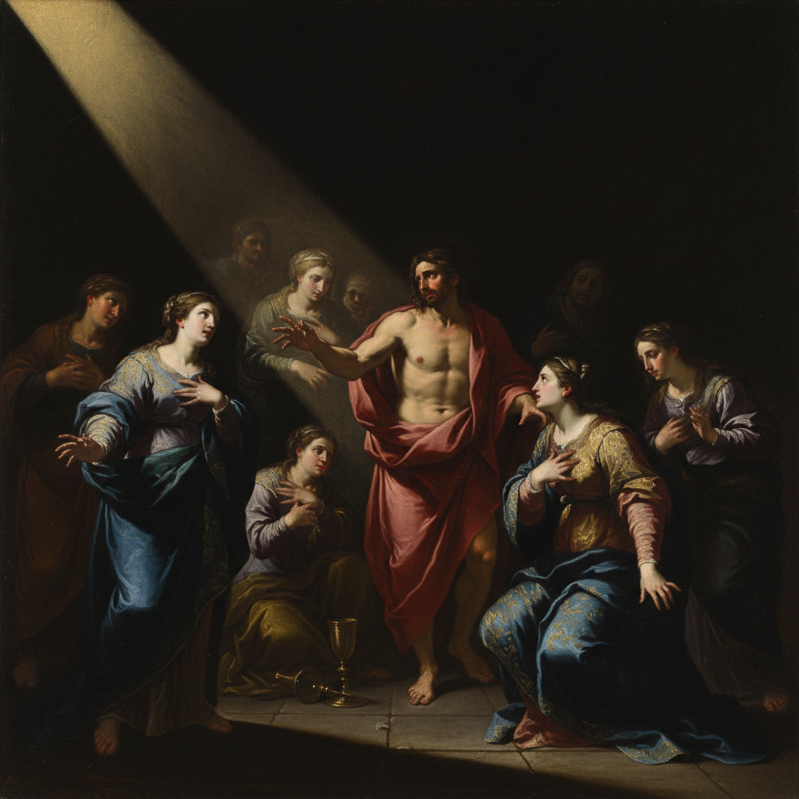

# Baroque Painting 巴洛克绘画

> **时期：** 1600年代–1750年代  
> **关键词：** 戏剧光影、宏大叙事、情感张力、反宗教改革、动态构图

## 概述

Baroque Painting（巴洛克绘画）是17世纪欧洲最具戏剧性的艺术风格——在反宗教改革的推动下，画家们用极端的明暗对比、宏大的构图和强烈的情感表达来震撼观者的灵魂。卡拉瓦乔的暗黑光线、鲁本斯的肉体狂欢、伦勃朗的心理深度——巴洛克要的不是让你欣赏，而是让你感受。

## 风格特征

- **明暗法**：极端的光影对比（Chiaroscuro/Tenebrism）
- **动态构图**：对角线、螺旋和不稳定的平衡
- **情感张力**：戏剧性的瞬间和表情
- **宏大规模**：教堂天顶和宫殿壁画
- **感官丰富**：织物、肌肤、食物的极致质感

## 代表人物与作品

- 卡拉瓦乔《圣马太蒙召》
- 彼得·保罗·鲁本斯 宏大历史画
- 伦勃朗《夜巡》
- 迭戈·委拉斯开兹《宫娥》

## 概念图

