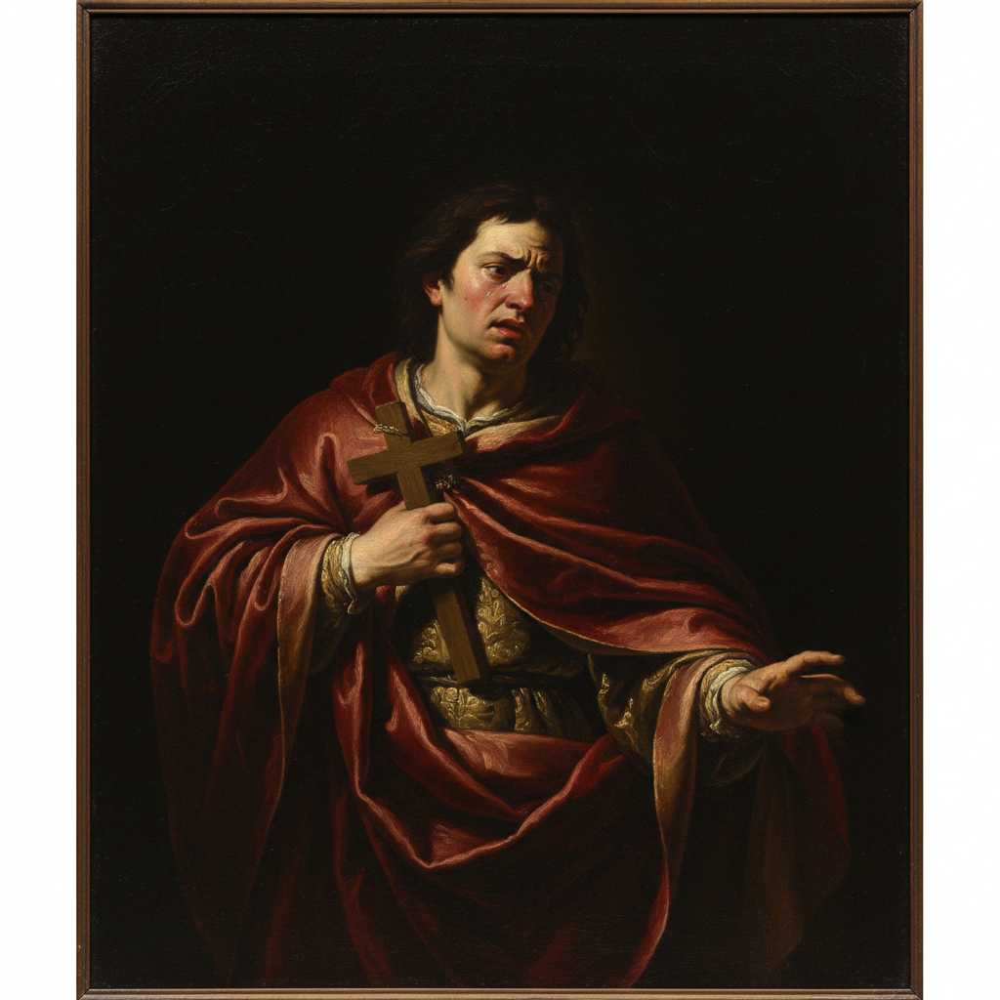

# Baroque 巴洛克



> **"更大、更戏剧、更震撼——光与影的极致对比——让观者的灵魂颤抖。"**

## 概述

| 维度 | 描述 |
|------|------|
| 时期 | 1600–1750/影响至今 |
| 别名 | Baroque, 巴洛克 |
| 核心色彩 | 深色背景+戏剧性光线、金色、深红、深蓝 |
| 关键元素 | 戏剧性光影(tenebrism)、动态构图、情感张力、华丽装饰 |
| 代表人物 | Caravaggio, Rembrandt, Rubens, Vermeer, Bernini |
| 关联风格 | Renaissance, Rococo, Romanticism, Chiaroscuro |

---

## 历史脉络

| 年份 | 事件 |
|------|------|
| 1600 | Caravaggio 革命——极端明暗法 |
| 1620s | Rubens——巴洛克的华丽与动态 |
| 1632 | Rembrandt《杜尔普教授的解剖课》 |
| 1656 | Velázquez《宫娥》——空间的革命 |
| 1665 | Vermeer《戴珍珠耳环的少女》 |
| 1700s | 巴洛克建筑遍布欧洲 |
| 2020s | "Baroque aesthetic"在摄影和时尚中复兴 |

### 核心哲学

巴洛克的精神是**"让人感受到——不只是看到"**：
- 戏剧 = 力量（"光从黑暗中切出——像舞台聚光灯"）
- 动态 = 生命（"对角线构图——一切都在运动"）
- 情感 = 目的（"让观者哭泣、颤抖、敬畏"）
- 华丽 = 权力（"金色、大理石、天顶画——教会和王权的视觉武器"）
- Caravaggio: "我用光画画——黑暗是我的画布"

---

## 视觉语法

### 色彩系统

```
主色：
  深黑 (#0A0A0A) — 背景、深渊
  金色 (#DAA520) — 华丽、神圣
  深红 (#8B0000) — 血、激情、权力
  暖光 (#FFD700) — 蜡烛光、戏剧

辅色：
  深蓝 (#000080) — 夜空、深度
  肉色 — 人体、温暖
  白色 — 高光、织物

规则：
  - Tenebrism: 极端明暗对比
  - 光源明确（蜡烛、窗户）
  - 深色占画面大部分
  - 光只照亮关键部分

质感：
  油画 — 厚重、多层
  丝绸 — 光泽、褶皱
  皮肤 — 温暖、真实
  金属 — 盔甲、珠宝
```

### 标志性元素

| 类别 | 元素 |
|------|------|
| 光影 | Tenebrism、聚光灯效果、极端对比 |
| 构图 | 对角线、动态、不稳定、戏剧化 |
| 情感 | 痛苦、狂喜、敬畏、恐惧 |
| 装饰 | 金色、大理石、天顶画、雕塑 |
| 题材 | 宗教、神话、肖像、静物(Vanitas) |
| 态度 | 戏剧、华丽、情感、权力、震撼 |

---

## 与千禧怀旧的关系

### "Baroque Aesthetic"的当代复兴
- 时尚摄影中的巴洛克光影
- Dolce & Gabbana = 巴洛克美学的当代代言
- "Dark academia"美学中的巴洛克元素
- AI生图中"baroque lighting"是热门标签

### 对摄影和电影的影响
- Caravaggio的光影 → 电影打光的基础
- "每一个好莱坞摄影师都在用Caravaggio的光"
- Rembrandt光 = 肖像摄影的经典布光
- 巴洛克 = "戏剧性"的视觉定义

---

## 中国语境

- 巴洛克艺术在中国的传播（传教士带入）
- 中国宫廷画中的巴洛克影响（郎世宁）
- 中国当代摄影中的巴洛克美学
- 巴洛克建筑在中国的遗存

---

## 设计应用

| 场景 | 应用方式 |
|------|----------|
| 时尚 | 华丽+戏剧+金色+织物+珠宝 |
| 摄影 | 光影+肖像+静物+氛围 |
| 品牌 | 奢华+经典+权力+艺术 |
| 空间 | 酒店+餐厅+剧院+奢侈品 |

---

## 相关风格

← [Renaissance 文艺复兴](renaissance.md) | [Rococo 洛可可](rococo.md) →

↑ [返回千禧怀旧目录](README.md) | [返回总目录](../README.md)
