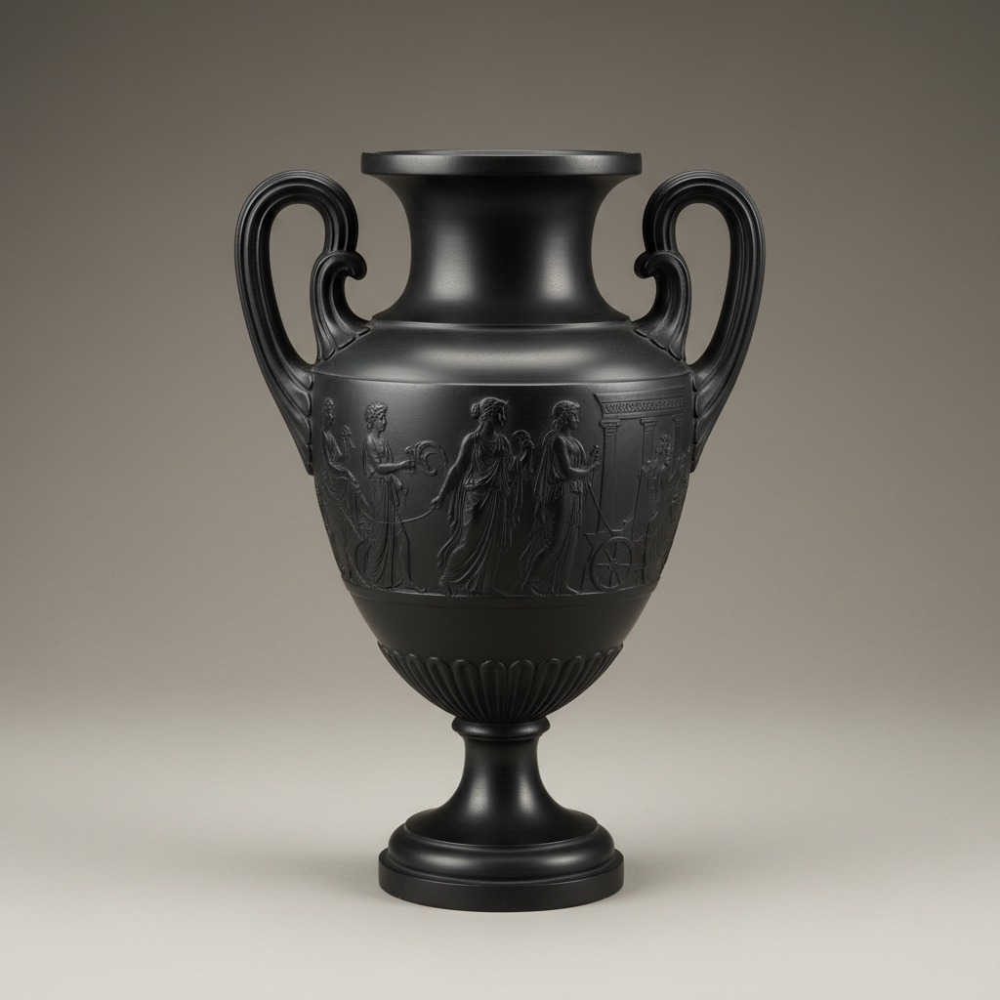

# Basalt Ware Art 玄武岩炻器艺术

> "Basalt ware is Wedgwood's answer to antiquity — a fine-grained black stoneware so dense and smooth it resembles polished volcanic stone, unglazed yet lustrous, shaped into classical forms that evoke Greek vases and Egyptian canopic jars, the Enlightenment's passion for the ancient world made tangible in a material that looks as if it were carved from night itself." — Unknown

## 概述

玄武岩炻器艺术（Basalt Ware Art）是18世纪英国陶瓷大师Josiah Wedgwood发明的一种精细黑色炻器艺术。玄武岩炻器（Black Basalt）以其深沉的黑色、细腻的质地和无釉的哑光表面著称——其外观如同抛光的玄武岩，因此得名。玄武岩炻器是新古典主义美学在陶瓷领域的完美体现——其造型多仿古希腊罗马和埃及的古典器形，体现了18世纪欧洲对古典文明的崇拜。

玄武岩炻器艺术的核心要素包括：1）深黑色——如玄武岩般的深黑；2）无釉哑光——不施釉的哑光表面；3）细腻质地——极其细腻的坯体；4）新古典造型——仿古典的器形设计；5）浮雕装饰——精细的浮雕装饰；6）Wedgwood——Wedgwood的标志性产品；7）启蒙美学——启蒙时代的审美理想。

## 核心特征

| 特征 | 描述 |
|------|------|
| 深黑色 | 如玄武岩般深黑 |
| 无釉哑光 | 不施釉哑光表面 |
| 细腻质地 | 极其细腻的坯体 |
| 新古典造型 | 仿古典器形 |
| 浮雕装饰 | 精细浮雕装饰 |
| Wedgwood | Wedgwood标志产品 |

## 视觉特征

- **纯黑色**：深沉均匀的纯黑色
- **哑光表面**：不反光的哑光质感
- **古典造型**：仿古希腊罗马造型
- **浮雕细节**：精细的浮雕装饰
- **如石质感**：如同抛光石材的质感
- **庄重典雅**：庄重典雅的气质

## 代表作品

| 作品 | 艺术家/文化 | 年代 | 意义 |
|------|-------------|------|------|
| *Wedgwood玄武岩* | Josiah Wedgwood | 1768年 | 玄武岩炻器的发明 |
| *仿古典花瓶* | Wedgwood | 18世纪 | 新古典主义造型 |
| *浮雕装饰器* | Wedgwood | 18-19世纪 | 精细浮雕 |
| *人物胸像* | Wedgwood | 18世纪 | 名人胸像系列 |
| *当代玄武岩* | 当代陶艺家 | 当代 | 当代的诠释 |

## 历史时间线

| 时期 | 事件 |
|------|------|
| 1768年 | Wedgwood发明玄武岩炻器 |
| 18世纪末 | 玄武岩炻器的流行 |
| 19世纪 | 持续生产和发展 |
| 20世纪 | Wedgwood的现代化 |
| 当代 | 玄武岩炻器的收藏和复兴 |

## 中国语境

玄武岩炻器虽然是英国的发明，但其美学理念与中国的黑陶传统有异曲同工之妙。中国龙山文化的蛋壳黑陶（约前2500年）同样以其深黑色、细腻质地和无釉表面著称——比Wedgwood的玄武岩炻器早了四千多年。中国黑陶的"黑如漆、薄如纸、硬如瓷"与玄武岩炻器的审美追求有相似之处——都追求材质本身的纯净之美。Wedgwood的玄武岩炻器在18世纪通过贸易传入中国——当时的中国文人对这种西方的黑色陶器也有一定的兴趣。玄武岩炻器证明了东西方在黑色陶瓷美学上的共同追求——无论是中国的黑陶还是英国的玄武岩炻器，都体现了对纯净、简洁、庄重之美的向往。

## AI生成概念图

## 与其他风格的关系

- **Wedgwood** → 韦奇伍德
- **Jasperware** → 碧玉炻器
- **Neoclassicism** → 新古典主义
- **Black Pottery** → 黑陶
- **Stoneware** → 炻器
- **Unglazed Ceramics** → 无釉陶瓷

---

*浮光艺志 | Chronicle of Artistry*
