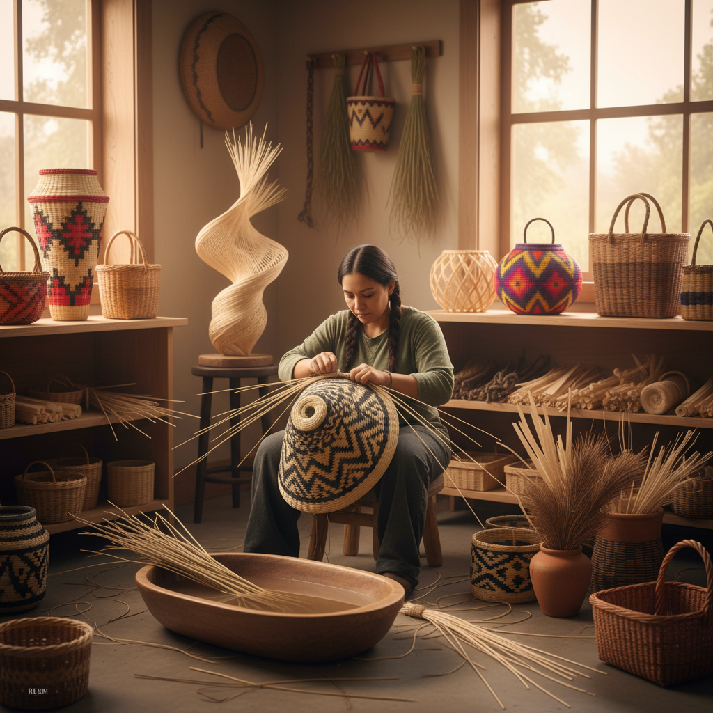

# Basket Weaving Art 编篮艺术

> "Basket weaving is architecture at the scale of the hand — each strip of material interlocking with its neighbors to create a structure that is simultaneously container, sculpture, and textile. A basket holds things, but it also holds knowledge: the mathematics of pattern, the botany of materials, the cultural memory of generations who wove before. It is one of humanity's oldest technologies, and one of its most beautiful." — Unknown

## 概述

编篮艺术（Basket Weaving Art）是利用柔韧的天然或人工材料通过编织技法创造容器和造型的艺术形式——是人类最古老的手工艺之一。编篮艺术将功能性与装饰性完美结合，从实用的储物容器到纯粹的艺术雕塑，展示了编织技法的无限可能。

编篮艺术的实践包括：1）传统编篮——用柳条、竹篾、藤条等天然材料编织的功能性篮子；2）艺术编篮——以艺术表达为目的的编篮创作；3）针编篮——用针缝技法将材料缠绕成螺旋形的篮子；4）编织雕塑——用编篮技法创造的大型雕塑；5）彩色编篮——用染色材料编织的装饰性篮子；6）当代编篮——将传统技法与现代材料和设计结合；7）微型编篮——极小尺寸的精细编篮。

## 核心特征

| 特征 | 描述 |
|------|------|
| 编织 | 经纬交织的结构 |
| 天然 | 天然材料为主 |
| 功能 | 功能与美的结合 |
| 图案 | 编织产生的图案 |
| 手工 | 纯手工制作 |
| 传承 | 代代相传的技艺 |

## 视觉特征

- **纹理**：编织产生的规律纹理
- **曲面**：优美的三维曲面
- **图案**：几何编织图案
- **色彩**：天然材料的色彩
- **光影**：编织间隙的光影
- **有机**：有机的形态

## 代表作品

| 作品 | 艺术家 | 年代 | 意义 |
|------|--------|------|------|
| *Native American baskets* | 传统 | 古代至今 | 美洲原住民编篮 |
| *African baskets* | 传统 | 古代至今 | 非洲编篮传统 |
| *Contemporary baskets* | Various | 当代 | 当代艺术编篮 |
| *Japanese bamboo baskets* | 传统 | 古代至今 | 日本竹编篮 |
| *Woven sculptures* | Various | 当代 | 编织雕塑 |

## 历史时间线

| 时期 | 事件 |
|------|------|
| 史前 | 人类最早的编篮（约1万年前） |
| 古代 | 各文化的编篮传统 |
| 中世纪 | 编篮作为重要手工业 |
| 19世纪 | 编篮的工业化和收藏 |
| 当代 | 编篮作为当代艺术媒介 |

## 中国语境

编篮艺术在中国有极其悠久的历史。中国的编篮传统可以追溯到新石器时代——河姆渡遗址出土了7000年前的编织物残片。中国各地有丰富的编篮传统——浙江的竹编、广东的藤编、山东的柳编、四川的棕编、贵州的草编等，每个地区都有独特的材料和技法。中国的编篮工艺品在国际市场上享有盛誉——特别是精细的竹编和藤编产品。中国的一些编篮技艺被列入非物质文化遗产名录。中国当代的一些艺术家和设计师在探索编篮的现代化——将传统编篮技法与当代设计理念结合，创造出既有传统韵味又符合现代审美的作品。

## AI生成概念图

## 与其他风格的关系

- **Bamboo Weaving** → 竹编艺术
- **Rattan Art** → 藤编艺术
- **Textile Art** → 纺织艺术
- **Sculpture** → 雕塑
- **Folk Art** → 民间艺术
- **Fiber Art** → 纤维艺术

---

*浮光艺志 | Chronicle of Artistry*
