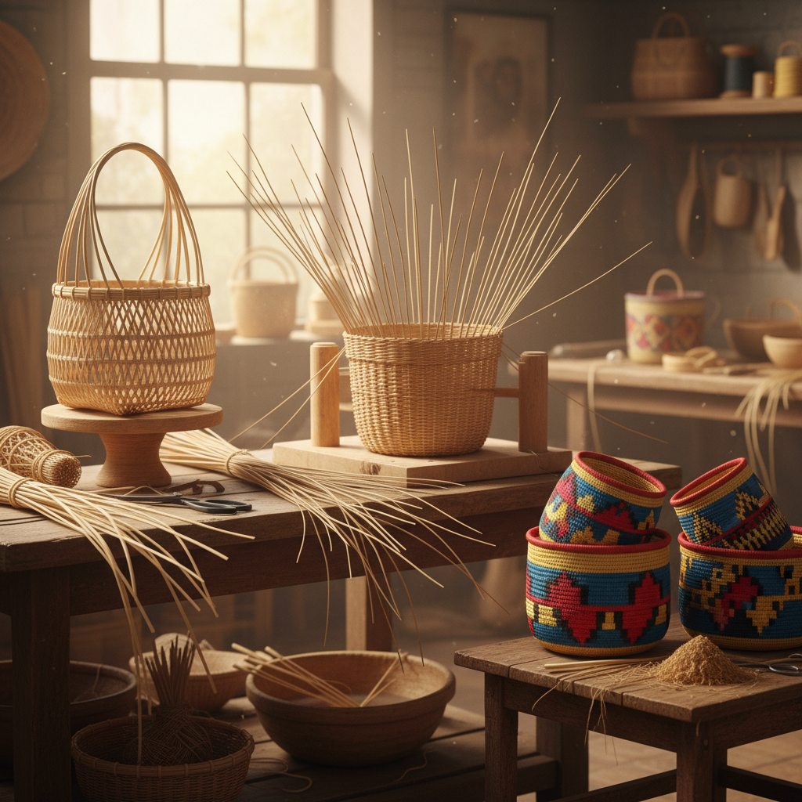

# Basketry 编篮

> "Basketry is architecture without nails — each woven strand supports the next, creating form from pure structure." — Unknown

## 概述

编篮（Basketry）是使用柔韧的天然或人工材料（如柳条、竹子、藤、草、树皮等）通过编织、缠绕、卷缝等技法制作容器和其他物品的古老工艺。编篮是人类最古老的手工艺之一——比陶器更早，可能是人类最早的"制造"行为。编篮的基本原理是利用柔韧材料的交织来创造刚性结构——单根柳条是柔软的，但编织在一起就变成了坚固的容器。

编篮的哲学在于：柔弱胜刚强——柔软的材料通过结构的力量变得坚固，如同老子所说"天下之至柔，驰骋天下之至坚"。

## 核心特征

| 特征 | 描述 |
|------|------|
| 编织 | 材料的交织结构 |
| 天然 | 使用天然材料 |
| 结构 | 结构创造强度 |
| 古老 | 最古老的手工艺 |
| 功能 | 功能性的容器 |
| 多样 | 技法和材料多样 |

## 视觉特征

- **纹理**：编织的纹理图案
- **自然**：天然材料的色彩
- **有机**：有机的曲线形态
- **节奏**：重复编织的节奏
- **质朴**：质朴的自然美
- **结构**：可见的结构逻辑

## 代表作品

| 作品 | 艺术家 | 年代 | 意义 |
|------|--------|------|------|
| *Native American baskets* | 匿名 | 传统 | 美洲原住民编篮 |
| *Japanese bamboo baskets* | Various | 传统 | 日本竹编 |
| *African coiled baskets* | 匿名 | 传统 | 非洲卷缝编篮 |
| *Dorothy Gill Barnes* | Dorothy Gill Barnes | 当代 | 当代编篮雕塑 |
| *Contemporary basket art* | Various | 当代 | 当代编篮艺术 |

## 历史时间线

| 时期 | 事件 |
|------|------|
| 公元前10000年+ | 最早的编篮（推测） |
| 古代 | 各文明的编篮传统 |
| 传统 | 全球各地的编篮文化 |
| 19世纪 | 工业化的冲击 |
| 20世纪 | 编篮作为艺术形式 |
| 当代 | 当代编篮艺术的繁荣 |

## 中国语境

中国有极其丰富的编篮传统——竹编是中国最重要的编篮形式，被列为国家级非物质文化遗产。四川青神竹编、浙江东阳竹编、安徽舒城竹编等都是著名的地方流派。中国竹编不仅制作实用器物，还能编织出极其精细的艺术品——如竹编画、竹编瓷胎等。此外，中国还有草编、藤编、柳编等多种编篮传统。当代中国的竹编艺术家正在将传统技法与现代设计结合。

## AI生成概念图

## 与其他风格的关系

- **Weaving** → 编织（共享交织原理）
- **Bamboo Art** → 竹艺
- **Fiber Art** → 纤维艺术
- **Sculpture** → 编篮雕塑
- **Folk Art** → 民间艺术
- **Sustainable Design** → 可持续设计

---

*浮光艺志 | Chronicle of Artistry*
