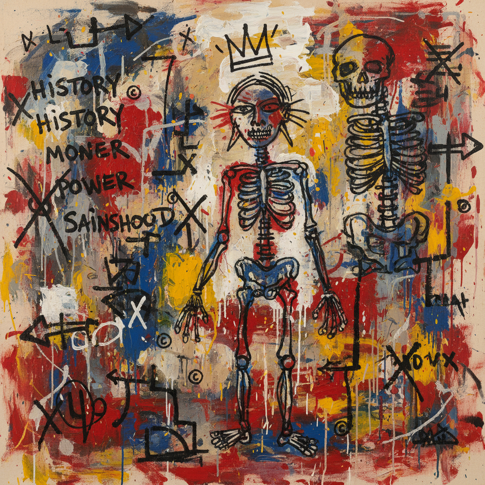

# Jean-Michel Basquiat 巴斯奎特

> "I don't think about art when I'm working. I try to think about life." — Jean-Michel Basquiat

## 概述

让-米歇尔·巴斯奎特（Jean-Michel Basquiat，1960–1988）是美国新表现主义的代表人物，从纽约街头涂鸦起步，在短短几年内成为国际艺术明星。他以原始的能量、文字与图像的混合、以及对种族和权力的尖锐批判闻名。

巴斯奎特的作品像一本打开的笔记本——解剖图、王冠、划掉的文字、非洲面具和爵士乐手在画布上碰撞，创造出一种前所未有的视觉语言。

## 核心特征

| 特征 | 描述 |
|------|------|
| 文字与图像 | 涂写、划掉、列表与图像并置 |
| 王冠符号 | 标志性的三尖王冠——黑人英雄的加冕 |
| 解剖学 | 骨骼、器官、身体结构的暴露 |
| 原始能量 | 看似儿童画的粗犷线条 |
| 种族政治 | 黑人身份、殖民历史的直接表达 |
| 信息过载 | 密集的符号、文字、箭头堆叠 |

## 视觉特征

- **线条**：粗犷的、颤抖的轮廓线
- **色彩**：强烈的原色——红、蓝、黄、黑
- **文字**：手写的单词、列表、划掉的文字
- **符号**：王冠、箭头、版权符号、骷髅
- **背景**：涂抹的、多层覆盖的混乱表面
- **材料**：画布、木板、门板——任何表面

## 代表作品

| 作品 | 年代 | 意义 |
|------|------|------|
| *Untitled (Skull)* | 1981 | 身体与死亡的对峙 |
| *Boy and Dog in a Johnnypump* | 1982 | 街头生活的能量 |
| *Dustheads* | 1982 | 城市夜生活 |
| *In This Case* | 1983 | 解剖学与种族 |
| *Riding with Death* | 1988 | 最后的杰作 |

## 真实作品（公共领域）

| 作品 | 来源 |
|------|------|
| *Untitled (Skull)* | [The Broad](https://www.thebroad.org/art/jean-michel-basquiat) |
| *Hollywood Africans* | [Whitney Museum](https://whitney.org/collection/works/10560) |
| *Dustheads* | [Private Collection — exhibited widely] |

> ⚠️ 本条目优先使用真实作品。

## AI生成概念图

## 与其他风格的关系

- **Neo-Expressionism** → 新表现主义的核心人物
- **Street Art** → 从街头涂鸦进入画廊
- **Outsider Art** → 自学成才的原始力量
- **Pop Art** → 与沃霍尔的合作与对话
