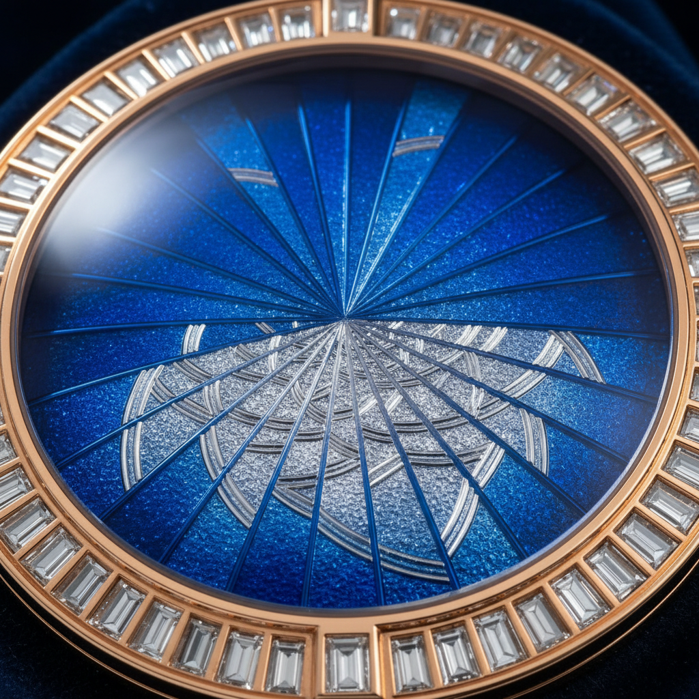

# Basse-taille Enamel Art 浅浮雕珐琅艺术

> "Basse-taille is sculpture beneath glass — the metal surface is engraved or engine-turned to create a low-relief pattern, then covered with translucent enamel so that light passes through the colored glass layer and reflects off the textured metal beneath, producing a shimmering depth effect where the enamel appears darker in the deeper cuts and lighter over the raised areas." — Unknown

## 概述

浅浮雕珐琅艺术（Basse-taille Enamel Art）是一种将金属表面雕刻成浅浮雕图案，然后覆盖透明或半透明珐琅釉料的精美工艺——光线穿过透明珐琅层，在雕刻的金属表面反射，产生独特的深浅变化和光影效果。这种技法常用于珠宝、钟表表盘和高级装饰品。

浅浮雕珐琅艺术的实践包括：1）金属雕刻——在金属表面雕刻浅浮雕图案；2）机刻纹——使用机械刻纹机创造规则纹理；3）透明珐琅——施加透明或半透明珐琅；4）烧制——在窑中烧制使珐琅熔化；5）打磨——打磨珐琅表面至光滑；6）珠宝应用——在珠宝和钟表中的应用；7）当代浅浮雕珐琅——将传统技法与现代设计结合的创作。

## 核心特征

| 特征 | 描述 |
|------|------|
| 浅雕 | 金属表面的浅浮雕 |
| 透明 | 透明或半透明珐琅 |
| 光影 | 独特的光影深浅效果 |
| 精密 | 极其精密的雕刻 |
| 珠宝 | 常用于珠宝制作 |
| 奢华 | 高级奢华的工艺 |

## 视觉特征

- **透明**：透明珐琅的通透感
- **深浅**：雕刻深浅造成的色调变化
- **光泽**：珐琅的玻璃光泽
- **纹理**：金属雕刻的纹理
- **精致**：极其精致的细节
- **华贵**：华贵的整体效果

## 代表作品

| 作品 | 艺术家/文化 | 年代 | 意义 |
|------|-------------|------|------|
| *Royal Gold Cup* | 法国/英国 | 14世纪 | 皇家金杯 |
| *Fabergé eggs* | 俄罗斯 | 19世纪 | 法贝热彩蛋 |
| *Patek Philippe dials* | 瑞士 | 20世纪 | 百达翡丽表盘 |
| *Italian Renaissance jewelry* | 意大利 | 15-16世纪 | 文艺复兴珠宝 |
| *Contemporary basse-taille* | 国际 | 当代 | 当代浅浮雕珐琅 |

## 历史时间线

| 时期 | 事件 |
|------|------|
| 13世纪 | 浅浮雕珐琅在意大利出现 |
| 14世纪 | 法国和英国的发展 |
| 文艺复兴 | 珠宝中的广泛应用 |
| 19世纪 | 法贝热的精湛运用 |
| 当代 | 高级钟表和珠宝中的传承 |

## 中国语境

浅浮雕珐琅与中国的珐琅工艺有一定的关联。中国的透明珐琅（透明珐琅彩）——在清代宫廷中有所使用。中国的珐琅彩瓷器——虽然是在瓷器上施珐琅，但对透明珐琅的运用有相似之处。中国当代的珠宝设计中，浅浮雕珐琅技法——被一些高端珠宝品牌采用。中国的钟表收藏界——对使用浅浮雕珐琅表盘的高级钟表有深入的了解。中国的工艺美术教育中，浅浮雕珐琅作为珐琅工艺的重要分支——在相关课程中介绍。

## AI生成概念图

## 与其他风格的关系

- **Cloisonné** → 景泰蓝
- **Champlevé** → 内填珐琅
- **Guilloché** → 机刻纹
- **Jewelry Art** → 珠宝艺术
- **Horology** → 钟表艺术
- **Metalwork** → 金属工艺

---

*浮光艺志 | Chronicle of Artistry*
