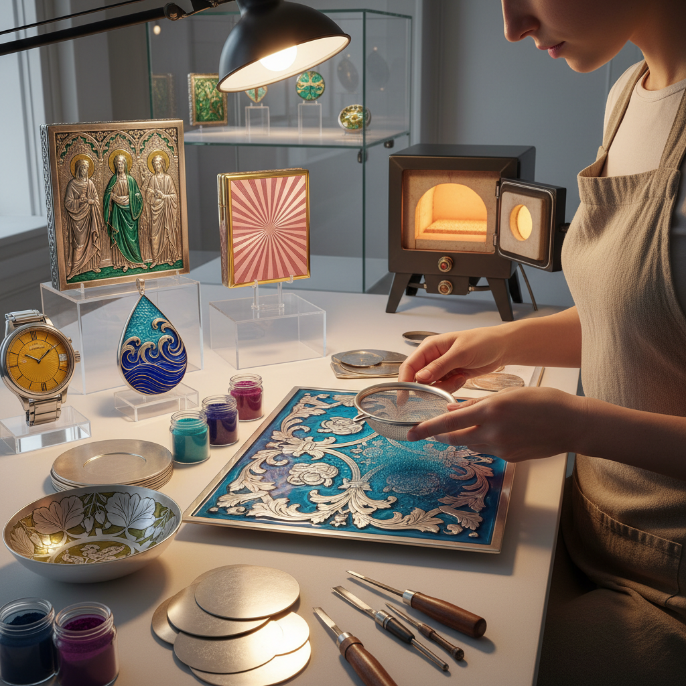

# Basse-taille 浅浮雕珐琅

> "Basse-taille is light trapped in glass over sculpted metal — the engraved relief beneath translucent enamel creates depth and shadow that shift with every change of angle, as if the color itself were breathing." — Unknown

## 概述

浅浮雕珐琅（Basse-taille，法语意为"低切割"）是一种珐琅工艺——在金属基体（通常是金或银）上雕刻出浅浮雕图案，然后覆盖透明或半透明的珐琅。由于珐琅是透明的，下方的浮雕图案透过珐琅清晰可见——浮雕的高低起伏使珐琅层的厚度不同，从而产生深浅不一的色彩效果，创造出独特的三维视觉。

Basse-taille是珐琅工艺中最精致、最具技术难度的形式之一——它要求金属雕刻和珐琅烧制两方面都达到极高水平。浮雕越深的地方珐琅越厚、颜色越深；浮雕越浅的地方珐琅越薄、颜色越浅——这种自然的明暗变化赋予作品一种内在的光辉。Basse-taille在中世纪意大利（特别是锡耶纳）和法国达到巅峰。

## 核心特征

| 特征 | 描述 |
|------|------|
| 浅浮雕 | 金属上的浅浮雕 |
| 透明珐琅 | 覆盖透明珐琅 |
| 深浅 | 珐琅厚度变化 |
| 光辉 | 内在的光辉效果 |
| 精致 | 极其精致的工艺 |
| 贵金属 | 通常使用金银 |

## 视觉特征

- **透明**：透明的珐琅层
- **深浅**：色彩的深浅变化
- **浮雕**：可见的浮雕图案
- **光辉**：内在的光辉
- **宝石**：宝石般的质感
- **精致**：极其精致的效果

## 代表作品

| 作品 | 艺术家 | 年代 | 意义 |
|------|--------|------|------|
| *Royal Gold Cup* | 匿名 | 1380 | 皇家金杯 |
| *Siena basse-taille* | 锡耶纳工匠 | 14世纪 | 锡耶纳浅浮雕珐琅 |
| *Fabergé eggs details* | Fabergé | 1900s | 法贝热彩蛋细节 |
| *Contemporary basse-taille* | Various | 当代 | 当代浅浮雕珐琅 |
| *Basse-taille watch dials* | Various | 当代 | 浅浮雕珐琅表盘 |

## 历史时间线

| 时期 | 事件 |
|------|------|
| 13世纪 | Basse-taille在意大利的出现 |
| 14世纪 | 锡耶纳和巴黎的鼎盛 |
| 文艺复兴 | 技法的精致化 |
| 18-19世纪 | 法贝热等大师的应用 |
| 20世纪 | 高级钟表中的应用 |
| 当代 | 当代珐琅艺术家的传承 |

## 中国语境

浅浮雕珐琅在中国的珐琅工艺体系中相对少见——中国传统珐琅以掐丝珐琅（景泰蓝）和画珐琅为主。但当代中国的一些珐琅艺术家和高端首饰设计师开始学习和使用Basse-taille技法。中国的高级钟表定制和珠宝设计领域对Basse-taille有一定的需求。中国的珐琅工艺教育中也开始引入Basse-taille作为高级课程内容。

## AI生成概念图

## 与其他风格的关系

- **Champlevé** → 凹雕填珐琅
- **Cloisonné** → 掐丝珐琅
- **Plique-à-jour** → 透光珐琅
- **Guilloché** → 机刻纹
- **Enameling** → 珐琅工艺
- **Engraving** → 雕刻

---

*浮光艺志 | Chronicle of Artistry*
