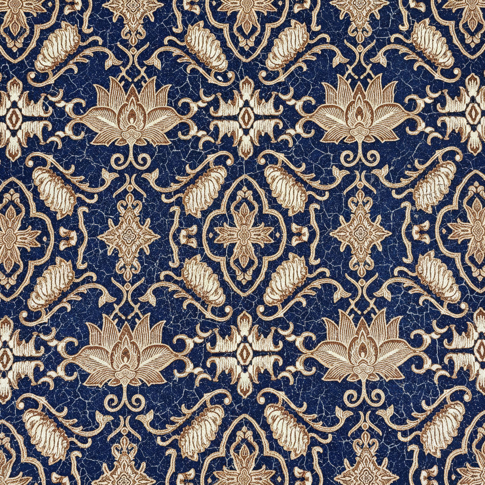

# Batik Art 蜡染艺术

> "Batik is a philosophy of patience." — Indonesian proverb

## 概述

蜡染艺术（Batik Art）是一种以蜡防染技法创作的纺织艺术，起源于爪哇岛，已有千年历史。2009年被联合国教科文组织列为人类非物质文化遗产。蜡染不仅是装饰技法，更是印度尼西亚文化身份的核心象征。

蜡染的魔力在于"抗拒"——蜡覆盖的部分抗拒染料的渗透，通过反复上蜡和染色，创造出层次丰富的图案。

## 核心特征

| 特征 | 描述 |
|------|------|
| 蜡防染 | 用熔蜡覆盖不需染色的区域 |
| 多层工序 | 反复上蜡-染色-去蜡的循环 |
| 裂纹效果 | 蜡的自然裂纹产生独特纹理 |
| 象征图案 | 每种图案都有文化和社会含义 |
| 手工传统 | 传统蜡染完全手工制作 |
| 文化身份 | 不同地区有不同的图案传统 |

## 视觉特征

- **图案**：精密的重复几何和有机图案
- **色彩**：传统为靛蓝和棕色；现代更多彩
- **裂纹**：蜡裂产生的细密纹理——蜡染的签名
- **对称**：中心对称或重复排列
- **主题**：花卉、鸟类、几何、云纹、龙凤
- **层次**：多次染色产生的色彩深度

## 代表作品

| 作品 | 年代 | 意义 |
|------|------|------|
| *Parang* 图案 | 传统 | 皇室专用的波浪纹 |
| *Kawung* 图案 | 传统 | 棕榈果的四瓣花 |
| *Mega Mendung* | 传统 | 井里汶的云纹 |
| *Sogan* 蜡染 | 传统 | 梭罗的棕色系经典 |
| 当代蜡染艺术 | 现代 | 从纺织到纯艺术的转化 |

## 真实作品（公共领域）

| 作品 | 来源 |
|------|------|
| 爪哇蜡染收藏 | [Textile Museum Jakarta](https://museumtekstil.jakarta.go.id/) |
| 传统蜡染图案 | [V&A Museum](https://www.vam.ac.uk/collections/textiles-and-fashion) |
| 蜡染工艺 | [UNESCO ICH](https://ich.unesco.org/en/RL/indonesian-batik-00170) |

## AI生成概念图

## 与其他风格的关系

- **African Textile** → 非洲蜡染共享防染技法
- **Islamic Geometric** → 几何图案的文化交流
- **Arts and Crafts** → 手工艺复兴的精神共鸣
- **Pattern Design** → 现代图案设计的灵感源泉
