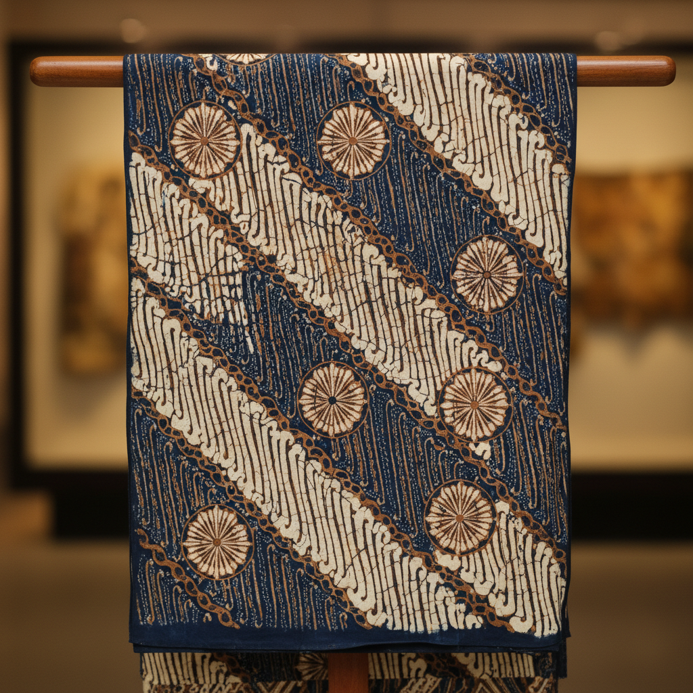

# Batik Indonesia 印尼蜡染 | Batik

> **"蜡与靛蓝的对话——爪哇岛上每一块布都是宇宙秩序的缩影。"**

## 概述

印尼蜡染（Batik / バティック）是印度尼西亚的传统蜡染纺织艺术，2009年被联合国教科文组织列入人类非物质文化遗产代表作名录。"Batik"源自爪哇语"amba"（写）和"titik"（点），意为"用点来写"。艺术家使用铜制蜡笔（canting）或铜印章（cap）将熔化的蜡涂在布料上形成图案，然后浸入染料。蜡覆盖的部分不会被染色，从而形成图案。爪哇蜡染有严格的图案等级制度——某些图案曾是王室专属。

## 主要产地风格

| 产地 | 特征 |
|------|------|
| 日惹 Yogyakarta | 棕色系，宫廷风格，精细 |
| 梭罗 Solo/Surakarta | 棕色系，传统，优雅 |
| 北海岸 Pekalongan | 鲜艳多色，中国和欧洲影响 |
| 井里汶 Cirebon | 云纹（Mega Mendung）著名 |
| 马都拉 Madura | 大胆红色，粗犷 |

## 核心技法

| 技法 | 特征 |
|------|------|
| Batik Tulis | 手绘蜡染，用canting笔 |
| Batik Cap | 铜印章蜡染，较快 |
| Batik Kombinasi | 手绘+印章结合 |

## 核心特征

- **蜡防染**：熔蜡阻止染料渗透
- **Canting笔**：铜制蜡笔，精细绘制
- **多次染色**：复杂图案需要多次上蜡和染色
- **双面图案**：高级蜡染两面都上蜡
- **图案等级**：某些图案有社会等级限制
- **哲学含义**：图案承载宇宙观和道德教化

## 经典图案

| 图案 | 含义 |
|------|------|
| Parang | 波浪/刀刃纹，王室专属 |
| Kawung | 棕榈果横截面，宇宙秩序 |
| Mega Mendung | 云纹，耐心和宽容 |
| Sido Mukti | 繁荣和幸福 |
| Truntum | 星星，引导和爱 |

## 视觉特征

- 精细的蜡笔线条
- 棕色系的传统配色（爪哇）
- 鲜艳多色（北海岸）
- 蜡裂纹的独特效果
- 密集的图案填充
- 对称的重复单元

## 与其他风格的关系

| 风格 | 关系 |
|------|------|
| African Wax Print | 直接技术后裔 |
| Yoruba Adire | 共享防染纺织传统 |
| 日本蜡染 | 受印尼影响 |
| 印度Kalamkari | 共享亚洲纺织传统 |
| 当代时装 | Batik是印尼国家身份 |

## 概念图

---

*浮光艺志 | Chronicle of Artistry*
