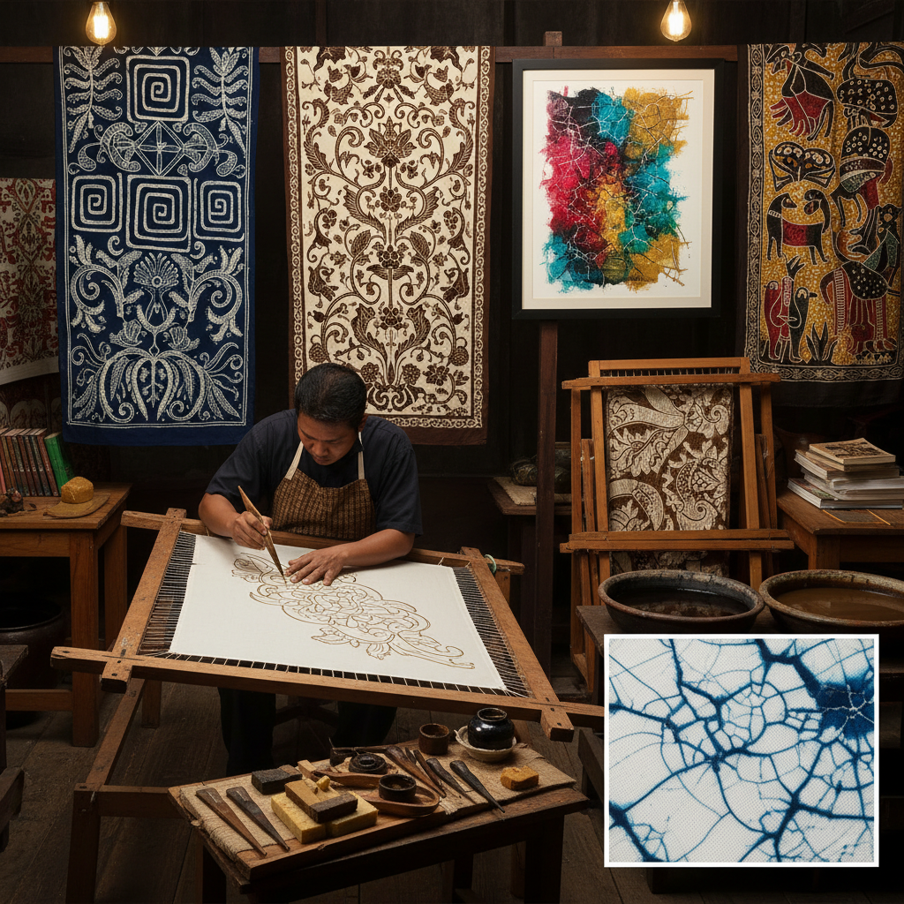

# Batik Painting 蜡染画

> "Batik is writing with wax and reading in color — each line of molten wax a boundary that dye cannot cross, each crack in the wax a vein through which color bleeds, creating patterns that are half intention and half the beautiful will of the material itself." — Unknown

## 概述

蜡染画（Batik Painting）是一种使用蜡作为防染剂在织物上创作图案的染色艺术——将熔化的蜡用特殊工具（如铜制的蜡刀/canting或铜印模/cap）涂绘在织物上，蜡覆盖的区域在染色时不会着色。染色后去除蜡，露出未染色的图案。通过多次上蜡和染色，可以创造出多色的复杂图案。

蜡染的独特视觉特征是"冰裂纹"（crackle effect）——蜡在干燥后会产生细小的裂纹，染料渗入裂纹形成独特的纹理。蜡染在印度尼西亚（特别是爪哇岛）发展到极高的艺术水平——爪哇蜡染（Javanese batik）于2009年被联合国教科文组织列为人类非物质文化遗产。蜡染在中国、印度、非洲、日本等地也有悠久的传统。

## 核心特征

| 特征 | 描述 |
|------|------|
| 蜡 | 使用蜡作为防染剂 |
| 防染 | 蜡防染原理 |
| 冰裂 | 独特的冰裂纹效果 |
| 多色 | 多次上蜡染色 |
| 手工 | 手工绘蜡 |
| 传统 | 悠久的全球传统 |

## 视觉特征

- **冰裂**：蜡裂纹的纹理
- **多色**：多层次的色彩
- **精细**：精细的线条图案
- **有机**：有机的图案形态
- **对比**：染色与留白的对比
- **传统**：传统的图案风格

## 代表作品

| 作品 | 艺术家 | 年代 | 意义 |
|------|--------|------|------|
| *Javanese batik tulis* | 爪哇工匠 | 传统 | 爪哇手绘蜡染 |
| *Chinese batik (蜡染)* | 苗族工匠 | 传统 | 中国贵州蜡染 |
| *African batik* | 非洲工匠 | 传统 | 非洲蜡染传统 |
| *Contemporary batik art* | Various | 当代 | 当代蜡染艺术 |
| *Batik fashion* | Various | 当代 | 蜡染时尚 |

## 历史时间线

| 时期 | 事件 |
|------|------|
| 古代 | 蜡染技法的起源 |
| 6-7世纪 | 爪哇蜡染的早期发展 |
| 中世纪 | 蜡染在亚洲的传播 |
| 殖民时期 | 蜡染的全球贸易 |
| 2009 | 爪哇蜡染列入UNESCO非遗 |
| 当代 | 蜡染在当代艺术和时尚中的应用 |

## 中国语境

蜡染在中国有悠久的历史——中国贵州的苗族蜡染是国家级非物质文化遗产。苗族蜡染以其精美的几何图案和自然纹样闻名——使用铜制蜡刀在白布上绘制图案，再用靛蓝染色。中国的布依族、瑶族等少数民族也有蜡染传统。中国的蜡染在唐代已有文献记载。中国的当代艺术家和设计师在创作中融合传统蜡染技法。中国的美术学院和设计学院教授蜡染作为传统工艺课程。

## AI生成概念图

## 与其他风格的关系

- **Shibori** → 绞缬染色
- **Indigo Dyeing** → 靛蓝染色
- **Wax Resist** → 蜡防染
- **Textile Art** → 纺织艺术
- **Folk Art** → 民间艺术
- **Indonesian Art** → 印尼艺术

---

*浮光艺志 | Chronicle of Artistry*
