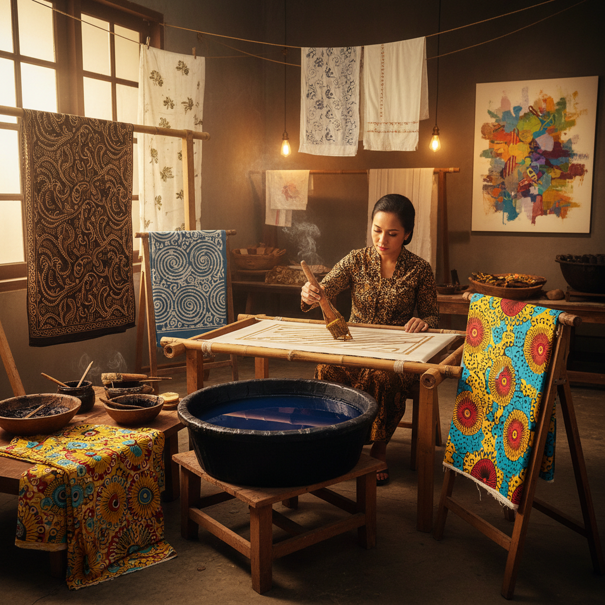

# Batik 蜡染

> "Batik is painting with wax and dye — the wax resists the color, and where it cracks, fine veins of dye seep through like rivers on a map." — Unknown

## 概述

蜡染（Batik）是一种使用蜡作为防染剂在织物上创造图案的染色工艺。艺术家用热蜡在织物上绘制图案——蜡覆盖的区域在染色时不会着色，从而形成图案。蜡染的独特标志是"冰裂纹"（crackle）——当蜡层在折叠或处理过程中产生裂纹时，染料会渗入裂缝，在织物上留下细密的网状纹理，这是蜡染独有的美学特征。蜡染可以通过多次上蜡和染色来创造多色图案——每次染色前用蜡保护不需要着色的区域。印度尼西亚的爪哇蜡染（Javanese Batik）被联合国教科文组织列为人类非物质文化遗产。

蜡染的哲学在于：抵抗与渗透——蜡抵抗染料，但裂缝允许渗透，完美与不完美共存。

## 核心特征

| 特征 | 描述 |
|------|------|
| 蜡 | 蜡作为防染剂 |
| 染色 | 浸染或涂染 |
| 冰裂 | 独特的冰裂纹 |
| 多色 | 可多次染色 |
| 手绘 | 手绘蜡线（canting） |
| 印章 | 铜印章（cap）印蜡 |

## 视觉特征

- **冰裂**：独特的冰裂纹理
- **色彩**：丰富的色彩层次
- **图案**：精美的图案设计
- **流动**：蜡线的流动感
- **对比**：染色与留白的对比
- **有机**：有机的纹理效果

## 代表作品

| 作品 | 艺术家 | 年代 | 意义 |
|------|--------|------|------|
| *Javanese court batik* | 匿名 | 传统 | 爪哇宫廷蜡染 |
| *Chinese Miao batik* | 苗族 | 传统 | 中国苗族蜡染 |
| *African wax prints* | Various | 19世纪+ | 非洲蜡染布 |
| *Sri Lankan batik* | Various | 传统 | 斯里兰卡蜡染 |
| *Contemporary batik art* | Various | 当代 | 当代蜡染艺术 |

## 历史时间线

| 时期 | 事件 |
|------|------|
| 古代 | 多地独立发展蜡染 |
| 6-7世纪 | 爪哇蜡染的早期发展 |
| 传统 | 中国西南少数民族蜡染 |
| 19世纪 | 工业化蜡染布的生产 |
| 2009 | 印尼蜡染列入UNESCO非遗 |
| 当代 | 当代蜡染艺术的全球化 |

## 中国语境

蜡染是中国重要的非物质文化遗产——贵州苗族蜡染、云南白族扎染（虽非蜡染但原理类似）都是国家级非遗项目。中国的蜡染传统主要集中在西南少数民族地区——苗族、布依族、瑶族等都有独特的蜡染传统。贵州丹寨是中国蜡染的重要产地。中国蜡染的特点是使用铜刀（蜡刀）绘制精细的几何图案和自然纹样，以蓝白两色为主。当代中国的设计师和艺术家将传统蜡染图案融入现代时装和家居设计，推动蜡染的当代转化。

## AI生成概念图

## 与其他风格的关系

- **Tie-Dye** → 扎染
- **Textile Art** → 纺织艺术
- **Resist Dyeing** → 防染技法
- **Ikat** → 经纬染
- **Shibori** → 日本绞染
- **Wax Art** → 蜡艺术

---

*浮光艺志 | Chronicle of Artistry*
