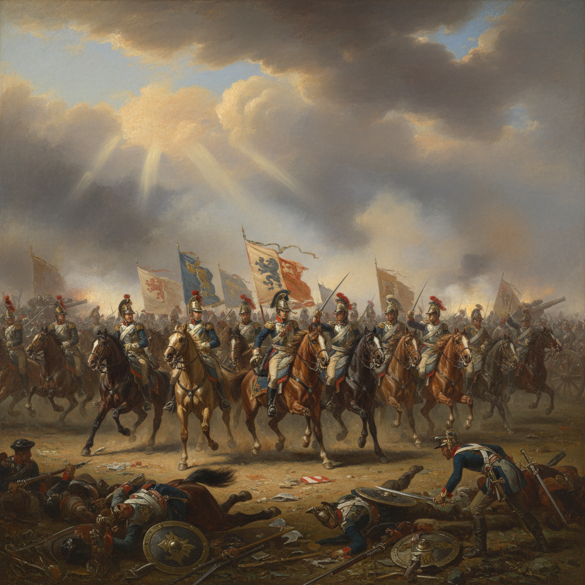

# Battle Painting 战争画

> **时期：** 古代–至今  
> **关键词：** 军事冲突、英雄主义、混乱与秩序、国家叙事、纪实与美化

## 概述

Battle Painting（战争画）描绘军事冲突的场景——从亚历山大大帝的马赛克到拿破仑战争的巨幅油画。它既是权力的宣传工具，也是对人类暴力的深刻反思。画家必须在混乱中找到秩序，在恐怖中发现崇高，在无数个体的命运中讲述一个国家的故事。

## 风格特征

- **宏大场面**：数百人物的复杂构图
- **动态混乱**：马匹、旗帜、烟尘的运动
- **英雄焦点**：将领或关键人物居中突出
- **地形精确**：对战场地理的忠实记录
- **情感张力**：胜利的荣耀与失败的悲壮

## 代表人物与作品

- 保罗·乌切洛《圣罗马诺之战》
- 委拉斯开兹《布雷达的投降》
- 安托万-让·格罗 拿破仑战争系列
- 瓦西里·韦列夏金 反战战争画

## 概念图

