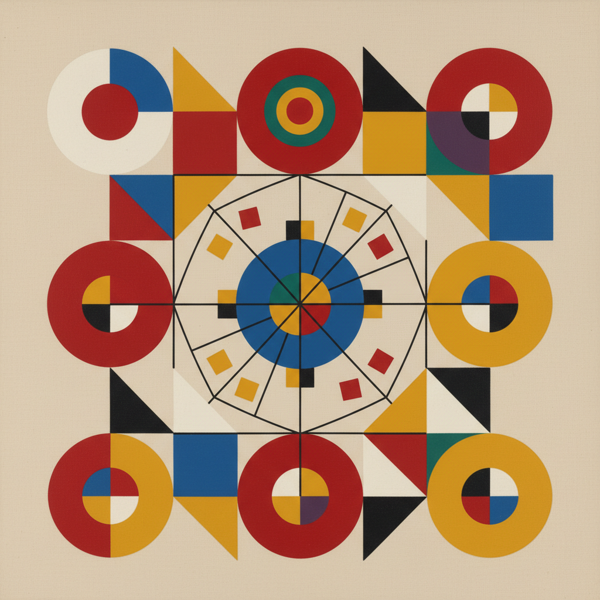

# Bauhaus Painting 包豪斯绘画

> **时期：** 1919年–1933年  
> **关键词：** 形式追随功能、基础课程、色彩理论、康定斯基、克利

## 概述

Bauhaus Painting（包豪斯绘画）是1919年格罗皮乌斯在魏玛创立的包豪斯学校中发展的绘画教学和创作传统。康定斯基的点线面理论、保罗·克利的色彩音乐、约瑟夫·阿尔伯斯的色彩交互——包豪斯不只是一所学校，更是一种信念：通过理解形式、色彩和材料的基本法则，艺术可以改善所有人的生活。

## 风格特征

- **几何基础**：圆、方、三角的基本形式
- **色彩科学**：系统化的色彩理论研究
- **功能美学**：形式服务于功能
- **跨媒介**：绘画、设计、建筑的统一
- **教学性**：每幅画都是视觉原理的演示

## 代表人物与作品

- 瓦西里·康定斯基《构成VIII》
- 保罗·克利《鱼的魔术》
- 约瑟夫·阿尔伯斯 向正方形致敬
- 拉兹洛·莫霍利-纳吉 光空间调节器

## 概念图

