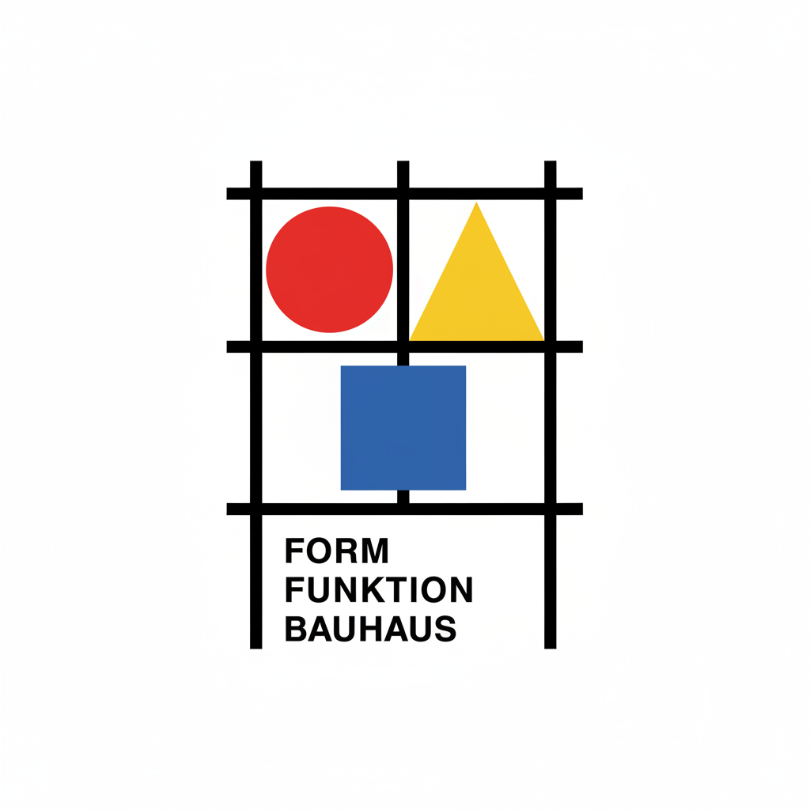

# Bauhaus 包豪斯

> "Less is more." — Ludwig Mies van der Rohe

## 概述

包豪斯（Bauhaus，德语"建筑之家"）是1919–1933年在德国魏玛、德绍和柏林运营的革命性艺术与设计学院，也是20世纪最具影响力的设计运动。由建筑师瓦尔特·格罗皮乌斯（Walter Gropius）创立，包豪斯追求艺术与工业的统一——将美术、手工艺和技术融为一体，为现代设计奠定了基础。

包豪斯的影响无处不在：从你坐的椅子到你看的字体，从摩天大楼到平面设计，现代世界的视觉语言在很大程度上是包豪斯的遗产。

## 核心特征

| 特征 | 描述 |
|------|------|
| 形式追随功能 | 设计由功能决定，而非装饰 |
| 几何简洁 | 基本几何形状——圆、方、三角 |
| 工业材料 | 钢管、玻璃、混凝土、胶合板 |
| 无装饰 | 去除一切不必要的装饰 |
| 跨学科 | 艺术、手工艺、技术的统一 |
| 民主设计 | 为大众设计，而非为精英 |

## 视觉特征

- **形状**：纯粹的几何形——圆、方、三角
- **色彩**：三原色（红黄蓝）+ 黑白灰
- **字体**：无衬线字体，小写字母
- **构图**：不对称的、动态的网格布局
- **材料**：钢管、玻璃、白色墙面
- **空间**：开放的、流动的空间

## 核心教师

| 教师 | 领域 | 贡献 |
|------|------|------|
| Walter Gropius | 建筑 | 创始人，学院理念 |
| Ludwig Mies van der Rohe | 建筑 | "少即是多"，最后一任校长 |
| Wassily Kandinsky | 绘画 | 色彩和形式理论 |
| Paul Klee | 绘画 | 线条和色彩的诗意 |
| László Moholy-Nagy | 摄影/设计 | 新视觉、光与运动 |
| Josef Albers | 色彩 | 色彩交互理论 |
| Marcel Breuer | 家具 | 钢管椅（Wassily Chair） |
| Herbert Bayer | 字体 | Universal 字体设计 |

## 历史阶段

| 阶段 | 时期 | 地点 | 特点 |
|------|------|------|------|
| 魏玛时期 | 1919-25 | 魏玛 | 表现主义影响，手工艺导向 |
| 德绍时期 | 1925-32 | 德绍 | 鼎盛期，工业化转向 |
| 柏林时期 | 1932-33 | 柏林 | 纳粹压力下关闭 |
| 流亡后 | 1933+ | 美国 | 教师流亡美国，影响全球 |

## 与其他风格的关系

- **De Stijl** → 蒙德里安的新造型主义直接影响包豪斯
- **Constructivism** → 俄国构成主义的影响
- **International Style** → 包豪斯建筑发展为国际风格
- **Swiss Design** → 瑞士平面设计继承包豪斯理念
- **Minimalism** → 极简主义的直接先驱
- **Modernism** → 现代主义设计的核心学院

## 概念图

---

*浮光艺志 | Chronicle of Artistry*
