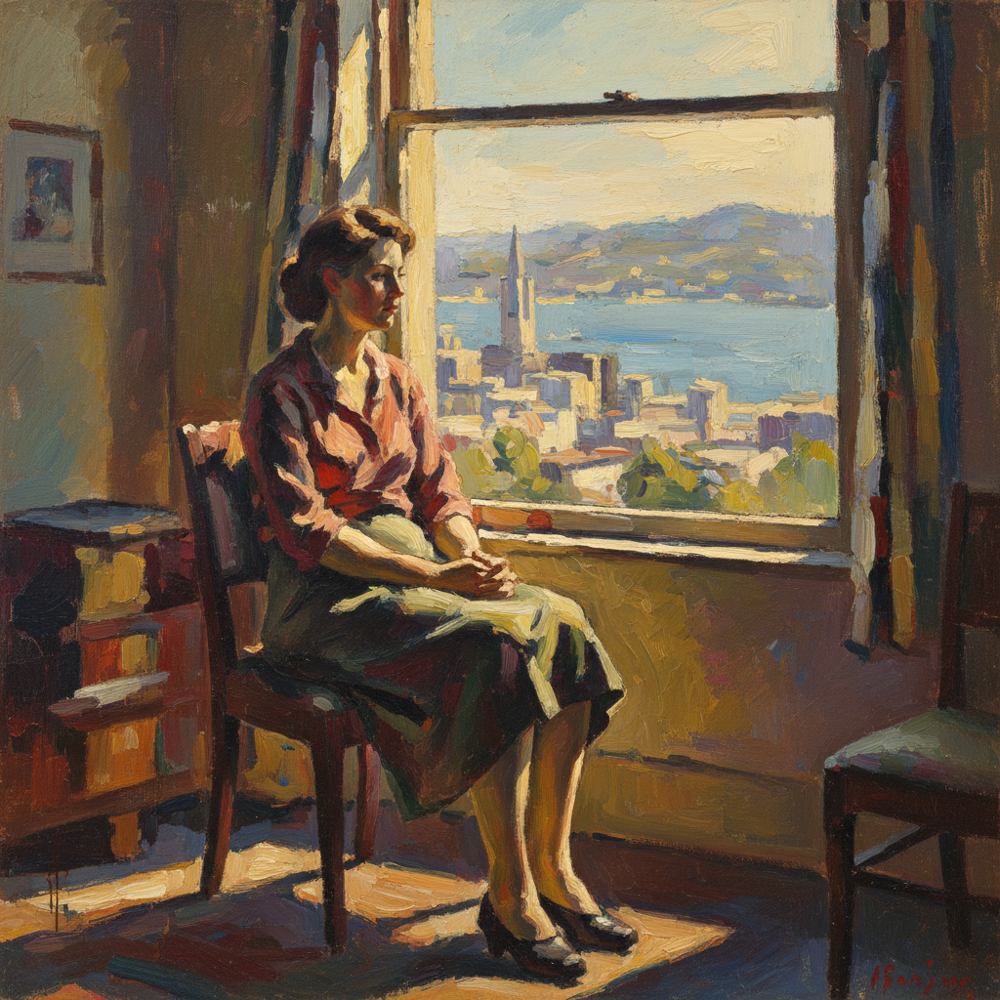

# Bay Area Figurative 湾区具象运动

> **时期：** 1950年代–1960年代  
> **关键词：** 旧金山、具象回归、抽象表现主义叛逆、加州光线、日常诗意

## 概述

Bay Area Figurative Movement（湾区具象运动）是1950年代在旧金山湾区兴起的绘画运动——一群原本从事抽象表现主义的画家，在抽象的巅峰时刻选择回归人物和风景。大卫·帕克、理查德·迪本科恩和埃尔默·比肖夫将抽象表现主义的色彩能量和笔触自由注入具象绘画，创造出一种充满加州阳光的新型人物画。

## 风格特征

- **具象回归**：在抽象主导时代画人物和风景
- **表现性色彩**：抽象表现主义的色彩遗产
- **加州光线**：明亮温暖的自然光
- **日常场景**：浴室、花园、海滩的平凡时刻
- **笔触自由**：保留抽象的手势能量

## 代表人物与作品

- 大卫·帕克 人物群像
- 理查德·迪本科恩 室内与风景
- 埃尔默·比肖夫 海滩场景
- 琼·布朗 自画像系列

## 概念图

