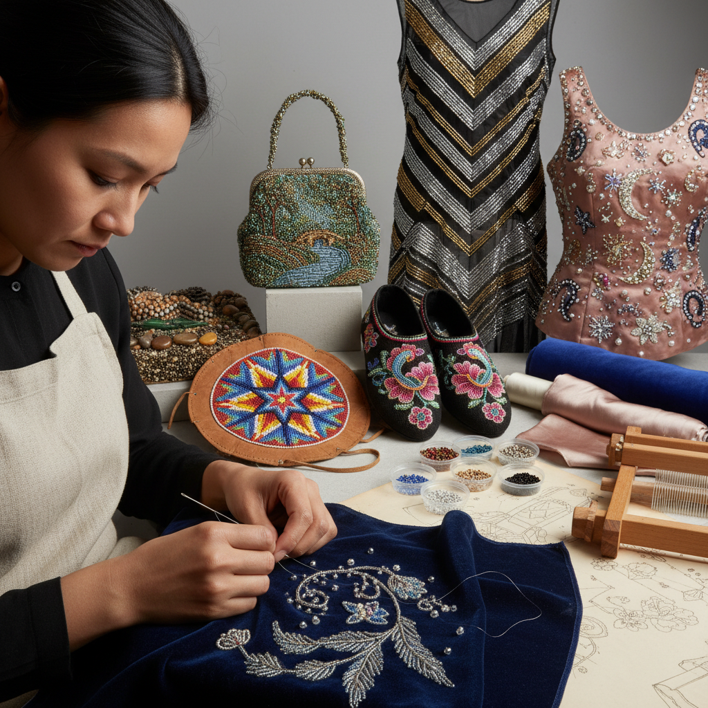

# Beadwork Embroidery 珠绣

> "Beadwork is light captured in glass — tiny spheres of colored glass stitched onto fabric one by one, each bead a lens that refracts and reflects light differently from every angle, creating surfaces that shimmer and shift like water, transforming flat cloth into fields of captured starlight." — Unknown

## 概述

珠绣（Beadwork Embroidery）是一种将珠子（玻璃珠、水晶珠、木珠、金属珠等）通过缝纫固定在织物上创造装饰效果的技法。珠绣可以是独立的艺术形式，也可以与其他刺绣技法结合。珠绣的基本技法包括：回针珠绣（backstitch beading）、钉珠（couching beads）、叠珠（stacking）、织珠（bead weaving on fabric）等。

珠绣的历史极其悠久——从古埃及的珠饰服装到中世纪欧洲的宗教刺绣，从维多利亚时代的珠饰手袋到Art Deco时期的珠饰晚装。珠绣在不同文化中有独特的传统：北美原住民的珠绣（beadwork）、非洲的珠饰艺术、印度的zardozi珠绣、中国潮汕的珠绣等。当代珠绣在高级定制时装（Haute Couture）中有核心地位——Lesage等刺绣工坊的珠绣是巴黎时装周的标志。

## 核心特征

| 特征 | 描述 |
|------|------|
| 珠子 | 使用各种珠子 |
| 光泽 | 珠子的光泽效果 |
| 立体 | 珠子的立体质感 |
| 多样 | 多种珠子和技法 |
| 奢华 | 奢华的装饰效果 |
| 全球 | 全球性的传统 |

## 视觉特征

- **闪耀**：珠子的闪耀光泽
- **纹理**：珠子的立体纹理
- **色彩**：玻璃珠的丰富色彩
- **密集**：密集珠饰的视觉冲击
- **光影**：光线在珠面的变化
- **奢华**：极致的奢华感

## 代表作品

| 作品 | 艺术家 | 年代 | 意义 |
|------|--------|------|------|
| *Native American beadwork* | 北美原住民 | 传统 | 原住民珠绣 |
| *Victorian beaded bags* | Various | 维多利亚时代 | 维多利亚珠袋 |
| *Art Deco beaded dresses* | Various | 1920s | Art Deco珠饰 |
| *Haute Couture beadwork* | Lesage等 | 当代 | 高定珠绣 |
| *Chaoshan beadwork* | 潮汕工匠 | 传统 | 潮汕珠绣 |

## 历史时间线

| 时期 | 事件 |
|------|------|
| 古代 | 古埃及等文明的珠饰 |
| 中世纪 | 欧洲宗教珠绣 |
| 维多利亚时代 | 珠饰手袋和配饰 |
| Art Deco | 珠饰晚装的鼎盛 |
| 当代 | 高级定制珠绣 |

## 中国语境

珠绣在中国有重要的传统——潮汕珠绣（潮绣珠绣）是国家级非物质文化遗产。潮汕珠绣使用细小的玻璃珠在织物上缝制精美的图案——传统题材包括龙凤、花鸟、人物等。潮汕珠绣的代表作品包括珠绣拖鞋、珠绣挂屏等。当代中国的珠绣在婚纱定制、舞台服装和高端配饰中有广泛应用。中国的手工社区中珠绣（串珠、钉珠）是流行的手工活动。

## AI生成概念图

## 与其他风格的关系

- **Tambour Beading** → 钩针珠绣
- **Embroidery** → 刺绣
- **Haute Couture** → 高级定制
- **Sequin Art** → 亮片艺术
- **Jewelry Making** → 珠宝制作
- **Textile Art** → 纺织艺术

---

*浮光艺志 | Chronicle of Artistry*
