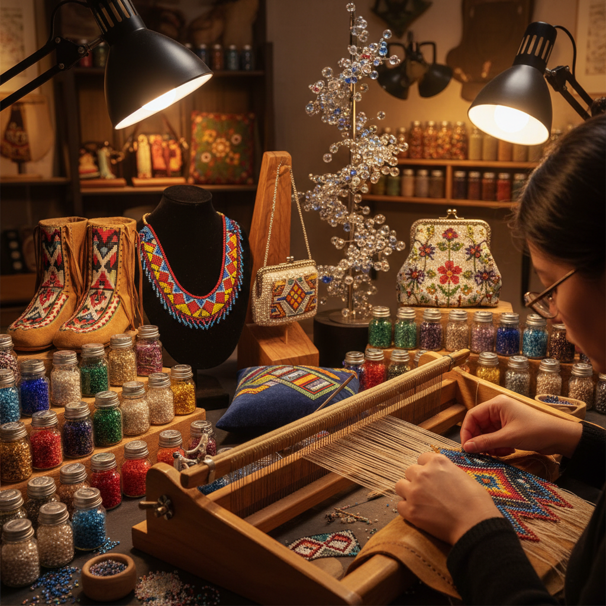

# Beadwork 串珠艺术

> "Beadwork is patience made visible — each tiny bead is a pixel of color, and together they compose images that shimmer with light and meaning." — Unknown

## 概述

串珠艺术（Beadwork）是使用小珠子（beads）通过穿线、编织、缝缀或粘贴等方式创造装饰性图案和物品的工艺。串珠是人类最古老的装饰艺术之一——最早的珠子可追溯到10万年前的贝壳珠。从非洲祖鲁族的几何图案到北美原住民的鹿皮串珠、从维多利亚时代的串珠手袋到当代的串珠雕塑，串珠艺术跨越了所有文化和时代。每一颗珠子都是一个色彩单元——如同数字图像的像素——通过精确的排列组合，创造出从简单的几何图案到复杂的写实图像。

串珠艺术的哲学在于：微小的积累——一颗一颗珠子的耐心排列，最终汇聚成令人惊叹的整体。

## 核心特征

| 特征 | 描述 |
|------|------|
| 珠子 | 以珠子为基本单元 |
| 耐心 | 极其耗时耐心 |
| 色彩 | 丰富的色彩组合 |
| 光泽 | 珠子的光泽感 |
| 立体 | 可平面可立体 |
| 文化 | 深厚的文化意义 |

## 视觉特征

- **光泽**：珠子的闪烁光泽
- **精细**：极其精细的图案
- **色彩**：丰富饱和的色彩
- **质感**：独特的颗粒质感
- **几何**：几何图案为主
- **层次**：立体的层次感

## 代表作品

| 作品 | 艺术家 | 年代 | 意义 |
|------|--------|------|------|
| *Zulu love letters* | 祖鲁族 | 传统 | 非洲串珠传统 |
| *Native American beadwork* | 原住民 | 传统 | 北美串珠传统 |
| *Victorian beaded bags* | Various | 19世纪 | 维多利亚串珠 |
| *Liza Lou installations* | Liza Lou | 1990s+ | 当代串珠艺术 |
| *Joyce Scott sculptures* | Joyce Scott | 1980s+ | 串珠雕塑 |

## 历史时间线

| 时期 | 事件 |
|------|------|
| 10万年前 | 最早的贝壳珠 |
| 古代 | 各文明的串珠传统 |
| 16世纪+ | 玻璃珠贸易的全球化 |
| 19世纪 | 维多利亚串珠的流行 |
| 20世纪 | 原住民串珠的复兴 |
| 当代 | 当代串珠艺术的繁荣 |

## 中国语境

中国有悠久的串珠传统——从商周时期的玉珠、绿松石珠到唐代的琉璃珠，从清代的朝珠到民间的串珠荷包。中国传统的"打结"和"编珠"工艺是非物质文化遗产的重要组成部分。当代中国的串珠艺术融合了传统技法和现代设计——从手工串珠首饰到串珠装置艺术。中国的珠绣（用珠子在织物上绣制图案）也是独特的串珠艺术形式，在广东潮汕地区尤为发达。

## AI生成概念图

## 与其他风格的关系

- **Embroidery** → 刺绣
- **Jewelry Making** → 珠宝制作
- **Weaving** → 编织
- **Mosaic** → 马赛克（像素类比）
- **Textile Art** → 纺织艺术
- **Folk Art** → 民间艺术

---

*浮光艺志 | Chronicle of Artistry*
