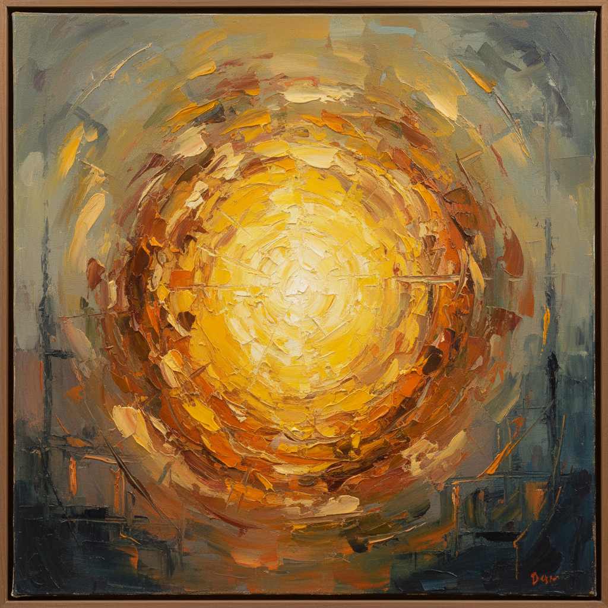

# Beauford Delaney 博福德·德拉尼

> **时期：** 1901–1979  
> **关键词：** 光之抽象、巴黎流亡、非裔美国现代主义、黄色光晕

## 概述

Beauford Delaney 是美国画家，早期在纽约以表现主义肖像和街景闻名，1953年移居巴黎后转向抽象，以标志性的黄色光晕和振动的色彩场域创造出独特的"光的绘画"。他是詹姆斯·鲍德温的挚友和精神导师，却在生前未获得应有的认可。

## 风格特征

- **黄色光晕**：标志性的金黄色光芒弥漫画面，如同精神性的光照
- **色彩振动**：厚涂的纯色笔触相互叠加，创造出光学振动效果
- **从具象到抽象**：早期纽约街景和肖像逐渐溶解为纯粹的色彩和光
- **厚涂肌理**：颜料堆积厚重，表面具有雕塑般的物质感
- **精神性**：画面传达一种超越物质的光明感和精神升华

## 代表作品

- *Can Fire in the Park*（1946）
- *Untitled (Yellow)*（1959）
- *Self-Portrait*（1962）
- *Composition 16*（1954）

## 历史意义

Delaney 是非裔美国抽象绘画的先驱之一，他的作品证明了抽象可以同时是个人的、精神的和政治的。他的迟来重新发现是艺术史种族修正的重要案例。

## 概念图

