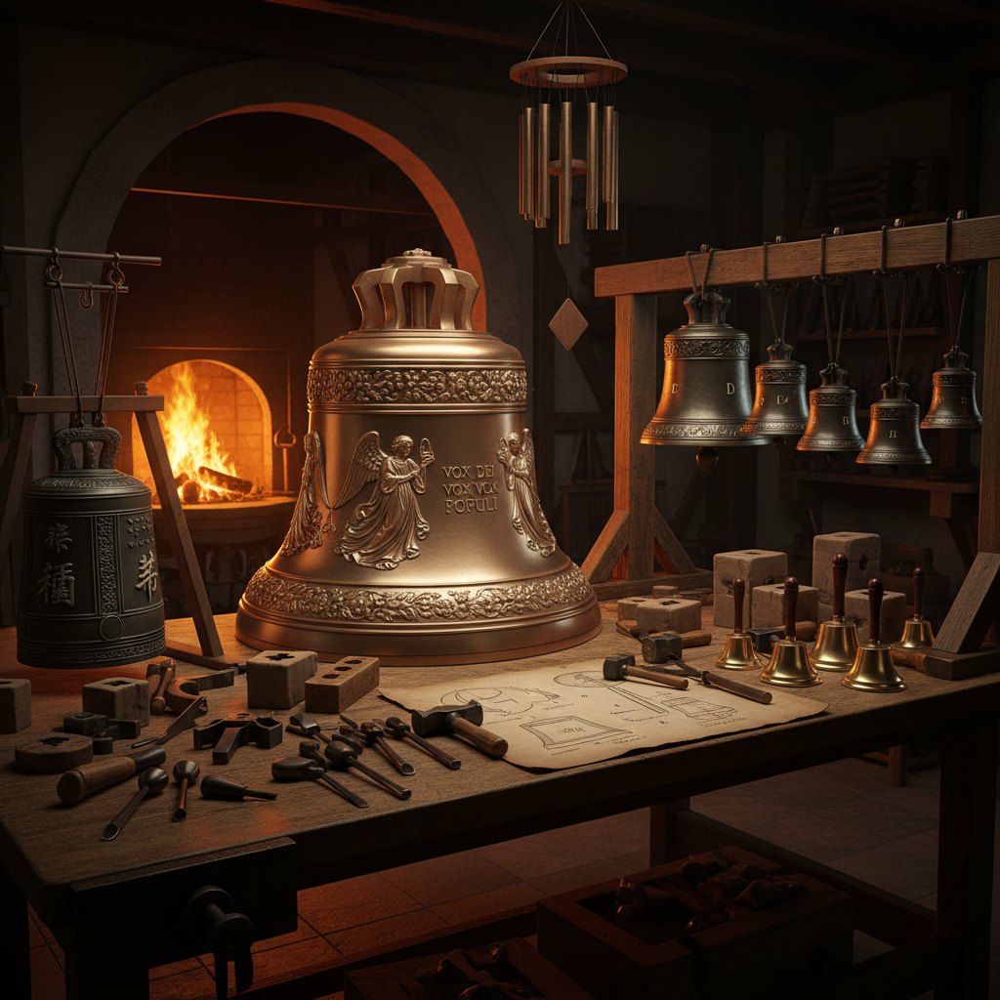

# Bell Art 钟铃艺术

> "A bell is a voice cast in metal — a single shape that contains an entire orchestra of overtones, harmonics, and resonances waiting to be released by a single strike. Bell-making is where sculpture meets music, where metallurgy meets acoustics, where the visual beauty of a curved bronze form is inseparable from the invisible beauty of its sound. Every bell is tuned by its shape, and shaped by its desired tone." — Unknown

## 概述

钟铃艺术（Bell Art）是以钟、铃为创作媒介或主题的艺术形式——包括铸钟工艺、钟铃雕塑、钟铃音乐装置和以钟铃为灵感的当代艺术创作。钟铃艺术融合了冶金、声学、雕塑和音乐，是人类最古老的声音艺术形式之一。

钟铃艺术的实践包括：1）铸钟工艺——传统的青铜铸钟技术；2）钟铃雕塑——以钟铃为造型的雕塑作品；3）钟琴——由多个调音钟组成的乐器；4）风铃艺术——装饰性和音乐性的风铃设计；5）钟铃装置——利用钟铃声音的艺术装置；6）教堂钟——欧洲教堂大钟的铸造和装饰；7）当代钟铃艺术——将钟铃作为当代艺术媒介的创作。

## 核心特征

| 特征 | 描述 |
|------|------|
| 声音 | 独特的共鸣声音 |
| 金属 | 青铜或其他金属材质 |
| 铸造 | 精密的铸造工艺 |
| 调音 | 声学调音技术 |
| 仪式 | 宗教和仪式意义 |
| 永久 | 极其持久的材料 |

## 视觉特征

- **曲线**：优美的钟形曲线
- **铭文**：钟身的铭文和装饰
- **铜绿**：青铜的铜绿色泽
- **浮雕**：钟身的浮雕装饰
- **光泽**：金属的光泽感
- **规模**：从微型到巨型的尺度

## 代表作品

| 作品 | 艺术家/地点 | 年代 | 意义 |
|------|-------------|------|------|
| *Big Ben* | 伦敦 | 1858 | 世界最著名的钟 |
| *Liberty Bell* | 费城 | 1752 | 美国自由象征 |
| *Tsar Bell* | 莫斯科 | 1735 | 世界最大的钟 |
| *Temple bells* | 日本/中国 | 古代至今 | 东亚寺庙钟 |
| *Sound sculptures* | Various | 当代 | 当代钟铃装置 |

## 历史时间线

| 时期 | 事件 |
|------|------|
| 公元前2000年 | 中国最早的青铜钟 |
| 中世纪 | 欧洲教堂铸钟传统 |
| 16-18世纪 | 钟琴的发展 |
| 19世纪 | 工业化铸钟 |
| 当代 | 钟铃的当代艺术实践 |

## 中国语境

钟铃艺术在中国有极其悠久和辉煌的传统——中国是世界上最早铸造青铜钟的文明之一。中国商周时期的编钟是世界音乐史上的奇迹——曾侯乙编钟（公元前433年）由65件青铜钟组成，音域跨越五个八度，至今仍能演奏。中国的寺庙钟是佛教文化的重要组成部分——"晨钟暮鼓"是中国寺庙生活的标志性声音。中国的铸钟工艺传承至今——一些传统铸钟作坊仍在为寺庙铸造大钟。中国的永乐大钟（1420年）重46.5吨，是中国现存最大的古钟。中国当代的一些声音艺术家将钟铃作为创作媒介——探索钟声的文化记忆和精神意义。

## AI生成概念图

## 与其他风格的关系

- **Sound Art** → 声音艺术
- **Bronze Sculpture** → 青铜雕塑
- **Wind Chime Art** → 风铃艺术
- **Musical Instrument** → 乐器制作
- **Foundry Art** → 铸造艺术
- **Sacred Art** → 宗教艺术

---

*浮光艺志 | Chronicle of Artistry*
