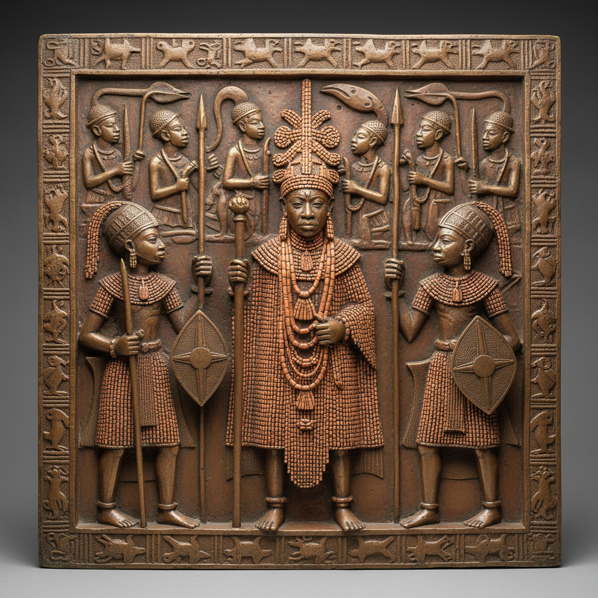

# Benin Bronzes 贝宁青铜 | Edo Bronze

> **"失蜡法铸就的王国记忆——贝宁城的青铜浮雕是非洲的史诗。"**

## 概述

贝宁青铜（Benin Bronzes / Edo Bronze）是西非贝宁王国（今尼日利亚南部）的传统金属铸造艺术，主要产于13世纪至19世纪。这些精美的青铜、黄铜和象牙雕塑由贝宁城（Benin City）的宫廷工匠行会（Igun Eronmwon）使用失蜡法（lost-wax casting）铸造，用于装饰奥巴（Oba，国王）的宫殿。1897年英国军队掠夺了数千件贝宁青铜，散落于全球博物馆，至今归还问题仍是国际文化遗产争议的焦点。

## 主要类型

| 类型 | 特征 |
|------|------|
| 宫殿浮雕板 | 长方形铜板，记录宫廷生活 |
| 纪念头像 | 奥巴和太后的肖像头像 |
| 公鸡雕塑 | 祭祀用的青铜公鸡 |
| 豹雕塑 | 王权象征的豹形器 |
| 象牙雕刻 | 象牙面具和权杖 |

## 核心特征

- **失蜡法**：精密的失蜡铸造技术
- **宫廷艺术**：为王室服务的专业行会
- **历史记录**：浮雕板记录重大事件
- **等级象征**：不同材质和尺寸代表等级
- **精细装饰**：衣物纹理、珠饰的精确再现
- **正面构图**：人物多为正面或四分之三侧面

## 视觉特征

- 精细的人物面部表情
- 复杂的衣物和珠饰纹理
- 高浮雕的立体效果
- 青铜的温暖金属色泽
- 对称的构图
- 叙事性的场景描绘

## 与其他风格的关系

| 风格 | 关系 |
|------|------|
| Ife头像 | 贝宁青铜的直接前身 |
| 中国青铜器 | 共享失蜡法铸造传统 |
| 古希腊青铜 | 共享写实人像传统 |
| 当代非洲雕塑 | 贝宁传统的延续 |
| 文艺复兴青铜 | 同时期的欧洲对应 |

## 概念图

---

*浮光艺志 | Chronicle of Artistry*
