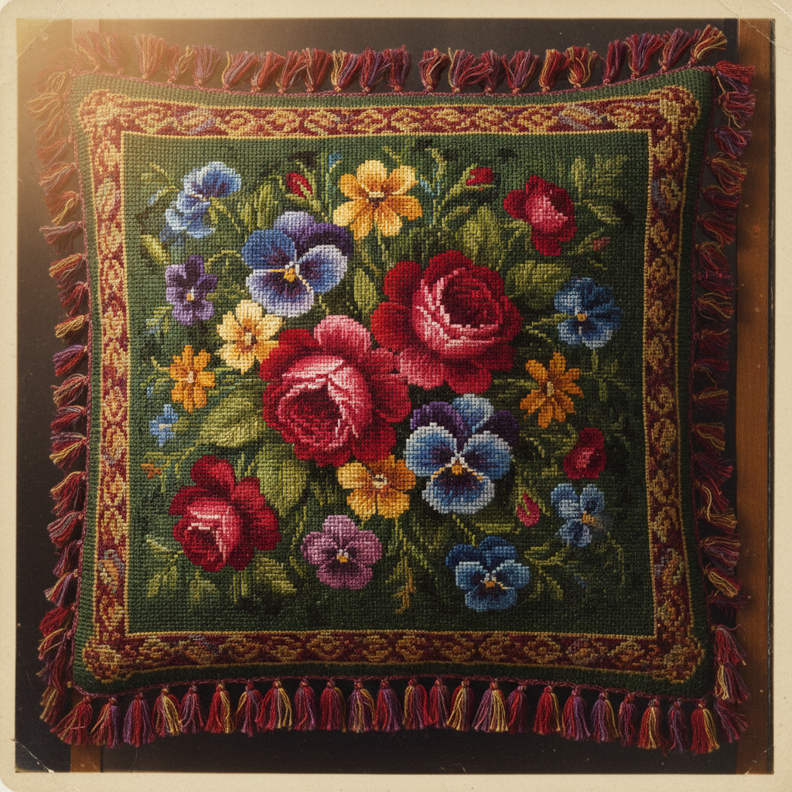

# Berlin Wool Work Art 柏林毛线绣艺术

> "Berlin wool work democratized embroidery — printed charts on squared paper replaced the need for drawing skill, and brilliantly dyed merino wools on canvas created pictures as vivid as oil paintings. Victorian parlors overflowed with cushions, firescreens, and slippers worked in tent stitch from patterns that arrived by post from Berlin, turning needlework into a mass-market phenomenon." — Unknown

## 概述

柏林毛线绣艺术（Berlin Wool Work Art）是一种19世纪流行的计数刺绣形式——使用彩色印刷图纸（Berlin patterns）作为指导，用鲜艳的美利奴羊毛线在帆布网格上进行帐篷针（tent stitch）刺绣。柏林毛线绣是维多利亚时代最流行的手工艺之一，将刺绣从贵族技艺变为大众消遣。

柏林毛线绣艺术的实践包括：1）帐篷针（Tent Stitch）——基本的斜向针法；2）十字针（Cross Stitch）——交叉针法；3）图纸阅读——按照彩色印刷图纸工作；4）色彩搭配——使用鲜艳的化学染料毛线；5）立体效果——使用剪绒和珠子增加立体感；6）实用品制作——靠垫、拖鞋、防火屏等；7）花卉和动物图案——维多利亚时代的经典主题。

## 核心特征

| 特征 | 描述 |
|------|------|
| 图纸 | 按印刷图纸工作 |
| 帆布 | 在帆布网格上绣 |
| 鲜艳 | 鲜艳的化学染料 |
| 大众 | 大众化的手工艺 |
| 维多利亚 | 维多利亚时代流行 |
| 实用 | 制作实用装饰品 |

## 视觉特征

- **鲜艳**：鲜艳饱和的色彩
- **图案**：精细的图案效果
- **花卉**：玫瑰和花卉主题
- **写实**：接近绘画的写实效果
- **规整**：网格化的规整针脚
- **丰富**：丰富的色彩层次

## 代表作品

| 作品 | 艺术家/文化 | 年代 | 意义 |
|------|-------------|------|------|
| *Berlin pattern publishers* | 德国 | 1804年起 | 柏林图纸出版商 |
| *Victorian firescreens* | 英国 | 19世纪中 | 维多利亚防火屏 |
| *Floral cushion covers* | 英国/美国 | 19世纪 | 花卉靠垫套 |
| *Beadwork Berlin patterns* | 欧洲 | 19世纪 | 珠绣柏林图案 |
| *Pet portrait samplers* | 英国 | 19世纪 | 宠物肖像绣品 |

## 历史时间线

| 时期 | 事件 |
|------|------|
| 1804年 | 柏林第一批彩色印刷图纸出版 |
| 1830-1870年 | 柏林毛线绣的黄金时代 |
| 1840年代 | 化学染料使色彩更加鲜艳 |
| 1870年代 | 艺术刺绣运动的批评 |
| 当代 | 作为历史手工艺的复兴 |

## 中国语境

柏林毛线绣在中国的直接影响有限，但其模式化的刺绣方式与中国的一些传统有相似之处。中国的十字绣热潮（2000年代）与柏林毛线绣有相似的社会现象——都是按图纸在网格上刺绣的大众化手工。中国的传统刺绣中，计数绣（如挑花）也使用网格和图案——与柏林毛线绣的方法论相通。中国当代的手工市场中，按图纸刺绣的套件产品——延续了柏林毛线绣开创的"按图施工"模式。中国的手工爱好者群体中，维多利亚风格的刺绣——作为一种复古审美正在获得关注。

## AI生成概念图

## 与其他风格的关系

- **Cross Stitch** → 十字绣
- **Needlepoint** → 针绣
- **Crewel** → 毛线刺绣
- **Victorian Craft** → 维多利亚手工艺
- **Tapestry** → 挂毯
- **Sampler** → 刺绣样品

---

*浮光艺志 | Chronicle of Artistry*
