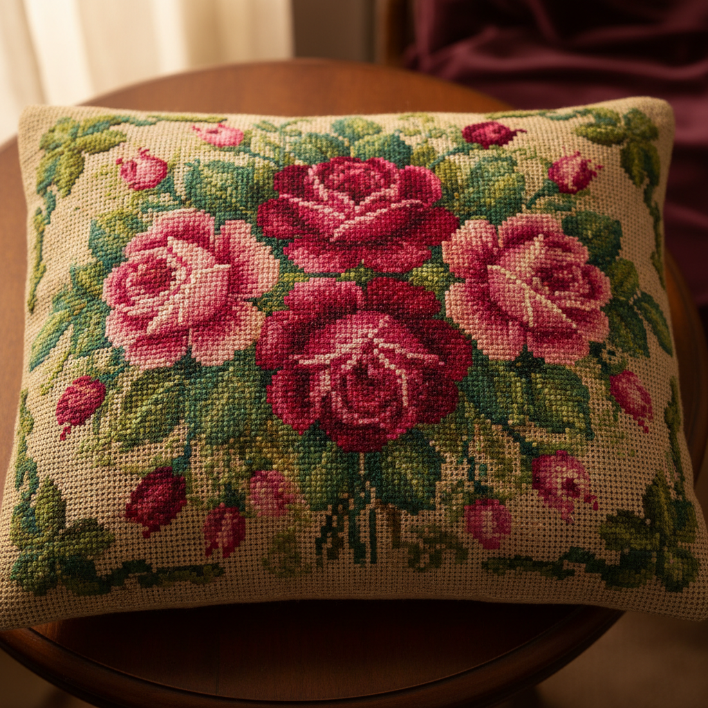

# Berlin Woolwork Art 柏林毛线绣艺术

> "Berlin woolwork was the Victorian obsession — brightly colored wool stitched onto canvas following printed charts, creating pictures and patterns that decorated every surface of the parlor. From cushions to firescreens, bell-pulls to slippers, Berlin woolwork brought art into the domestic sphere through the medium of cross stitch and tent stitch on gridded canvas, democratizing needlework through the revolutionary concept of the printed pattern." — Unknown

## 概述

柏林毛线绣艺术（Berlin Woolwork Art）是一种19世纪在欧洲和北美极为流行的帆布刺绣形式——使用鲜艳的柏林毛线（经过化学染色的美利奴羊毛线）在帆布网格上按照印刷图案进行十字绣或帐篷针绣制。柏林毛线绣是维多利亚时代最普及的手工艺形式之一，其印刷图案的革命性概念使刺绣真正大众化。

柏林毛线绣艺术的实践包括：1）十字绣——最基本的柏林毛线绣针法；2）帐篷针——斜向的单线针法；3）珠饰——在毛线绣中加入玻璃珠；4）丝绒效果——剪开线圈创造丝绒质感；5）花卉图案——最受欢迎的玫瑰和花束图案；6）动物图案——宠物和野生动物图案；7）当代柏林毛线绣——将传统技法与现代设计结合的创作。

## 核心特征

| 特征 | 描述 |
|------|------|
| 图案 | 印刷图案的革命 |
| 色彩 | 鲜艳的化学染色 |
| 大众 | 大众化的手工艺 |
| 维多利亚 | 维多利亚时代标志 |
| 实用 | 装饰家居用品 |
| 帆布 | 在帆布网格上工作 |

## 视觉特征

- **鲜艳**：化学染色的鲜艳色彩
- **图案**：花卉和动物图案
- **网格**：清晰的网格结构
- **密实**：密实的针法覆盖
- **装饰**：强烈的装饰效果
- **写实**：追求写实的图案

## 代表作品

| 作品 | 艺术家/文化 | 年代 | 意义 |
|------|-------------|------|------|
| *Rose cushions* | 欧洲 | 19世纪 | 玫瑰靠垫 |
| *Pet portraits* | 英国 | 19世纪 | 宠物肖像 |
| *Firescreens* | 欧美 | 19世纪 | 壁炉屏风 |
| *Berlin pattern books* | 德国 | 19世纪 | 柏林图案册 |
| *Contemporary Berlin work* | 当代 | 当代 | 当代柏林毛线绣 |

## 历史时间线

| 时期 | 事件 |
|------|------|
| 1804年 | 第一批柏林图案在柏林出版 |
| 1830-40年代 | 柏林毛线绣在英国的流行 |
| 1850-70年代 | 柏林毛线绣的黄金时代 |
| 1880年代 | 艺术与工艺运动的批评 |
| 当代 | 柏林毛线绣的历史研究和复兴 |

## 中国语境

柏林毛线绣艺术在中国有间接的影响。中国21世纪初的十字绣热潮在某种程度上重现了维多利亚时代柏林毛线绣的社会现象——大量印刷图案、鲜艳色彩、家居装饰用途。中国的十字绣产业借鉴了柏林毛线绣的商业模式——标准化的图案、配色方案和材料包。中国的一些手工艺研究者开始关注柏林毛线绣的历史——将其作为理解手工艺大众化和商业化的案例。中国的帆布绣爱好者中，柏林毛线绣的复古图案正在获得关注——以其维多利亚时代的浪漫美学受到欢迎。

## AI生成概念图

## 与其他风格的关系

- **Cross Stitch** → 十字绣
- **Needlepoint** → 帆布绣
- **Victorian Art** → 维多利亚艺术
- **Bargello** → 巴杰罗刺绣
- **Textile Art** → 纺织艺术
- **Decorative Art** → 装饰艺术

---

*浮光艺志 | Chronicle of Artistry*
