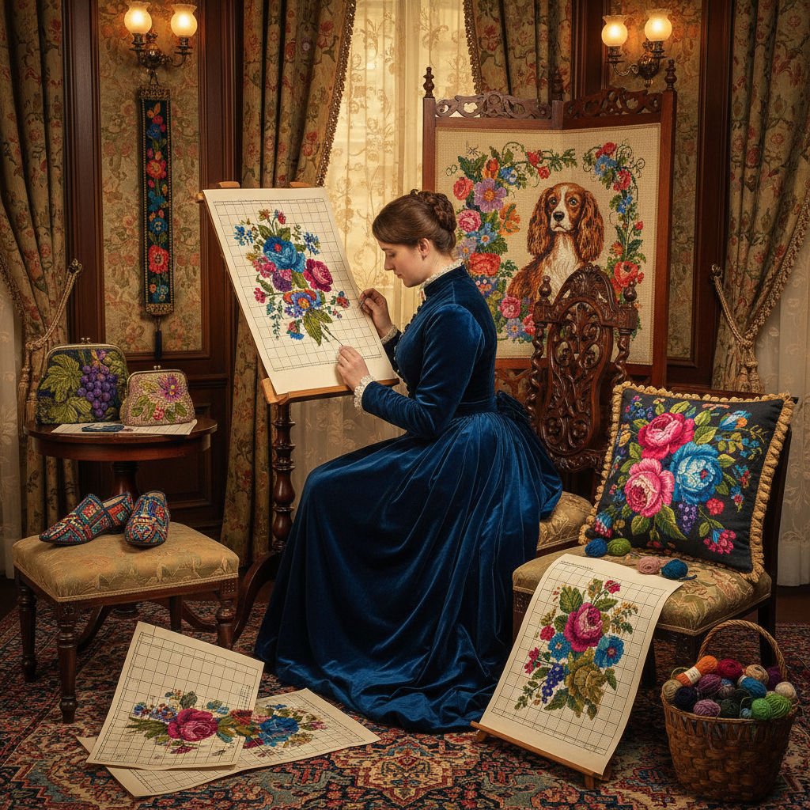

# Berliner Wool Work 柏林毛线绣

> "Berlin wool work is painting by numbers in yarn — hand-colored charts on gridded paper guiding cross stitches in brilliant aniline-dyed wools onto canvas, creating pictures of impossible color intensity that decorated every Victorian parlor, democratizing needlework by separating design from execution." — Unknown

## 概述

柏林毛线绣（Berlin Wool Work/Berliner Arbeit）是19世纪最流行的刺绣形式——使用彩色毛线在网格帆布（canvas）上按照印刷的彩色图案（Berlin patterns）进行十字绣或帐篷针（tent stitch）刺绣。这种技法的革命性在于：它首次将设计与执行分离——任何人只要按照彩色图表逐格填色，就能完成复杂的图案，无需设计能力。

柏林毛线绣起源于1804年的柏林——出版商开始在方格纸上印刷手工着色的刺绣图案。随着1856年合成苯胺染料的发明，毛线的颜色变得极其鲜艳。柏林毛线绣在维多利亚时代的英国和美国达到狂热——用于椅垫、脚凳、壁挂、拖鞋、钱包等几乎所有家居物品。图案主题包括：花卉（尤其是玫瑰）、宠物、风景、宗教场景和名画复制。

## 核心特征

| 特征 | 描述 |
|------|------|
| 图表 | 按彩色图表刺绣 |
| 帆布 | 在网格帆布上 |
| 毛线 | 使用彩色毛线 |
| 鲜艳 | 苯胺染料的鲜艳色彩 |
| 普及 | 大众化的刺绣 |
| 维多利亚 | 维多利亚时代的流行 |

## 视觉特征

- **鲜艳**：极其鲜艳的色彩
- **像素**：网格化的像素感
- **花卉**：大量的花卉图案
- **写实**：追求写实的图像
- **密集**：密集的针脚覆盖
- **装饰**：强烈的装饰性

## 代表作品

| 作品 | 艺术家 | 年代 | 意义 |
|------|--------|------|------|
| *Berlin pattern publishers* | Various | 1804-1870s | 柏林图案出版 |
| *Victorian cushions and screens* | Various | 维多利亚时代 | 维多利亚家居 |
| *Floral Berlin work* | Various | 19世纪 | 花卉柏林绣 |
| *Beaded Berlin work* | Various | 19世纪 | 珠饰柏林绣 |
| *Plushwork Berlin* | Various | 19世纪 | 绒毛柏林绣 |

## 历史时间线

| 时期 | 事件 |
|------|------|
| 1804年 | 柏林图案出版的开始 |
| 1830-40年代 | 柏林毛线绣的流行 |
| 1850-70年代 | 柏林毛线绣的鼎盛 |
| 1870年代后 | 工艺美术运动的批评 |
| 当代 | 柏林毛线绣的历史研究 |

## 中国语境

柏林毛线绣在中国没有直接的传统，但其"按图表刺绣"的理念与中国当代流行的十字绣（cross stitch kit）完全一致——中国2000年代的十字绣热潮本质上是柏林毛线绣理念的现代延续。中国的十字绣产业（图案设计、材料包销售）与19世纪柏林图案产业有惊人的相似性。中国的十字绣爱好者数以百万计，他们的实践直接继承了柏林毛线绣"按图填色"的传统。

## AI生成概念图

## 与其他风格的关系

- **Cross Stitch** → 十字绣
- **Needlepoint** → 针绣
- **Tapestry** → 挂毯
- **Crewel** → 毛线刺绣
- **Victorian Art** → 维多利亚艺术
- **Pixel Art** → 像素艺术

---

*浮光艺志 | Chronicle of Artistry*
