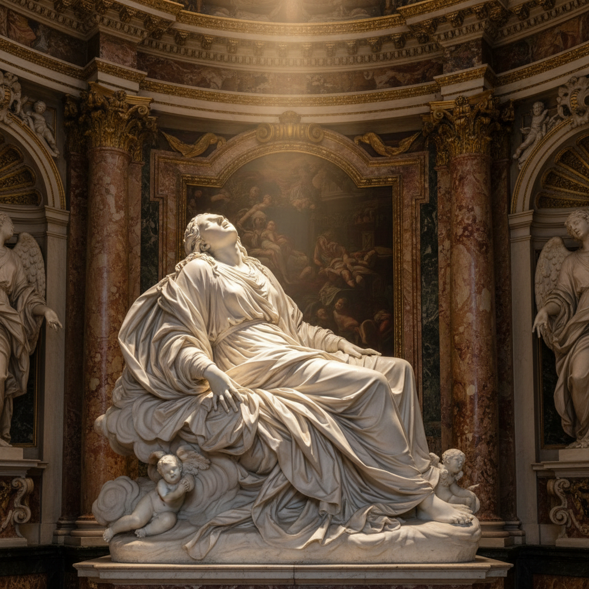

# Gian Lorenzo Bernini 贝尼尼

> "A man who is master of an art may sometimes work in a style that appears incorrect to those less skilled." — Gian Lorenzo Bernini

## 概述

吉安·洛伦佐·贝尼尼（Gian Lorenzo Bernini，1598–1680）是意大利巴洛克艺术的最伟大天才，集雕塑家、建筑师、画家和舞台设计师于一身。他以超越人类极限的大理石雕塑闻名——将冰冷的石头变成飘动的布料、流动的头发和颤抖的肌肤，创造出戏剧性的瞬间永恒。

## 核心特征

| 特征 | 描述 |
|------|------|
| 大理石奇迹 | 石头变成布料、肌肤、火焰 |
| 戏剧瞬间 | 捕捉最高潮的动态时刻 |
| 多视角 | 雕塑从每个角度都完美 |
| 光线设计 | 建筑与雕塑的光影整合 |
| 情感极致 | 狂喜、痛苦、爱的视觉化 |
| 城市舞台 | 罗马广场和喷泉的总设计师 |

## 代表作品

| 作品 | 年代 | 意义 |
|------|------|------|
| *The Ecstasy of Saint Teresa* | 1647–52 | 巴洛克雕塑的巅峰 |
| *Apollo and Daphne* | 1622–25 | 变形瞬间的永恒 |
| *David* | 1623–24 | 动态雕塑的革命 |
| *St. Peter's Square Colonnade* | 1656–67 | 巴洛克城市设计的杰作 |

## AI生成概念图

## 与其他风格的关系

- **Baroque** → 巴洛克艺术的最高代表
- **Michelangelo** → 继承并超越文艺复兴雕塑
- **Caravaggio** → 共享戏剧性光影
- **Rococo** → 影响了洛可可的动态优雅
