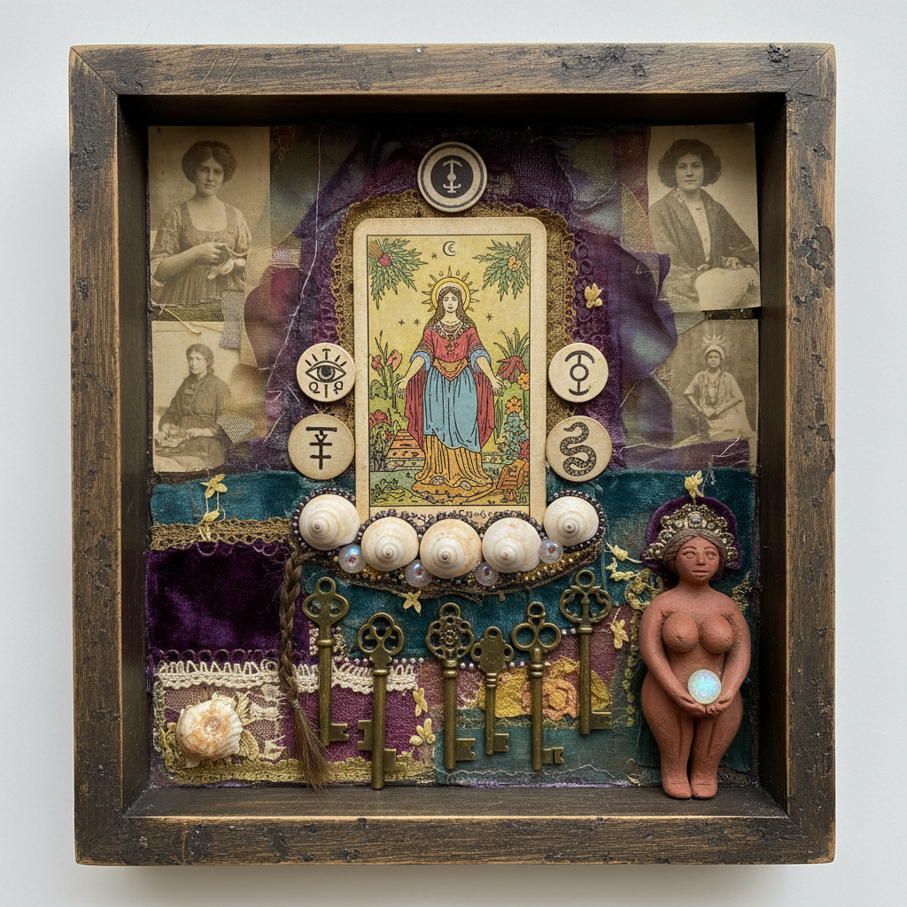

# Betye Saar 贝蒂·萨尔

> **时期：** 1926–至今  
> **关键词：** 集合艺术、种族刻板印象颠覆、神秘主义、回收记忆

## 概述

Betye Saar 是美国集合艺术（assemblage）的先驱，以将种族刻板印象物件转化为赋权符号而闻名。她的标志性作品将旧窗框、照片、护身符、贝壳和种族歧视纪念品重新组合为充满神秘力量的祭坛式装置，融合了非洲精神传统、巫术和女性主义。

## 风格特征

- **集合/装配**：将现成物件在盒子或窗框中组合为叙事性装置
- **种族符号颠覆**：将"Aunt Jemima"等歧视性形象转化为反抗的武器
- **神秘主义层次**：融入塔罗牌、占星术、非洲宗教符号等神秘元素
- **记忆考古**：使用旧照片、信件、织物等承载个人和集体记忆的物件
- **祭坛美学**：作品具有仪式性和神圣感，如同私人祭坛或圣物箱

## 代表作品

- *The Liberation of Aunt Jemima*（1972）
- *Black Girl's Window*（1969）
- *Mti*（1973）
- *Mystic Window for Leo*（1966）

## 历史意义

Saar 的《Aunt Jemima的解放》被视为黑人女性主义艺术的里程碑，她将种族歧视的视觉垃圾转化为政治武器的策略影响了此后数十年的身份政治艺术。她至今仍在创作，年近百岁。

## 概念图

