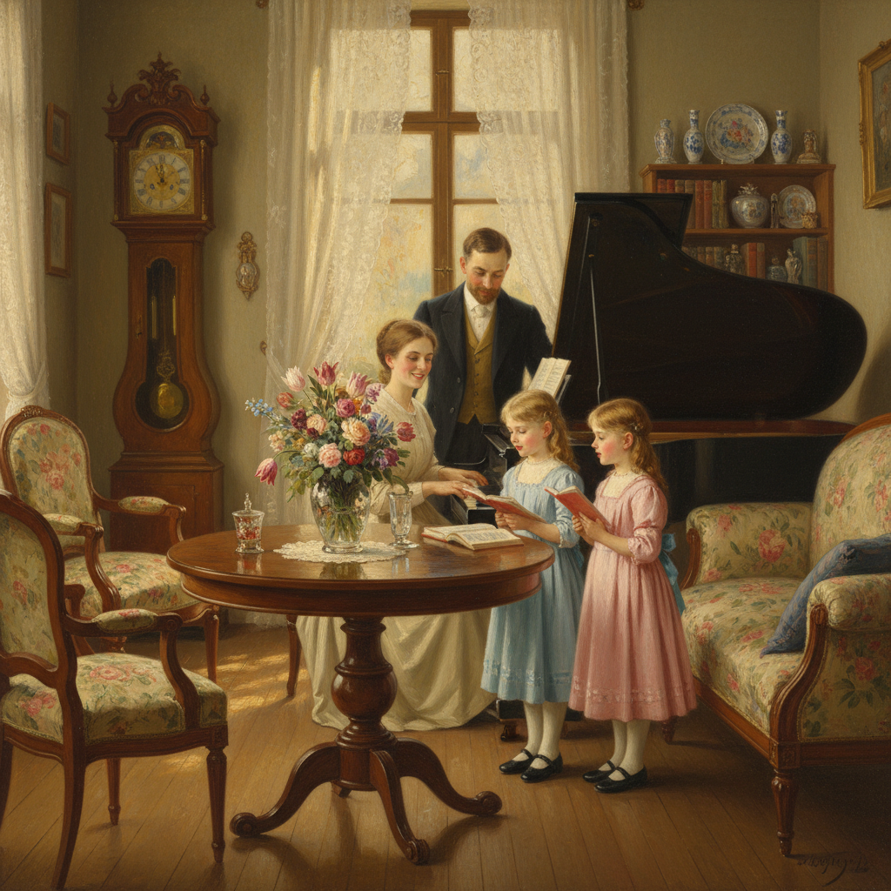

# Biedermeier Painting 比德迈尔绘画

> **时期：** 1815年–1848年  
> **关键词：** 中产阶级、家庭温馨、室内场景、维也纳、朴素幸福

## 概述

Biedermeier Painting（比德迈尔绘画）是1815年维也纳会议后至1848年革命之间中欧中产阶级文化的视觉表达——在政治压抑的年代，人们将注意力转向私人生活的小确幸。瓦尔德米勒的阳光花园、施皮茨韦格的小人物——比德迈尔画家用精致的技法描绘家庭聚会、花卉静物和宁静风景，创造出一个温暖、有序、令人安心的小世界。

## 风格特征

- **家庭场景**：室内聚会、阅读、音乐
- **精致技法**：细腻光滑的表面处理
- **温暖光线**：阳光透过窗帘的柔和效果
- **小尺幅**：适合中产阶级客厅的画作
- **朴素幸福**：日常生活中的小美好

## 代表人物与作品

- 费迪南德·格奥尔格·瓦尔德米勒 花园场景
- 卡尔·施皮茨韦格《穷诗人》
- 弗里德里希·冯·阿默林 肖像画
- 彼得·芬迪 家庭场景

## 概念图

