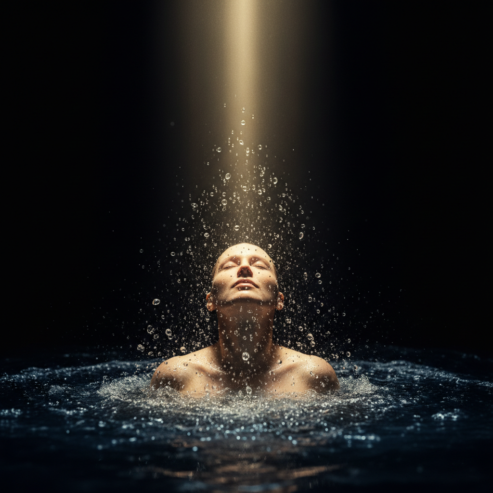

# Bill Viola 比尔·维奥拉

> **流派**: 视频艺术 · 新媒体艺术  
> **时期**: 1951–2024 美国  
> **关键词**: 慢动作视频、水与火、生死主题、精神性

## 概述

比尔·维奥拉是视频艺术领域最重要的艺术家之一。他用极度缓慢的影像捕捉人类最深层的情感——出生、死亡、悲伤、顿悟。他的作品常以水、火、光为元素，将文艺复兴绘画的庄严感与当代技术结合，创造出具有冥想品质的沉浸式体验。

## 视觉特征

- **极慢动作**: 将几秒的动作延展为数分钟
- **水与火**: 人体穿越水幕或火焰的仪式感
- **黑暗空间**: 在全黑展厅中投射巨幅影像
- **文艺复兴构图**: 借鉴古典绘画的人物姿态和光线
- **情感极端**: 捕捉哭泣、尖叫、沉思等极端表情

## 代表作品

- 《升天》(The Ascension, 2000)
- 《五天使千年》(Five Angels for the Millennium, 2001)
- 《殉道者》(Martyrs, 2014)
- 《特里斯坦的升天》(Tristan's Ascension, 2005)
- 《纳特的十字路口》(The Crossing, 1996)

## 历史影响

维奥拉证明了视频可以达到与古典绘画同等的精神深度和情感力量。他将技术媒介从冷冰冰的记录工具提升为探索人类灵魂的容器，影响了整整一代新媒体艺术家。

## 相关风格

- [Video Art 视频艺术](video-art.md)
- [Nam June Paik 白南准](nam-june-paik.md)
- [New Media Art 新媒体艺术](new-media-art.md)
