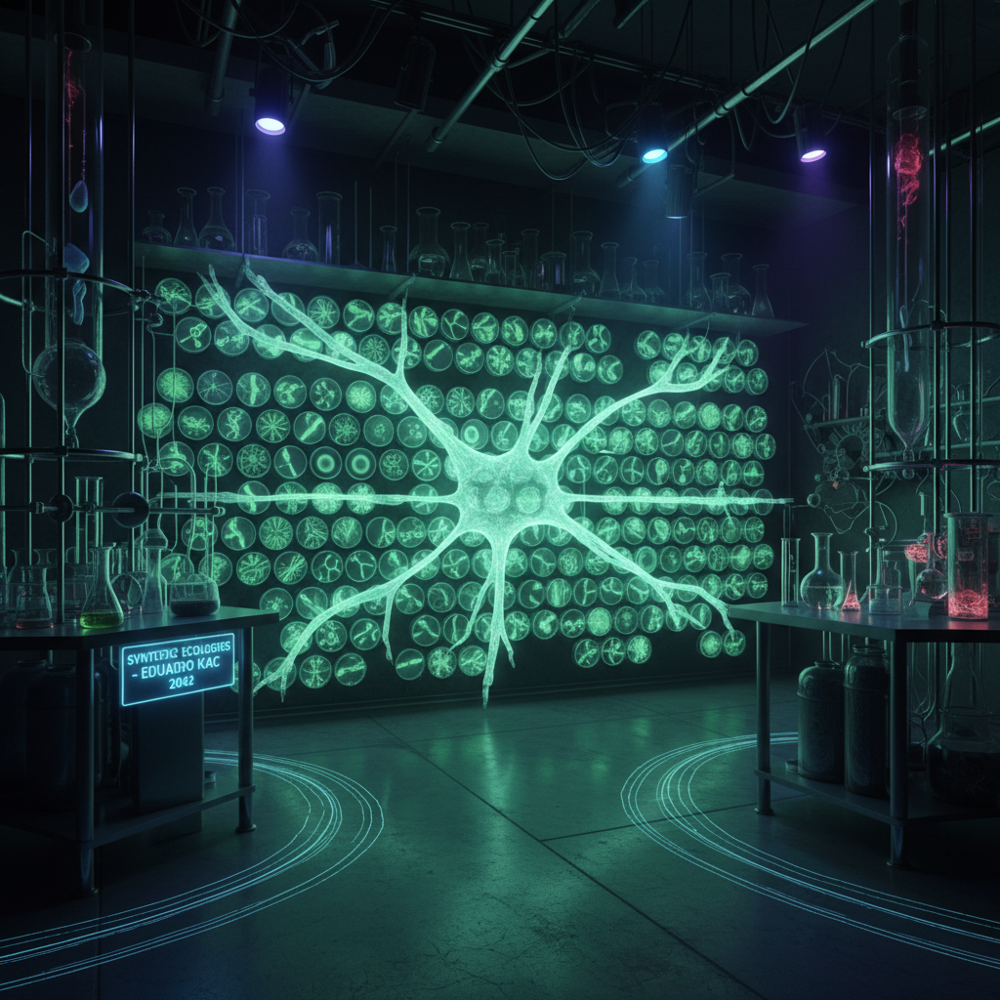

# Bio Art 生物艺术



> **"当艺术家的画笔是基因、画布是活细胞——生命本身成为创作媒介。"**

## 概述

| 维度 | 描述 |
|------|------|
| 时期 | 1990s–至今 |
| 别名 | Bio Art, 生物艺术, Biotech Art, Wet Art, Living Art |
| 核心色彩 | 生物荧光绿、培养基琥珀、组织粉红、实验室白 |
| 关键元素 | 活体材料、基因工程、微生物、生态系统、伦理 |
| 代表人物 | Eduardo Kac, Stelarc, Suzanne Anker, Heather Dewey-Hagborg |
| 关联风格 | New Media Art, Conceptual Art, Land Art, Science Art |

---

## 历史脉络

| 年份 | 事件 |
|------|------|
| 1936 | Edward Steichen用秋水仙素改变植物——生物艺术前史 |
| 1990s | 生物技术进入艺术家工作室 |
| 2000 | Eduardo Kac "GFP Bunny"——荧光兔Alba |
| 2004 | SymbioticA实验室——艺术家驻留生物实验室 |
| 2010s | DIY生物学+生物黑客运动 |
| 2020s | CRISPR+合成生物学+AI = 新可能 |

### 核心哲学

生物艺术的精神是**"生命不是观察对象——是创作媒介和合作者"**：
- "当我们能编辑基因——'自然'还意味着什么？"
- "生物艺术不是用生物做装饰——是质疑生命的定义"
- "每一件生物艺术品都是活的——它会生长、变化、死亡"
- "伦理不是限制——是作品的核心议题"
- "实验室是新的工作室——培养皿是新的画布"

---

## 视觉语法

### 材料系统

```
活体材料：
  微生物 — 细菌、酵母、藻类
  组织 — 细胞培养、组织工程
  植物 — 转基因、嫁接、生长
  动物 — 基因编辑、共生

技术：
  基因工程 — CRISPR、GFP、合成生物学
  细胞培养 — 组织工程、生物打印
  微生物学 — 培养、发酵、生态
  数据 — DNA存储、生物计算

美学：
  实验室 — 培养皿、试管、显微镜
  生长 — 有机形态、不可预测
  荧光 — GFP绿、生物发光
  衰败 — 死亡、分解、循环

规则：
  - 必须涉及真实的生物过程
  - 伦理反思是作品的一部分
  - 作品是活的（或曾经活的）
  - 不可完全控制结果
```

---

## 与千禧怀旧/当代的关系

### 合成生物学时代
- CRISPR = 人人可用的基因编辑 = 生物艺术民主化
- "当基因编辑像Photoshop一样简单——每个人都是生物艺术家？"
- 生物设计 = 生物艺术的商业化

### 生态危机与生物艺术
- 气候变化 = 生物艺术的紧迫性
- "用艺术让人感受生态系统的脆弱"
- 跨物种共情 = 生物艺术的伦理贡献

---

## 设计应用

| 场景 | 应用方式 |
|------|----------|
| 材料 | 生物材料+可降解+活体材料 |
| 时尚 | 生物面料+菌丝体+活体染色 |
| 建筑 | 活体建筑+生物混凝土+绿色墙 |
| 食品 | 培养肉+发酵设计+食物未来 |

---

## 相关风格

← [New Media Art 新媒体艺术](new-media-art.md) | [AI Art AI艺术](ai-art.md) →

↑ [返回千禧怀旧目录](README.md) | [返回总目录](../README.md)
