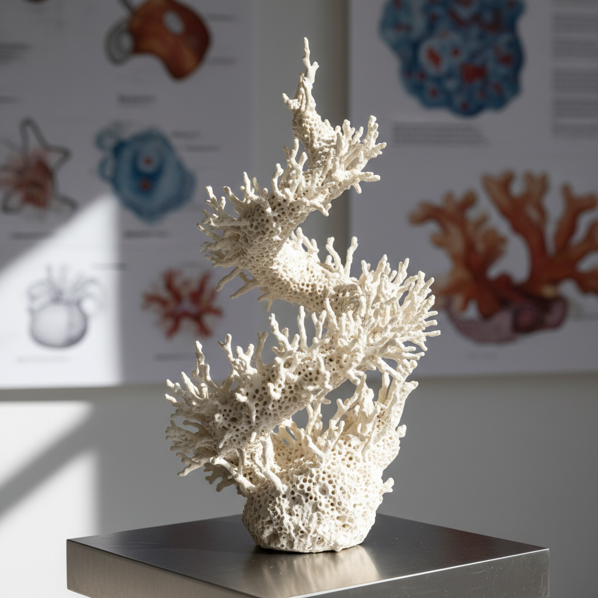

# Bio-Ceramic Art 生物陶瓷艺术

> "When biology meets ceramics, the boundary between the living and the mineral dissolves." — Contemporary bio-art

## 概述

生物陶瓷艺术（Bio-Ceramic Art）是将生物学原理、生物材料和生命过程与陶瓷艺术相结合的当代跨学科实践。生物陶瓷艺术探索的是陶瓷与生命之间的边界——从利用微生物（如菌丝体、细菌）参与陶瓷创作过程，到模仿生物结构设计陶瓷形态，再到开发可降解或可与生物体共存的陶瓷材料。

生物陶瓷艺术的兴起反映了21世纪艺术与科学深度融合的趋势。一方面，生物医学领域的生物陶瓷（如羟基磷灰石、生物活性玻璃）已经广泛用于骨骼修复和牙科——这些"活在人体内的陶瓷"本身就具有深刻的艺术哲学意义。另一方面，当代艺术家开始探索让微生物参与陶瓷创作——利用细菌产生的矿化作用形成陶瓷般的结构，或让菌丝体在陶瓷模具中生长形成有机形态。

生物陶瓷艺术的核心要素包括：1）生物材料——利用生物来源的陶瓷材料；2）微生物参与——细菌、真菌参与创作过程；3）仿生设计——模仿生物结构的陶瓷设计；4）可降解性——探索可降解陶瓷材料；5）医学陶瓷——人体内的生物陶瓷；6）生态意识——环境友好的陶瓷实践；7）跨学科——艺术、生物学、材料科学的交叉。

## 核心特征

| 特征 | 描述 |
|------|------|
| 生物材料 | 生物来源陶瓷材料 |
| 微生物参与 | 细菌真菌参与创作 |
| 仿生设计 | 模仿生物结构设计 |
| 可降解性 | 探索可降解陶瓷 |
| 医学陶瓷 | 人体内生物陶瓷 |
| 跨学科 | 艺术生物学材料科学交叉 |

## 视觉特征

- **有机形态**：模仿骨骼、珊瑚的有机形态
- **多孔结构**：类似骨骼的多孔结构
- **生长痕迹**：微生物生长留下的痕迹
- **白色质感**：骨瓷般的白色质感
- **珊瑚纹理**：类似珊瑚的分支结构
- **半透明**：薄壁生物陶瓷的半透明效果

## 代表作品

| 作品 | 年代 | 意义 |
|------|------|------|
| *骨骼修复生物陶瓷* | 1970年代至今 | 医学应用 |
| *菌丝体陶瓷复合材料* | 2010年代 | 生物制造 |
| *细菌矿化陶瓷* | 2015至今 | 微生物参与 |
| *仿生珊瑚陶瓷* | 当代 | 仿生设计 |
| *可降解陶瓷花盆* | 当代 | 生态设计 |
| *人工骨骼支架* | 当代 | 3D打印生物陶瓷 |

## 历史时间线

| 时期 | 事件 |
|------|------|
| 1970年代 | 生物活性玻璃发明 |
| 1980年代 | 羟基磷灰石陶瓷用于骨修复 |
| 2000年代 | 仿生陶瓷设计兴起 |
| 2010年代 | 微生物参与陶瓷创作 |
| 2015年 | 3D打印生物陶瓷骨骼支架 |
| 当代 | 生物陶瓷艺术成为独立领域 |

## 中国语境

中国在生物陶瓷领域有着重要的研究和应用。中国科学院上海硅酸盐研究所等机构在生物活性陶瓷材料方面处于国际前沿——开发了多种用于骨骼修复的生物陶瓷材料。中国传统陶瓷中的"骨瓷"（bone china）——以动物骨灰为原料——可以被视为最早的"生物陶瓷"之一，虽然其目的是美学而非医学。中国丰富的生物多样性为仿生陶瓷设计提供了无穷的灵感来源——从竹子的中空结构到莲藕的多孔形态，从贝壳的层状结构到蜘蛛丝的强度。生物陶瓷艺术为中国陶瓷传统注入了全新的科学维度——将千年的制瓷智慧与当代生物技术相结合。

## 概念图

## 与其他风格的关系

- **Ceramic 3D Printing** → 陶瓷3D打印（制造技术）
- **Digital Ceramic** → 数字陶瓷（技术融合）
- **Bio Art** → 生物艺术（艺术运动）
- **Biomimicry** → 仿生学
- **Sustainable Design** → 可持续设计
- **Medical Ceramics** → 医学陶瓷

---

*浮光艺志 | Chronicle of Artistry*
