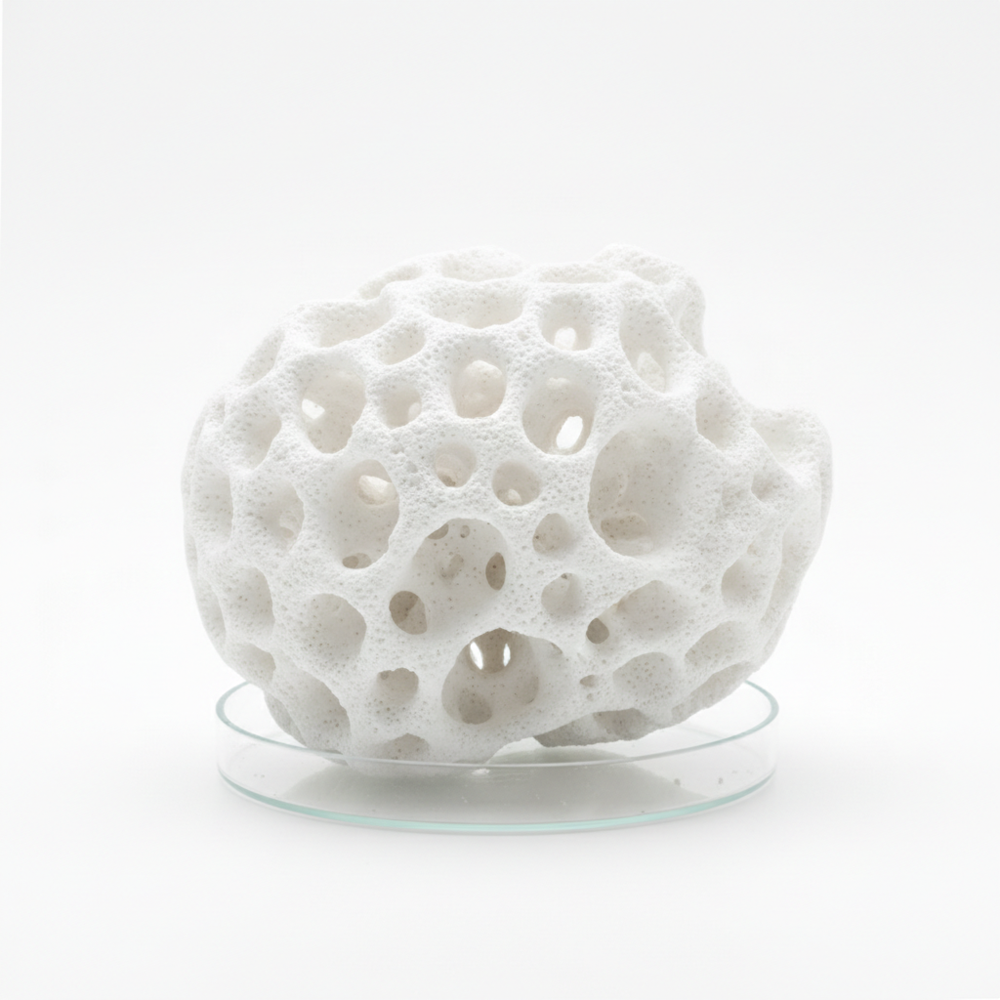

# Bio Ceramics Art 生物陶瓷艺术

> "Bio ceramics is clay reimagined for the living body — hydroxyapatite and calcium phosphate shaped into scaffolds that bone grows through, zirconia milled into teeth indistinguishable from nature, alumina polished into joints that flex for decades without wear, the oldest material on earth repurposed for the newest medicine, ceramics no longer holding life's water but becoming part of life itself." — Unknown

## 概述

生物陶瓷艺术（Bio Ceramics Art）是一种将陶瓷材料应用于生物医学和生命科学领域的跨学科艺术与科学形式。生物陶瓷包括用于骨骼修复的羟基磷灰石、用于牙科修复的氧化锆、用于关节置换的氧化铝等——这些材料与人体具有良好的生物相容性。生物陶瓷艺术探索的是陶瓷材料与生命体之间的关系——当古老的陶瓷材料进入人体，它不再是容器，而成为生命的一部分。

生物陶瓷艺术的核心要素包括：1）生物相容——与人体组织和谐共存；2）功能修复——修复或替代人体组织；3）材料科学——精确控制的材料性能；4）微观结构——纳米级的结构设计；5）生命融合——与活体组织的融合；6）跨学科——医学、材料学和艺术的交叉；7）未来指向——指向人体增强的未来。

## 核心特征

| 特征 | 描述 |
|------|------|
| 生物相容 | 与人体组织和谐共存 |
| 功能修复 | 修复或替代人体组织 |
| 精密制造 | 纳米级的精密制造 |
| 生命融合 | 与活体组织融合生长 |
| 跨学科 | 医学与材料学的交叉 |
| 未来指向 | 人体修复的未来方向 |

## 视觉特征

- **多孔结构**：模拟骨骼的多孔结构
- **白色纯净**：高纯度的白色材料
- **微观之美**：电子显微镜下的微观结构
- **仿生形态**：模拟自然组织的形态
- **精密加工**：计算机辅助的精密加工
- **透明质感**：牙科陶瓷的透明质感

## 代表作品

| 作品 | 艺术家/文化 | 年代 | 意义 |
|------|-------------|------|------|
| *羟基磷灰石骨支架* | 材料科学家 | 当代 | 骨修复的突破 |
| *氧化锆牙冠* | 牙科技术 | 当代 | 牙科修复的革命 |
| *生物陶瓷艺术装置* | 当代艺术家 | 当代 | 生物陶瓷的艺术化 |
| *3D打印生物陶瓷* | 研究机构 | 当代 | 个性化医疗 |
| *陶瓷人工关节* | 医疗器械 | 当代 | 关节置换技术 |

## 历史时间线

| 时期 | 事件 |
|------|------|
| 1960年代 | 生物陶瓷概念的提出 |
| 1970年代 | 氧化铝人工关节的应用 |
| 1980年代 | 羟基磷灰石骨修复材料 |
| 2000年代 | 氧化锆牙科修复的普及 |
| 当代 | 3D打印个性化生物陶瓷 |

## 中国语境

中国在生物陶瓷研究领域处于世界前列——中国科学院上海硅酸盐研究所等机构在生物陶瓷领域有重要贡献。中国的生物陶瓷产业正在快速发展——从牙科修复到骨科植入，中国制造的生物陶瓷产品正在服务越来越多的患者。中国当代艺术家也开始关注生物陶瓷的美学维度——探索当陶瓷进入人体后，器物与生命之间的哲学关系。生物陶瓷将中国数千年的陶瓷传统延伸到了一个全新的维度——从"器以载道"到"器以载生"，陶瓷不再只是承载文化的容器，而成为承载生命的材料。

## AI生成概念图

## 与其他风格的关系

- **Nano Ceramics** → 纳米陶瓷
- **3D Printed Ceramics** → 3D打印陶瓷
- **Material Science** → 材料科学
- **Medical Art** → 医学艺术
- **Biomimicry** → 仿生学
- **Future Ceramics** → 未来陶瓷

---

*浮光艺志 | Chronicle of Artistry*
