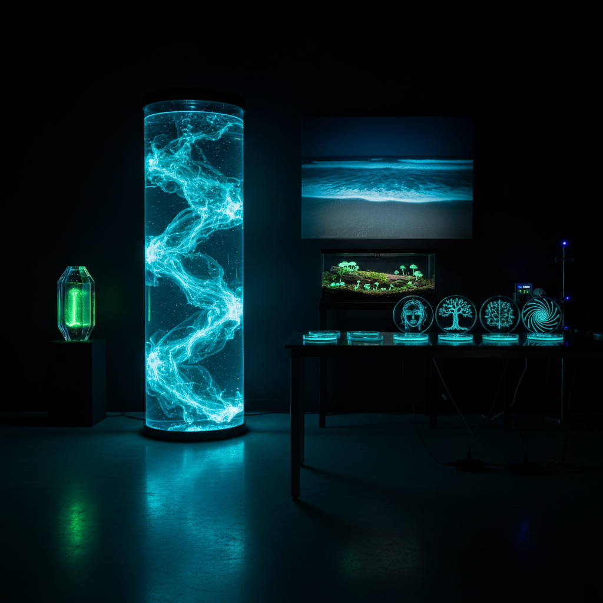

# Bioluminescence Art 生物发光艺术

> "Bioluminescence is nature's own light art — living organisms that glow in the dark, from deep-sea jellyfish to fireflies, from glowing plankton to foxfire fungi. When artists harness this living light, they create works that are literally alive: breathing, growing, responding to their environment, and eventually dying. It is art that participates in the cycle of life." — Unknown

## 概述

生物发光艺术（Bioluminescence Art）是利用生物发光现象进行艺术创作的实践——使用能够自然发光的生物体（如发光细菌、荧光蛋白、发光藻类、萤火虫）或受生物发光启发的材料和技术，创造活的发光艺术作品。生物发光艺术是生物学、生态学和艺术的前沿交叉。

生物发光艺术的实践包括：1）活体发光装置——用发光细菌或藻类创造的活的发光作品；2）生物发光摄影——拍摄自然界生物发光现象的艺术摄影；3）基因艺术——用荧光蛋白基因改造生物创造发光生命体；4）仿生发光——模拟生物发光效果的人工材料和装置；5）海洋发光——利用发光浮游生物创造的海洋光艺术；6）菌丝发光——利用发光真菌创造的作品；7）萤火虫艺术——以萤火虫为主题或媒介的艺术。

## 核心特征

| 特征 | 描述 |
|------|------|
| 活体 | 活的生物为媒介 |
| 自发光 | 无需外部光源 |
| 有机 | 有机的光线质感 |
| 生态 | 生态意识 |
| 短暂 | 生命周期限制 |
| 神秘 | 神秘的美感 |

## 视觉特征

- **蓝绿**：典型的蓝绿色生物光
- **柔和**：极其柔和的光线
- **脉动**：有节奏的明暗变化
- **有机**：有机的形态和分布
- **黑暗**：需要黑暗环境
- **流动**：液态的流动感

## 代表作品

| 作品 | 艺术家 | 年代 | 意义 |
|------|--------|------|------|
| *Bioluminescent art* | Eduardo Kac | 2000 | GFP兔子（基因艺术） |
| *Dino Pet* | Yonder Biology | 2013 | 发光藻类宠物 |
| *Bio-luminescent forest* | Various | 当代 | 发光森林装置 |
| *Plankton installations* | Various | 当代 | 发光浮游生物装置 |
| *Firefly photography* | Various | 当代 | 萤火虫摄影 |

## 历史时间线

| 时期 | 事件 |
|------|------|
| 古代 | 人类观察生物发光现象 |
| 19世纪 | 生物发光的科学研究 |
| 1960年代 | GFP（绿色荧光蛋白）的发现 |
| 2000年代 | 生物发光进入当代艺术 |
| 当代 | 合成生物学与艺术结合 |

## 中国语境

生物发光艺术在中国有独特的文化背景。中国传统文化中对萤火虫有深厚的情感——"囊萤映雪"的典故、李白"银烛秋光冷画屏，轻罗小扇扑流萤"的诗句，萤火虫是中国文化中浪漫和勤学的象征。中国近年来的"萤火虫主题公园"和萤火虫观赏活动引发了关于生态保护的讨论。中国的一些当代艺术家和科学家在探索生物发光艺术——用发光藻类创造装置、用荧光蛋白技术进行生物艺术实验。中国沿海地区偶尔出现的"蓝眼泪"（发光藻类）现象也激发了艺术创作。中国的合成生物学研究也在为生物发光艺术提供新的可能性。

## AI生成概念图

## 与其他风格的关系

- **Bio Art** → 生物艺术
- **Light Art** → 光艺术
- **Ecological Art** → 生态艺术
- **Science Art** → 科学艺术
- **Installation Art** → 装置艺术
- **Living Art** → 活体艺术

---

*浮光艺志 | Chronicle of Artistry*
