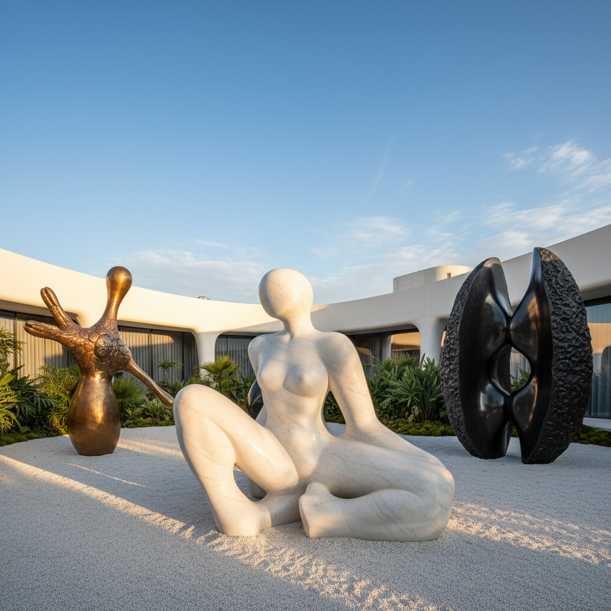

# Biomorphic Art 生物形态艺术

> "Biomorphic art draws from the deepest well of form — the shapes that life itself has invented over billions of years of evolution, the curves of cells and shells and bones and leaves, the branching of rivers and lungs and lightning, the spirals of galaxies and snails and DNA, an art that recognizes these forms not as mere decoration but as the fundamental vocabulary of existence, the geometry of growth and decay, the architecture of the living world that we carry in our own bodies and rediscover every time we pick up a brush or shape a piece of clay." — Unknown

## 概述

生物形态艺术（Biomorphic Art）是一种以有机的、类似生物的形态为核心视觉语言的艺术实践。"Biomorphic"一词由英国艺术评论家Geoffrey Grigson在1930年代提出，用来描述那些从自然生物形态中汲取灵感但并非直接模仿自然的抽象艺术。

生物形态艺术的形式语言包括：流动的曲线、细胞状的形态、类似骨骼或贝壳的结构、触手和伪足状的延伸、以及暗示生长和变形的动态形态。这种美学在20世纪的多个艺术运动中都有体现：超现实主义（如Yves Tanguy、Joan Miró）、抽象表现主义（如Arshile Gorky）、雕塑（如Henry Moore、Barbara Hepworth、Jean Arp）、以及建筑（如Eero Saarinen的TWA航站楼）。在当代，生物形态美学影响了参数化建筑、产品设计、数字艺术和生物艺术。

## 核心特征

| 特征 | 描述 |
|------|------|
| 有机 | 有机的曲线形态 |
| 生长 | 暗示生长的动态 |
| 细胞 | 细胞和微生物的形态 |
| 流动 | 流动和变形 |
| 自然 | 自然形态的抽象 |
| 生命 | 生命力的表达 |

## 视觉特征

- **曲线**：流动的有机曲线
- **膨胀**：膨胀和收缩的形态
- **触手**：触手和伪足状延伸
- **孔洞**：穿透和孔洞
- **表面**：光滑的有机表面
- **对称**：不完美的对称

## 代表作品

| 作品 | 艺术家 | 年代 | 意义 |
|------|--------|------|------|
| *Reclining Figure* | Henry Moore | 1951 | 生物形态雕塑 |
| *Concretion* | Jean Arp | 1930年代 | 有机抽象 |
| *The Liver is the Cock's Comb* | Arshile Gorky | 1944 | 生物形态绘画 |
| *TWA Terminal* | Eero Saarinen | 1962 | 生物形态建筑 |
| *Parametric design* | Zaha Hadid | 2000年代 | 当代生物形态建筑 |

## 历史时间线

| 时期 | 事件 |
|------|------|
| 1930年代 | "Biomorphic"术语的提出 |
| 1940年代 | 超现实主义中的生物形态 |
| 1950-60年代 | 雕塑和建筑中的应用 |
| 2000年代 | 参数化设计的兴起 |
| 当代 | 生物启发设计的主流化 |

## 中国语境

生物形态艺术在中国有深厚的文化共鸣。中国传统艺术中充满了有机的、生物形态的视觉语言——从太湖石的自然穿孔形态，到云纹和水纹的流动曲线，到龙凤等神话生物的有机造型，到传统建筑中的曲线屋顶。中国当代建筑中，MAD建筑事务所（马岩松）的作品体现了强烈的生物形态美学——如哈尔滨大剧院的雪丘造型、梦露大厦的扭转形态。中国的一些当代雕塑家和数字艺术家也在探索生物形态的可能性，将传统的有机美学与当代技术结合。

## AI生成概念图

## 与其他风格的关系

- **Surrealism** → 超现实主义
- **Organic Architecture** → 有机建筑
- **Abstract Art** → 抽象艺术
- **Parametric Design** → 参数化设计
- **Bio Art** → 生物艺术
- **Art Nouveau** → 新艺术运动

---

*浮光艺志 | Chronicle of Artistry*
