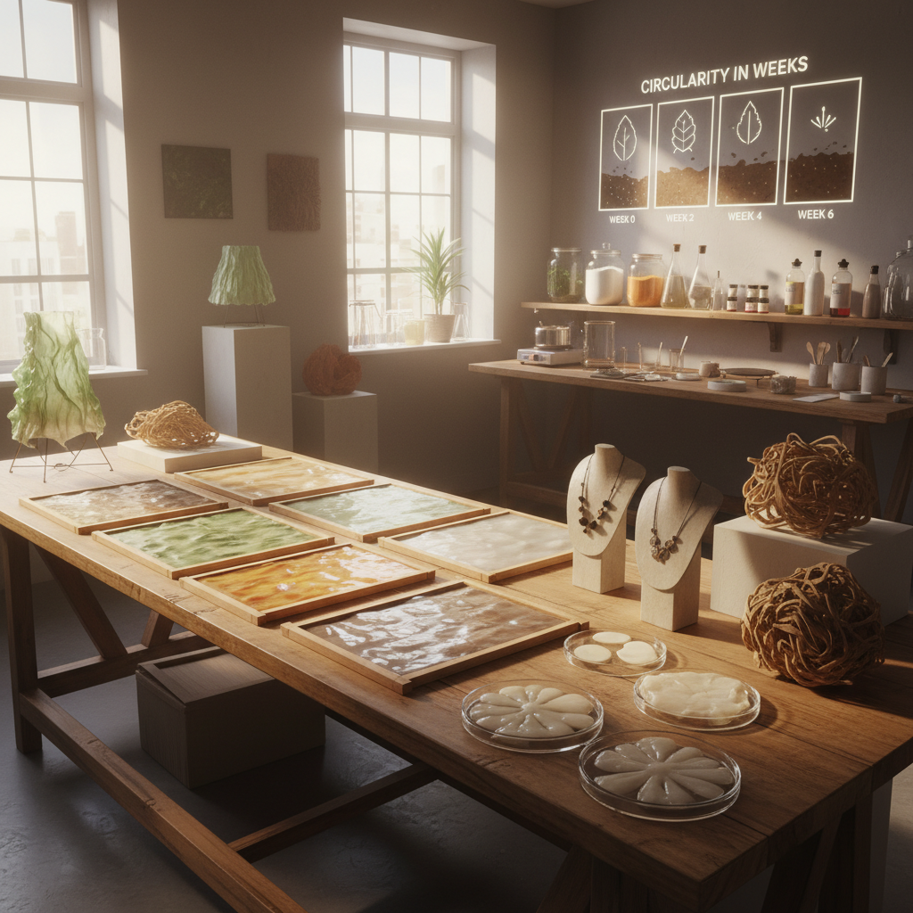

# Bioplastic Art 生物塑料艺术

> "Bioplastic art reimagines material culture — it asks what happens when we replace the petroleum-based plastics that define our age with materials grown from algae, bacteria, agricultural waste, and mycelium, creating objects that are born from the living world and can return to it, that decompose rather than persist, that nourish rather than pollute, and that prove that beauty and sustainability are not opposites but natural partners." — Unknown

## 概述

生物塑料艺术（Bioplastic Art）是使用生物基和可生物降解的塑料替代材料进行创作的艺术实践。生物塑料——由植物淀粉、藻类、细菌纤维素、菌丝体等生物材料制成的类塑料材料——代表了一种从石油基材料向生物基材料转变的可持续设计方向。

生物塑料艺术的实践包括：1）DIY生物塑料——用厨房材料（明胶、琼脂、淀粉、甘油）制作可降解的类塑料薄膜和片材；2）藻类塑料——用藻类生长制作半透明的生物材料；3）细菌纤维素——用醋酸菌等细菌培养的纤维素膜作为材料；4）菌丝体复合材料——用真菌菌丝体生长的材料替代泡沫塑料和包装材料；5）食物废料材料——将果皮、咖啡渣等食物废料转化为材料。

## 核心特征

| 特征 | 描述 |
|------|------|
| 生物基 | 生物来源材料 |
| 可降解 | 可生物降解 |
| 可持续 | 可持续设计 |
| DIY | 可自制 |
| 活体 | 活体材料 |
| 循环 | 循环经济 |

## 视觉特征

- **半透明**：半透明的薄膜
- **有机**：有机的纹理和色彩
- **不完美**：自然的不规则性
- **变化**：随时间变化的材料
- **色彩**：天然色素的色彩
- **质感**：独特的触感质地

## 代表作品

| 作品 | 艺术家 | 年代 | 意义 |
|------|--------|------|------|
| *Algae-based materials* | Various | 2010年代 | 藻类材料 |
| *Bacterial cellulose fashion* | Suzanne Lee | 2010年代 | 细菌纤维素时尚 |
| *Mycelium packaging* | Ecovative | 2010年代 | 菌丝体包装 |
| *DIY bioplastic workshops* | Various | 2010年代 | DIY生物塑料 |
| *Compostable design* | Various | 当代 | 可堆肥设计 |

## 历史时间线

| 时期 | 事件 |
|------|------|
| 2000年代 | 生物塑料研究的加速 |
| 2010年代 | 设计师开始使用生物塑料 |
| 2010年代 | DIY生物塑料运动 |
| 2020年代 | 生物塑料的商业化 |
| 当代 | 与循环经济的融合 |

## 中国语境

生物塑料艺术在中国有巨大的发展潜力。中国是世界上最大的塑料生产和消费国，也面临严重的塑料污染问题——这使得生物塑料替代方案具有特殊的紧迫性。中国的生物塑料产业正在快速发展，政府也在推动"限塑令"和可降解材料的使用。中国传统文化中有丰富的"天然材料"传统——竹、纸、丝、漆等天然材料的使用历史悠久。中国当代的一些设计师和艺术家在探索生物塑料：用中国特有的农业废料（如稻壳、竹纤维、茶渣）制作生物材料、将传统的漆艺与生物塑料结合、以及探索中国丰富的藻类和真菌资源作为材料来源。

## AI生成概念图

## 与其他风格的关系

- **Material Art** → 材料艺术
- **Eco-Art** → 生态艺术
- **Bio Art** → 生物艺术
- **Sustainable Design** → 可持续设计
- **Craft** → 工艺
- **Mycological Art** → 真菌艺术

---

*浮光艺志 | Chronicle of Artistry*
