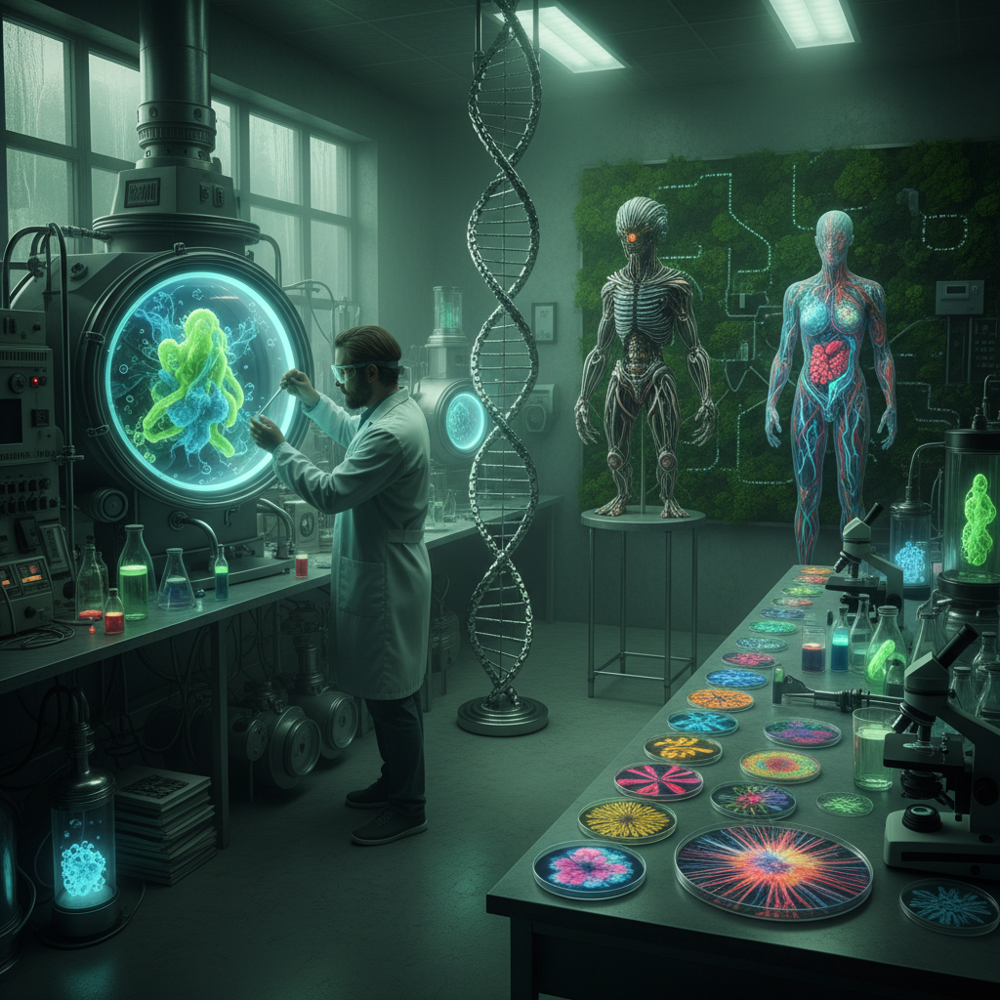

# Biopunk Art 生物朋克艺术

> "Biopunk grows its futures from living tissue — a world where biotechnology replaces electronics, where buildings are grown not built, where medicine is hacked in garage labs, where the human body becomes programmable wetware, and where the line between natural and artificial dissolves into something wet, warm, and terrifyingly alive, a genre that asks what happens when we can edit life itself as easily as we edit code." — Unknown

## 概述

生物朋克（Biopunk）是一种以生物技术（基因工程、合成生物学、生物黑客等）为核心想象的科幻亚文化和美学风格。与赛博朋克关注信息技术和电子设备不同，生物朋克关注的是生命科学的极端发展——基因编辑、人造生命、生物武器、有机计算机、活体建筑等。生物朋克的视觉世界充满了有机的、湿润的、生长的、变异的形态。

生物朋克的文学先驱包括保罗·迪·菲利波（Paul Di Filippo）的《Ribofunk》（1996）和格雷格·贝尔（Greg Bear）的《血音乐》（Blood Music, 1985）。在视觉领域，H.R.吉格（H.R. Giger）的生物机械美学、大卫·柯南伯格（David Cronenberg）的"身体恐怖"电影、以及当代的生物艺术（BioArt）都是生物朋克的重要视觉参照。随着CRISPR基因编辑技术的普及和合成生物学的发展，生物朋克正在从科幻变为现实。

## 核心特征

| 特征 | 描述 |
|------|------|
| 生物 | 生物技术为核心 |
| 有机 | 有机的、活的材料 |
| 基因 | 基因编辑和改造 |
| 变异 | 生物的变异和进化 |
| 湿件 | 湿件（wetware）计算 |
| 伦理 | 生物伦理的挑战 |

## 视觉特征

- **有机**：有机的生物形态
- **湿润**：湿润的、黏液的质感
- **生长**：生长和蔓延的结构
- **变异**：变异的生物体
- **透明**：半透明的生物材料
- **融合**：生物与机械的融合

## 代表作品

| 作品 | 艺术家 | 年代 | 意义 |
|------|--------|------|------|
| *Alien design* | H.R. Giger | 1979 | 吉格的生物机械美学 |
| *eXistenZ* | David Cronenberg | 1999 | 柯南伯格的有机游戏机 |
| *Ribofunk* | Paul Di Filippo | 1996 | 生物朋克文学 |
| *BioArt installations* | Eduardo Kac | 2000年代 | 转基因艺术 |
| *Annihilation* | Alex Garland | 2018 | 生物变异的视觉 |

## 历史时间线

| 时期 | 事件 |
|------|------|
| 1985 | Greg Bear《血音乐》 |
| 1996 | Di Filippo《Ribofunk》 |
| 2000年代 | 生物艺术的兴起 |
| 2012 | CRISPR技术的突破 |
| 当代 | 合成生物学的艺术化 |

## 中国语境

生物朋克在中国有独特的发展语境。中国在基因编辑和合成生物学领域的快速发展（如2018年的基因编辑婴儿事件）使得生物朋克的想象在中国有特殊的现实感和紧迫性。中国的科幻文学中有越来越多的生物朋克元素。中国的生物艺术家（如梁绍基的蚕丝艺术）也在探索生物材料的艺术可能性。中国传统医学中的"气"和"经络"概念，以及道家的"炼丹"传统，都可以被视为一种古老的"生物黑客"想象。中国的中医药传统和当代生物技术的交汇也为中国生物朋克提供了独特的文化资源。

## AI生成概念图

## 与其他风格的关系

- **Cyberpunk** → 赛博朋克
- **Bio Art** → 生物艺术
- **Body Horror** → 身体恐怖
- **Science Fiction Art** → 科幻艺术
- **Organic Architecture** → 有机建筑
- **Transhumanism** → 超人类主义

---

*浮光艺志 | Chronicle of Artistry*
