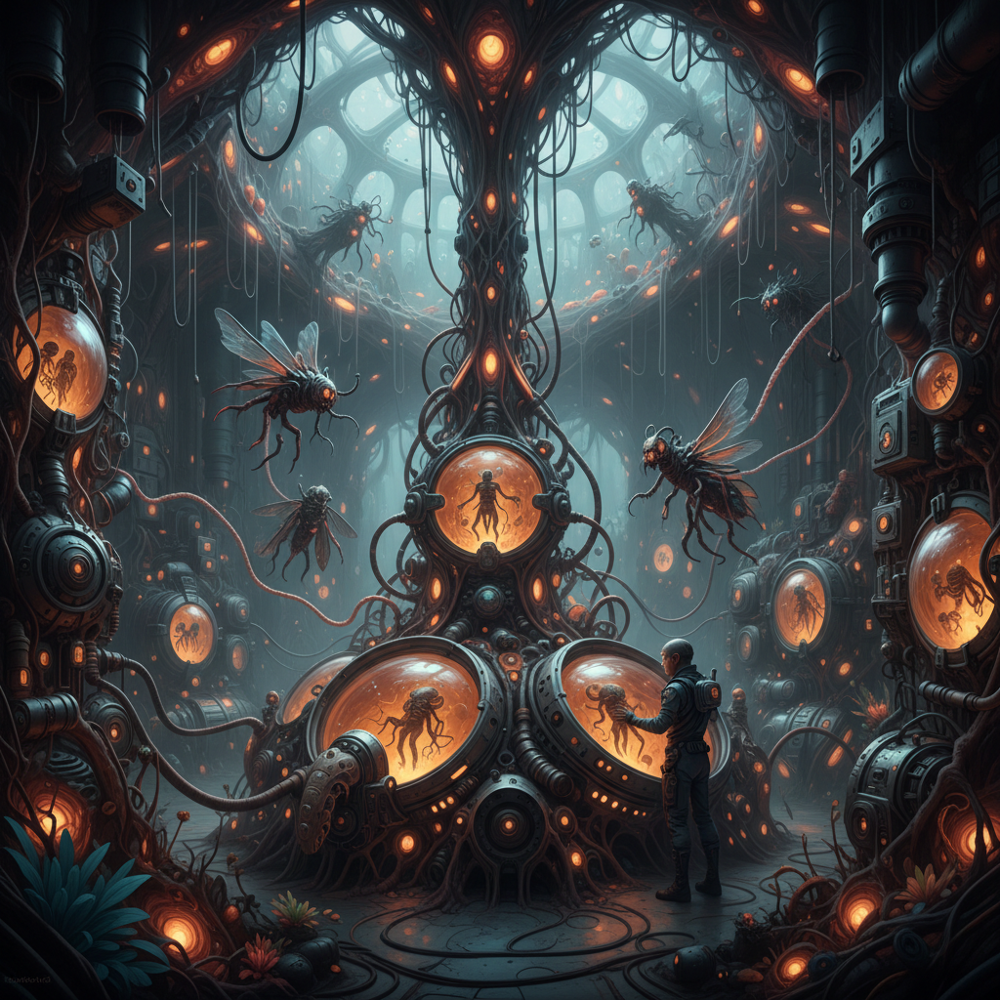

# Biopunk 生物朋克



> **"基因是新的代码，肉体是新的机器——当生物学取代硅芯片。"**

## 概述

| 维度 | 描述 |
|------|------|
| 时期 | 1990s–至今 |
| 别名 | Biopunk, 生物朋克, Ribofunk, Wetware |
| 核心色彩 | 有机绿、血红、琥珀黄、骨白、黏液紫 |
| 关键元素 | 基因改造、有机建筑、生物机械、变异、实验室 |
| 代表人物 | H.R. Giger(视觉), Paul Di Filippo(文学), David Cronenberg(电影) |
| 关联风格 | Cyberpunk, Bio Art, Body Horror, Solarpunk, Organic Design |

---

## 历史脉络

| 年份 | 事件 |
|------|------|
| 1979 | H.R. Giger为《异形》设计——生物机械美学诞生 |
| 1990s | 基因工程突破——Biopunk文学兴起 |
| 1996 | Paul Di Filippo《Ribofunk》——Biopunk经典 |
| 2003 | 人类基因组计划完成——Biopunk从科幻变为现实 |
| 2010s | CRISPR技术——Biopunk的现实化加速 |
| 2020s | 合成生物学+生物计算——Biopunk美学在设计中流行 |

### 核心哲学

Biopunk的精神是**"赛博朋克用硅——我们用碳。未来不是金属的——是有机的"**：
- "DNA是终极编程语言"
- "身体是可以hack的——基因是可以编辑的"
- "建筑应该像生物一样生长——不是像机器一样建造"
- "Cyberpunk的反叛精神 + 生物学的工具"
- "当企业控制了你的基因——反抗就是Biopunk"

---

## 视觉语法

### 色彩系统

```
主色：
  有机绿 (#228B22) — 生命、生长
  血红 (#8B0000) — 肉体、危险
  琥珀黄 (#FFBF00) — 实验室、培养液
  骨白 (#FFF8DC) — 骨骼、结构

辅色：
  黏液紫 (#800080) — 变异、异常
  深海蓝 (#003366) — 深层、未知
  肉粉 (#FFDAB9) — 皮肤、有机

材质：
  有机表面 — 皮肤、膜、纤维
  透明液体 — 培养液、血清
  骨骼结构 — 内骨骼、外骨骼
  藤蔓/管道 — 有机管线系统
  发光生物 — 生物荧光

规则：
  - 有机 > 机械
  - 曲线 > 直线
  - 生长 > 建造
  - 湿润 > 干燥
  - 不对称 > 对称
```

### 标志性元素

| 类别 | 元素 |
|------|------|
| 生物 | 基因改造生物、嵌合体、变异 |
| 建筑 | 有机建筑、生长的结构、活体墙壁 |
| 技术 | 基因编辑、生物计算、活体机器 |
| 身体 | 改造、增强、变异、融合 |
| 空间 | 实验室、培养缸、温室、洞穴 |
| 态度 | 反企业、DIY生物学、身体自主 |

---

## 与千禧怀旧/当代的关系

### 与Cyberpunk的对比
| Cyberpunk | Biopunk |
|-----------|---------|
| 硅芯片 | DNA |
| 金属义肢 | 基因改造 |
| 黑客 | 生物黑客 |
| 霓虹城市 | 有机丛林 |
| 干燥 | 湿润 |

### 当代Biopunk
- 合成生物学创业公司的品牌美学
- "生物设计"(Biodesign)运动
- 可降解材料+活体建筑
- COVID后的生物安全焦虑 = Biopunk情绪

---

## 设计应用

| 场景 | 应用方式 |
|------|----------|
| 游戏 | 有机世界+基因改造+变异 |
| 品牌 | 生物科技+有机+未来 |
| 建筑 | 仿生设计+有机形态 |
| 时尚 | 有机材料+生物荧光+变异美学 |

---

## 相关风格

← [Cyberpunk 赛博朋克](cyberpunk.md) | [Solarpunk 太阳朋克](solarpunk.md) →

↑ [返回千禧怀旧目录](README.md) | [返回总目录](../README.md)
