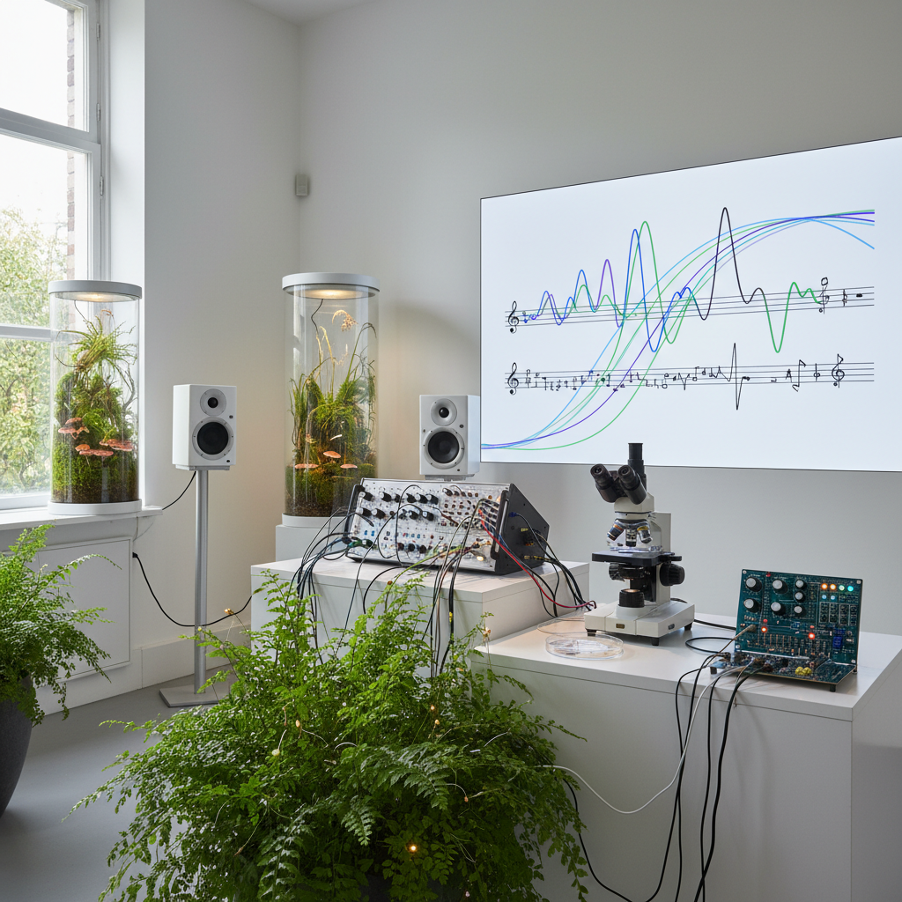

# Biosonification Art 生物声化艺术

> "Biosonification art listens to life itself — it translates the electrical whispers of cells, the chemical conversations of bacteria, the growth rhythms of plants, and the neural symphonies of brains into sound, revealing that every living thing is already making music, already singing its own song in frequencies and modalities we cannot naturally perceive, and that the boundary between biology and music was always artificial, a limitation of our senses rather than a truth about the world." — Unknown

## 概述

生物声化艺术（Biosonification Art）是将生物过程和生物数据转化为声音的艺术实践。生物声化是声化艺术的一个专门分支，专注于生命系统产生的数据——从单细胞的电活动到整个生态系统的节律。

生物声化艺术的实践包括：1）植物电信号的声化——将植物的生物电活动转化为音乐；2）微生物活动的声化——将细菌生长、发酵过程等转化为声音；3）脑电波音乐——将人类或动物的脑电波转化为音乐；4）心跳和生理节律——将心跳、呼吸等生理数据转化为节奏；5）生态系统声化——将整个生态系统的数据（温度、湿度、物种活动）转化为声景。

## 核心特征

| 特征 | 描述 |
|------|------|
| 生命 | 生命过程的声音 |
| 电信号 | 生物电信号 |
| 节律 | 生物节律 |
| 倾听 | 倾听生命 |
| 连接 | 人与生物的连接 |
| 实时 | 实时生物数据 |

## 视觉特征

- **传感器**：连接生物体的传感器
- **波形**：生物电波形
- **植物**：连接电极的植物
- **设备**：生物传感设备
- **数据**：生物数据的可视化
- **有机**：有机的视觉元素

## 代表作品

| 作品 | 艺术家 | 年代 | 意义 |
|------|--------|------|------|
| *Music of the Plants* | Damanhur | 1970年代 | 植物音乐先驱 |
| *PlantWave* | Various | 2010年代 | 植物音乐设备 |
| *Brain-computer music* | Various | 2010年代 | 脑机音乐 |
| *Microbial sonification* | Various | 2020年代 | 微生物声化 |
| *Forest sonification* | Various | 当代 | 森林声化 |

## 历史时间线

| 时期 | 事件 |
|------|------|
| 1970年代 | Damanhur的植物音乐实验 |
| 1990年代 | 脑电波音乐的发展 |
| 2010年代 | 植物声化设备的商业化 |
| 2020年代 | 微生物声化的兴起 |
| 当代 | 多物种声化 |

## 中国语境

生物声化艺术在中国有独特的文化共鸣。中国传统文化中有"万物有声"的观念——从"风声雨声读书声"到"蝉噪林逾静，鸟鸣山更幽"，中国文人一直在倾听自然的声音。中国传统医学中的"闻诊"——通过听声音来诊断疾病——也是一种古老的"生物声化"实践。中国当代的一些艺术家在探索生物声化：将中国传统药用植物的电信号转化为音乐、用茶树的生物数据创作声景、以及将中国传统的"天人感应"观念与当代生物传感技术结合。

## AI生成概念图

## 与其他风格的关系

- **Sonification Art** → 声化艺术
- **Bio Art** → 生物艺术
- **Sound Art** → 声音艺术
- **Plant Art** → 植物艺术
- **Electronic Music** → 电子音乐
- **Science Art** → 科学艺术

---

*浮光艺志 | Chronicle of Artistry*
