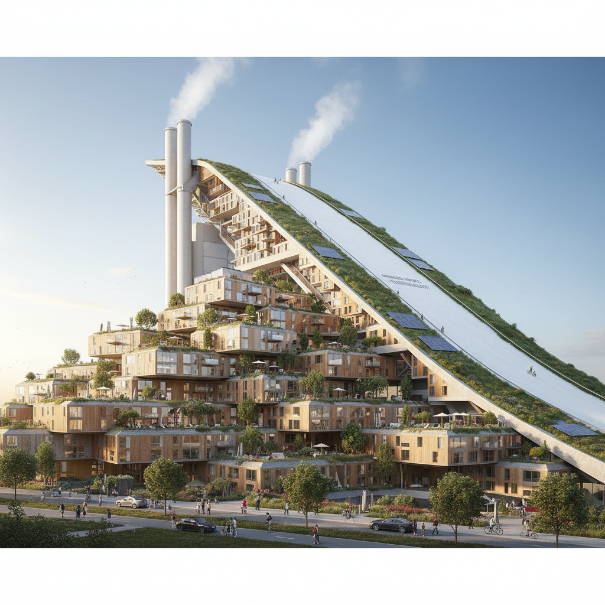

# Bjarke Ingels 比亚克·英格尔斯

> **时期：** 1974–至今  
> **关键词：** 实用乌托邦、BIG、堆叠游戏、是即是多

## 概述

Bjarke Ingels 是丹麦建筑师，BIG事务所创始人。他以"是即是多"（Yes is More）的哲学闻名——拒绝建筑中的二元对立，将可持续与享乐、公共与私密、城市与自然同时实现。他的建筑如同巨型玩具或城市游戏，将实用功能转化为令人惊喜的形态。

## 风格特征

- **堆叠与扭转**：将简单的体块通过堆叠、扭转产生复杂形态
- **实用乌托邦**：每个设计都解决实际问题同时创造惊喜
- **图解叙事**：用漫画式的图解解释设计逻辑
- **混合功能**：滑雪场+发电厂、公寓+山坡等意外组合
- **社交性**：建筑鼓励人与人的偶遇和互动

## 代表作品

- *8 House*（2010，哥本哈根）
- *CopenHill 垃圾发电厂+滑雪场*（2019）
- *VIA 57 West*（2016，纽约）
- *The Spiral*（2025，纽约）

## 概念图

