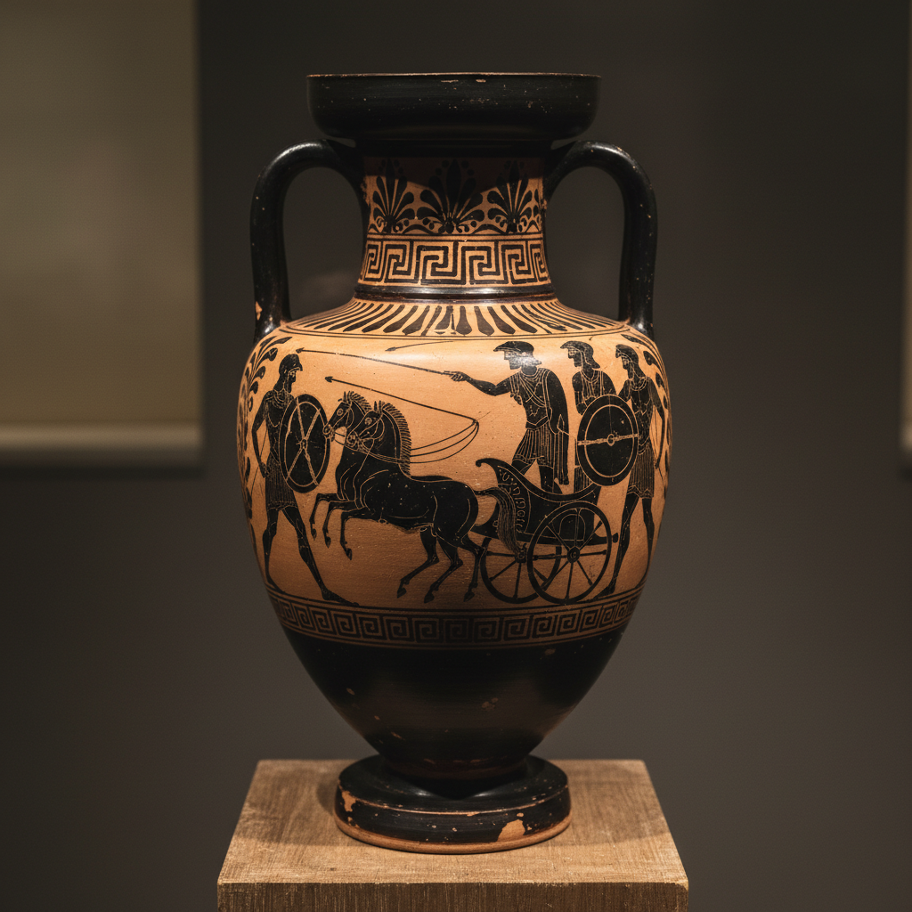

# Black-Figure Art 黑绘陶艺术

> "On the red clay of Athens, black figures dance eternally — heroes, gods, and mortals frozen in silhouette." — Greek vase painting tradition

## 概述

黑绘陶艺术（Black-Figure Art）是古希腊（约公元前7-5世纪）发展的一种陶器装饰技术——在红色陶土器物上用黑色泥浆（slip）绘制人物和场景，再用尖锐工具刻划出细节线条，烧成后黑色图案在红色底色上形成鲜明的剪影效果。

黑绘技法起源于公元前7世纪的科林斯——后来在雅典达到巅峰。这一技术的原理是：陶工用精细的含铁泥浆在器物表面绘画，烧成过程中经过氧化-还原-再氧化三个阶段——绘画部分因为泥浆颗粒更细密而在还原阶段烧结，再氧化时无法恢复红色，保持黑色；而未涂泥浆的部分恢复为红色。这是一种极其精妙的化学过程。

黑绘陶艺术的核心要素包括：1）剪影效果——黑色人物在红色背景上的剪影；2）刻线细节——用尖锐工具刻划的内部细节；3）叙事性——描绘神话、战争、日常生活的叙事场景；4）器形多样——双耳瓶、混酒器、杯等多种器形；5）签名传统——陶工和画师的签名；6）科林斯起源——从科林斯到雅典的发展；7）红绘前身——红绘技法的前身。

## 核心特征

| 特征 | 描述 |
|------|------|
| 剪影效果 | 黑色人物红色背景剪影 |
| 刻线细节 | 尖锐工具刻划内部细节 |
| 叙事性 | 神话战争日常叙事场景 |
| 器形多样 | 双耳瓶混酒器杯等 |
| 签名传统 | 陶工画师签名 |
| 三段烧成 | 氧化还原再氧化 |

## 视觉特征

- **黑色剪影**：人物的黑色剪影形象
- **红色底色**：温暖的红色陶土底色
- **刻线白色**：刻划露出的浅色线条
- **紫红点缀**：紫红色颜料的点缀
- **白色高光**：白色颜料的高光装饰
- **带状构图**：环绕器身的带状叙事

## 代表作品

| 作品 | 年代 | 意义 |
|------|------|------|
| *弗朗索瓦花瓶* (Francois Vase) | 前570年 | 叙事巅峰 |
| *埃克塞基亚斯双耳瓶* | 前540年 | 大师杰作 |
| *阿喀琉斯与埃阿斯弈棋* | 前530年 | 经典构图 |
| *狄俄尼索斯杯* | 前530年 | 埃克塞基亚斯 |
| *科林斯黑绘陶* | 前7世纪 | 技法起源 |
| *帕那辛奈克奖瓶* | 前6-4世纪 | 传统延续 |

## 历史时间线

| 时期 | 事件 |
|------|------|
| 前7世纪 | 科林斯发展黑绘技法 |
| 前6世纪初 | 雅典采用黑绘技法 |
| 前570-530年 | 雅典黑绘鼎盛期 |
| 前530年 | 红绘技法发明 |
| 前5世纪 | 黑绘逐渐被红绘取代 |
| 前4世纪 | 仅帕那辛奈克奖瓶保留黑绘 |

## 中国语境

黑绘陶与中国古代陶瓷装饰有着有趣的比较关系。中国商周时期的印纹硬陶和战国时期的彩绘陶也在器物表面进行叙事性装饰——但采用了完全不同的技术和美学路径。希腊黑绘陶追求的是人物的精确轮廓和叙事的戏剧性——这与中国传统陶瓷更注重抽象纹样和象征意义的装饰传统形成对比。黑绘陶的"三段烧成"技术（氧化-还原-再氧化）展示了古代陶工对窑内气氛控制的精湛掌握——这与中国古代窑工控制还原气氛烧制青瓷的技术有着平行的智慧。黑绘陶上的签名传统也值得关注——它反映了古希腊对个体艺术家身份的重视，这在中国陶瓷中直到宋代才逐渐出现。

## 概念图

## 与其他风格的关系

- **Red-Figure** → 红绘陶（继承发展）
- **Corinthian Pottery** → 科林斯陶器（起源）
- **Bucchero** → 布凯罗黑陶（同时代）
- **Greek Sculpture** → 希腊雕塑（同一文明）
- **Narrative Art** → 叙事艺术
- **Silhouette Art** → 剪影艺术

---

*浮光艺志 | Chronicle of Artistry*
