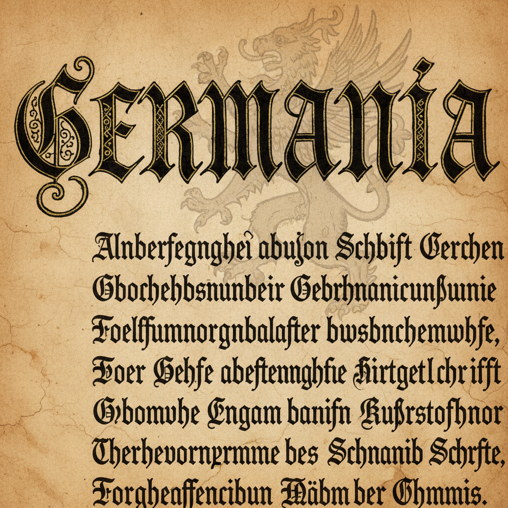

# Blackletter / Fraktur 哥特字体 | Gebrochene Schrift

> **"断笔的力量——中世纪抄写员用尖角字母为拉丁语穿上铠甲。"**

## 概述

哥特字体（Blackletter / Fraktur / Gebrochene Schrift）是中世纪欧洲的书法和印刷字体风格，以其尖角、断笔和密集的黑色笔画著称。"Blackletter"指页面上大面积的黑色墨迹，"Fraktur"源自拉丁语"fractus"（断裂），指笔画的断裂转折。这种字体从12世纪开始在欧洲流行，古腾堡的第一本印刷圣经（1455年）就使用了Textura风格的哥特字体。在德语区，Fraktur一直使用到1941年纳粹政府废除为止。当代，Blackletter在金属乐、纹身、街头文化和奢侈品牌中持续流行。

## 主要变体

| 变体 | 时期 | 特征 |
|------|------|------|
| Textura | 12-15世纪 | 最正式，密集垂直 |
| Rotunda | 13-16世纪 | 圆润，意大利 |
| Schwabacher | 15-16世纪 | 圆润，德国日常 |
| Fraktur | 16-20世纪 | 尖角+曲线，德国正式 |
| Bastarda | 14-16世纪 | 草书混合 |

## 核心特征

- **尖角笔画**：锐利的三角形衬线
- **断笔**：笔画在转折处断开
- **密集排列**：字母间距紧密
- **垂直强调**：强烈的垂直节奏
- **装饰性大写**：华丽的首字母
- **高对比度**：粗细笔画对比强烈

## 当代应用

| 领域 | 特征 |
|------|------|
| 金属乐 | 乐队logo和专辑封面 |
| 纹身 | 哥特字体纹身 |
| 街头文化 | Chicano字体 |
| 奢侈品牌 | 传统感和权威感 |
| 啤酒/威士忌 | 德国/英国传统 |
| 报纸报头 | The New York Times等 |

## 视觉特征

- 尖锐的三角形笔画末端
- 密集的黑色墨迹
- 强烈的垂直节奏感
- 华丽的装饰性大写字母
- 断裂转折的独特美感
- 中世纪的庄严气质

## 与其他风格的关系

| 风格 | 关系 |
|------|------|
| 泥金手抄本 | Blackletter是手抄本的字体 |
| 哥特建筑 | 共享尖角美学 |
| Chicano | 拉丁裔街头文化的Blackletter |
| 金属乐视觉 | Death Metal字体 |
| 当代字体设计 | Blackletter的现代诠释 |

## 概念图

---

*浮光艺志 | Chronicle of Artistry*
