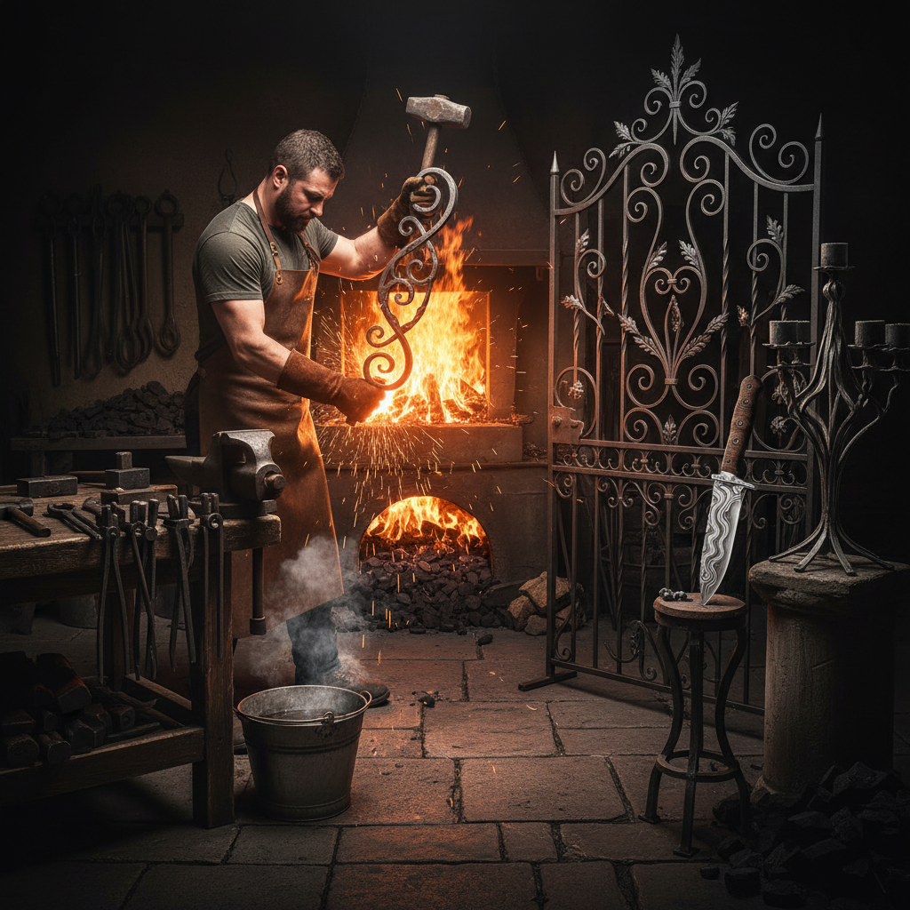

# Blacksmithing Art 锻铁艺术

> "The blacksmith is the original maker — standing between fire and anvil, transforming raw iron into tools, weapons, gates, and sculptures through nothing but heat, hammer, and will. It is the most physical of arts, demanding strength and precision in equal measure, timing each blow to the temperature of the metal, reading the color of the glow to know when the iron is ready to yield. Every handmade nail, every scrolled gate, every forged blade carries the rhythm of the hammer." — Unknown

## 概述

锻铁艺术（Blacksmithing Art）是通过加热铁或钢至可塑状态，然后用锤子在铁砧上锻打成型的金属工艺艺术——包括装饰性铁艺（如大门、栏杆、灯具）、锻造雕塑、刀剑制作和各种铁制艺术品。锻铁是人类最古老的金属加工技术之一，也是最具力量感的手工艺。

锻铁艺术的实践包括：1）装饰铁艺——大门、栏杆、灯架等装饰性铁制品；2）锻造雕塑——用锻铁技法创造的雕塑；3）刀剑锻造——传统刀剑的锻造工艺；4）铁艺家具——锻铁制作的家具；5）建筑铁艺——建筑中的装饰性铁构件；6）工具制作——手工工具的锻造；7）当代锻铁艺术——将锻铁作为当代艺术媒介的创作。

## 核心特征

| 特征 | 描述 |
|------|------|
| 力量 | 需要体力和技巧 |
| 火焰 | 在高温下操作 |
| 锻打 | 锤击成型的技法 |
| 坚固 | 极其坚固耐久 |
| 功能 | 功能性与装饰性结合 |
| 古老 | 数千年的传统 |

## 视觉特征

- **黑色**：铁的深黑色调
- **锤纹**：锻打留下的纹理
- **曲线**：热弯的优美曲线
- **卷轴**：经典的卷轴造型
- **粗犷**：粗犷的力量感
- **锈蚀**：铁的自然锈蚀色

## 代表作品

| 作品 | 艺术家/地点 | 年代 | 意义 |
|------|-------------|------|------|
| *Wrought iron gates* | 欧洲传统 | 中世纪至今 | 装饰铁艺大门 |
| *Japanese katana* | 日本传统 | 古代至今 | 日本刀锻造 |
| *Damascus steel* | 中东传统 | 古代 | 大马士革钢 |
| *Art Nouveau ironwork* | Hector Guimard | 1900 | 新艺术铁艺 |
| *Contemporary forged sculpture* | Various | 当代 | 当代锻铁雕塑 |

## 历史时间线

| 时期 | 事件 |
|------|------|
| 公元前1200年 | 铁器时代开始 |
| 中世纪 | 铁匠行会和装饰铁艺 |
| 18-19世纪 | 工业革命前的铁艺高峰 |
| 1900年代 | 新艺术运动的铁艺 |
| 当代 | 锻铁的艺术复兴 |

## 中国语境

锻铁艺术在中国有悠久的传统——中国是世界上最早掌握铸铁和锻铁技术的文明之一。中国古代的铁匠不仅制作农具和武器，也创造精美的铁艺作品。中国传统建筑中的铁艺装饰——如铁制门环、铁制窗花——是中国锻铁艺术的重要组成部分。中国的龙泉宝剑锻造是国家级非物质文化遗产——传承了数千年的锻剑技艺。中国当代的一些艺术家将锻铁作为创作媒介——创造大型锻铁雕塑和装置。中国的一些乡村仍然保留着传统铁匠铺——虽然数量在减少，但一些地方在努力保护这一传统。中国的铁艺产业在浙江等地形成了产业集群——从装饰铁艺到艺术锻造都有生产。

## AI生成概念图

## 与其他风格的关系

- **Metal Art** → 金属艺术
- **Sculpture** → 雕塑
- **Wrought Iron** → 熟铁工艺
- **Blade Art** → 刀剑艺术
- **Industrial Art** → 工业艺术
- **Architectural Decoration** → 建筑装饰

---

*浮光艺志 | Chronicle of Artistry*
