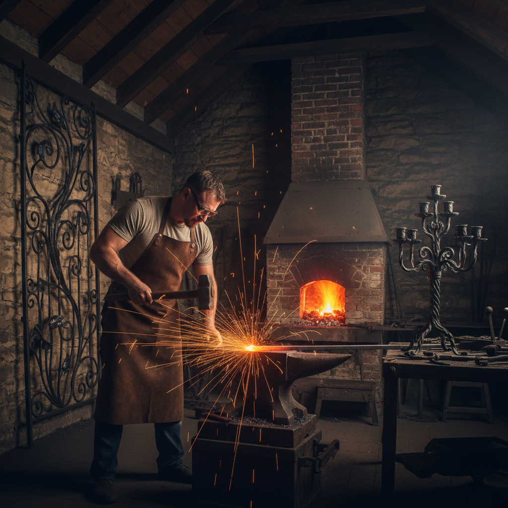

# Blacksmithing 锻铁工艺

> "The blacksmith is the original maker — shaping civilization one hammer blow at a time." — Unknown

## 概述

锻铁工艺（Blacksmithing）是通过加热和锤打将铁和钢塑造成各种形态的古老金属工艺。从农具到武器，从建筑装饰到艺术雕塑，铁匠是人类文明最基础的创造者之一。锻铁的独特之处在于它的直接性——没有模具、没有铸造，只有火、锤子和铁砧之间的对话。当代艺术锻铁已经超越了实用功能，成为一种独立的雕塑和装饰艺术形式。

锻铁工艺的哲学在于：力量与精确的统一——每一锤都必须在正确的温度、正确的位置、以正确的力度落下。

## 核心特征

| 特征 | 描述 |
|------|------|
| 锻打 | 加热后锤打成形 |
| 铁钢 | 以铁和钢为材料 |
| 火 | 需要锻造炉加热 |
| 直接 | 直接塑形无需模具 |
| 力量 | 需要体力和技巧 |
| 古老 | 数千年的历史 |

## 视觉特征

- **锤痕**：可见的锤打痕迹
- **曲线**：优美的锻造曲线
- **黑色**：铁的深沉黑色
- **质感**：粗犷的表面质感
- **力量**：力量感的视觉表达
- **有机**：有机的手工形态

## 代表作品

| 作品 | 艺术家 | 年代 | 意义 |
|------|--------|------|------|
| *Medieval gates* | 匿名 | 中世纪 | 教堂铁门 |
| *Art Nouveau ironwork* | Hector Guimard | 1900s | 巴黎地铁入口 |
| *Albert Paley gates* | Albert Paley | 1974 | 当代锻铁艺术 |
| *Tom Joyce sculptures* | Tom Joyce | 2000s+ | 当代锻铁雕塑 |
| *Japanese katana* | 匿名 | 传统 | 日本刀锻造 |

## 历史时间线

| 时期 | 事件 |
|------|------|
| 公元前1200年 | 铁器时代开始 |
| 古代-中世纪 | 铁匠是社会核心角色 |
| 中世纪 | 装饰锻铁的发展 |
| 工业革命 | 机械化的冲击 |
| 19世纪末 | Arts & Crafts运动的复兴 |
| 当代 | 艺术锻铁的独立发展 |

## 中国语境

中国的锻铁传统极其悠久——从春秋战国的铁器到唐代的百炼钢，中国铁匠创造了无数技术奇迹。中国传统的铁艺包括铁画（芜湖铁画，国家级非遗）、铁壶、铁锅等。芜湖铁画以锤打铁片为"墨"，以铁丝为"线"，创造出独特的金属绘画。当代中国的艺术锻铁正在复兴，许多艺术家将传统锻铁技法与当代雕塑结合。

## AI生成概念图

## 与其他风格的关系

- **Metalwork** → 金属工艺的基础
- **Sculpture** → 锻铁雕塑
- **Architecture** → 建筑装饰铁艺
- **Art Nouveau** → 新艺术运动的铁艺
- **Japanese Sword** → 日本刀锻造
- **Wrought Iron** → 装饰锻铁

---

*浮光艺志 | Chronicle of Artistry*
