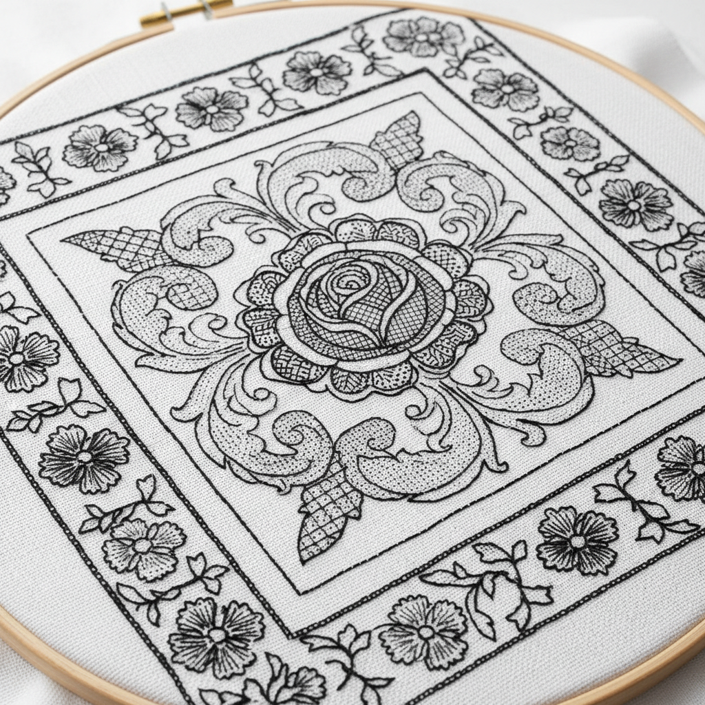

# Blackwork Art 黑线绣艺术

> "Blackwork is embroidery's most graphic tradition — black silk thread on white linen, creating patterns of extraordinary intricacy through nothing more than running stitch, back stitch, and double running stitch (Holbein stitch). Each motif is a miniature geometric universe, a tessellation of repeating units that fills space with mathematical precision. Blackwork proves that limitation breeds creativity: with only one color, the embroiderer must rely entirely on pattern, density, and negative space." — Unknown

## 概述

黑线绣艺术（Blackwork Art）是一种使用黑色丝线在白色亚麻布上绣制几何填充图案的刺绣技法——以其精密的几何图案、数学般的规律性和强烈的黑白对比著称。黑线绣在16世纪的英国都铎王朝时期达到巅峰，常见于亨利八世时期的宫廷服饰中。

黑线绣艺术的实践包括：1）Holbein针——双面相同的双行针法；2）填充图案——各种几何填充图案；3）轮廓——用较粗的线勾勒轮廓；4）渐变——通过图案密度创造明暗渐变；5）自由黑线绣——不受网格限制的自由图案；6）彩色黑线绣——使用彩色线的现代变体；7）当代黑线绣——将传统技法与现代设计结合的创作。

## 核心特征

| 特征 | 描述 |
|------|------|
| 黑白 | 强烈的黑白对比 |
| 几何 | 精密的几何图案 |
| 数学 | 数学般的规律性 |
| 都铎 | 都铎王朝传统 |
| 填充 | 多样的填充图案 |
| 精密 | 极其精密的针法 |

## 视觉特征

- **黑白**：纯粹的黑白对比
- **几何**：精密的几何填充
- **密度**：通过密度创造明暗
- **规律**：数学般的重复规律
- **精细**：极其精细的线条
- **图形**：强烈的图形感

## 代表作品

| 作品 | 艺术家/文化 | 年代 | 意义 |
|------|-------------|------|------|
| *Tudor costume blackwork* | 英国 | 16世纪 | 都铎服饰黑线绣 |
| *Holbein portraits* | 英国 | 16世纪 | 霍尔拜因肖像中的黑线绣 |
| *Spanish blackwork* | 西班牙 | 15-16世纪 | 西班牙黑线绣 |
| *Elizabethan samplers* | 英国 | 16世纪 | 伊丽莎白时代样品 |
| *Contemporary blackwork* | 当代 | 当代 | 当代黑线绣 |

## 历史时间线

| 时期 | 事件 |
|------|------|
| 中世纪 | 黑线绣从摩尔人传入西班牙 |
| 15世纪 | 西班牙黑线绣的发展 |
| 16世纪 | 英国都铎时期的黄金时代 |
| 17世纪后 | 黑线绣的衰落 |
| 当代 | 黑线绣的复兴和创新 |

## 中国语境

黑线绣艺术在中国有一定的爱好者群体。中国传统刺绣中虽然没有完全对应的黑线绣传统，但单色刺绣在中国有悠久的历史——如墨绣（用黑色丝线绣制水墨画效果）。中国的十字绣爱好者中，黑线绣作为一种精密的计数刺绣正在获得关注——因为其图案的数学美感和冥想般的制作过程。中国的一些刺绣设计师将黑线绣的几何填充与中国传统图案结合——创造具有东方韵味的黑白刺绣作品。中国的当代艺术中，黑线绣的极简美学与中国水墨传统有共鸣——黑白、留白、密度变化都是共同的美学语言。

## AI生成概念图

## 与其他风格的关系

- **Cross Stitch** → 十字绣
- **Whitework** → 白色刺绣
- **Geometric Art** → 几何艺术
- **Tudor Art** → 都铎艺术
- **Op Art** → 光学艺术
- **Graphic Art** → 图形艺术

---

*浮光艺志 | Chronicle of Artistry*
