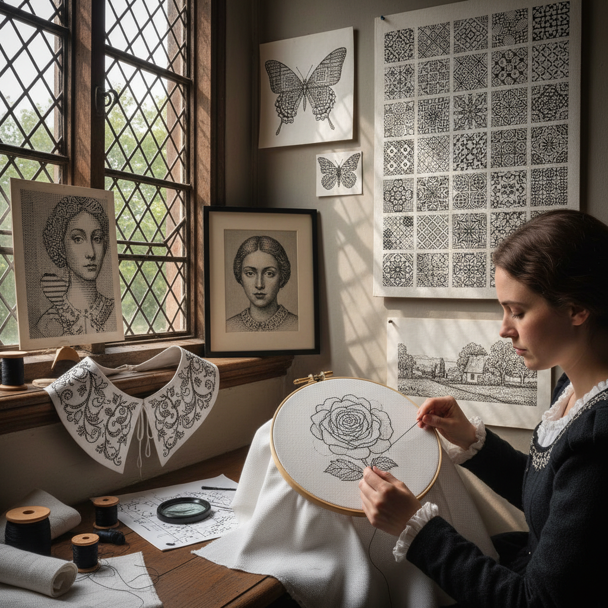

# Blackwork Embroidery 黑线刺绣

> "Blackwork is drawing with a needle — black silk thread on white linen creating patterns of such geometric precision they seem printed rather than stitched, each motif a mathematical tessellation that fills space with the logic of Islamic tile work, proving that a single color and a single stitch can contain infinite variety." — Unknown

## 概述

黑线刺绣（Blackwork Embroidery）是一种使用黑色丝线在白色亚麻布上进行的计数线刺绣——通过Holbein针法（双面平针/double running stitch）和回针（back stitch）创造精确的几何填充图案。黑线刺绣的独特之处在于：它完全依靠图案的密度变化来创造明暗效果——密集的图案显得深色，稀疏的图案显得浅色，从而实现类似版画的灰度效果。

黑线刺绣在16世纪的英国都铎王朝时期达到鼎盛——亨利八世的第一任妻子阿拉贡的凯瑟琳（Catherine of Aragon）据说将这种西班牙风格的刺绣带到了英国。黑线刺绣用于装饰衬衫的领口、袖口和前襟。汉斯·霍尔拜因（Hans Holbein）的肖像画中精确描绘了黑线刺绣的图案，因此双面平针也被称为"Holbein stitch"。

## 核心特征

| 特征 | 描述 |
|------|------|
| 黑白 | 黑线白布 |
| 几何 | 精确的几何图案 |
| 计数 | 计数线技法 |
| 密度 | 密度创造明暗 |
| 双面 | 双面平针技法 |
| 都铎 | 都铎时代的传统 |

## 视觉特征

- **黑白**：纯粹的黑白对比
- **几何**：精确的几何填充
- **灰度**：密度变化的灰度
- **精密**：数学般的精密
- **版画**：类似版画的效果
- **优雅**：简约的优雅

## 代表作品

| 作品 | 艺术家 | 年代 | 意义 |
|------|--------|------|------|
| *Tudor blackwork garments* | 英国工匠 | 16世纪 | 都铎黑线刺绣 |
| *Holbein portraits* | Hans Holbein | 16世纪 | 记录黑线刺绣 |
| *Spanish blackwork* | 西班牙工匠 | 15-16世纪 | 西班牙黑线绣 |
| *Contemporary blackwork* | Various | 当代 | 当代黑线刺绣 |
| *Blackwork portraits* | Various | 当代 | 黑线刺绣肖像 |

## 历史时间线

| 时期 | 事件 |
|------|------|
| 中世纪 | 摩尔人影响下的西班牙黑线绣 |
| 16世纪 | 都铎英国的黑线绣鼎盛 |
| 17世纪 | 黑线绣的衰落 |
| 20世纪后期 | 黑线绣的复兴 |
| 当代 | 黑线绣的创新发展 |

## 中国语境

黑线刺绣在中国的刺绣社区中有一定的知名度。中国的十字绣和计数线刺绣爱好者中有人学习和实践黑线刺绣。中国传统的"墨绣"（使用黑色丝线的刺绣）与黑线刺绣有某些视觉上的相似性，但技法不同。当代中国的一些刺绣艺术家将黑线刺绣的几何美学与中国传统纹样结合。黑线刺绣的"密度创造灰度"理念与中国水墨画的"墨分五色"有哲学上的共鸣。

## AI生成概念图

## 与其他风格的关系

- **Cross Stitch** → 十字绣
- **Whitework** → 白色刺绣
- **Geometric Art** → 几何艺术
- **Printmaking** → 版画
- **Islamic Pattern** → 伊斯兰图案
- **Embroidery** → 刺绣

---

*浮光艺志 | Chronicle of Artistry*
